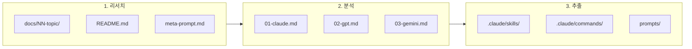

# AI Lab

[English](./README.md)

> 화제의 LLM 도구를 분석하고 실용적인 인사이트를 추출하는 리서치 워크스페이스

## 목적

트렌딩 LLM 도구, 프레임워크, 패턴을 연구하여:

1. **리서치** - 개념과 구현을 심층 분석
2. **분석** - 여러 AI 모델(Claude, GPT, Gemini)의 접근 방식 비교
3. **추출** - 재사용 가능한 아티팩트(스킬, 프롬프트, 패턴) 생성

## 워크플로우



## 예시: Component Architect

"Command vs Skill vs Agent 선택 기준" 리서치:

| 단계 | 산출물 |
|------|--------|
| 리서치 | [`docs/01-component-architect/`](./docs/01-component-architect/) |
| 멀티모델 분석 | Claude, GPT-4, Gemini 관점 비교 |
| 추출 아티팩트 | [`.claude/skills/component-architect/`](./.claude/skills/component-architect/) |

## 디렉토리 구조

```
ai-lab/
├── docs/                     # 리서치 문서
│   └── 01-component-architect/
│       ├── README.md         # 주제 개요
│       ├── meta-prompt.md    # 재사용 프롬프트
│       └── research/         # 멀티모델 분석
├── .claude/                  # Claude Code 아티팩트
│   ├── skills/               # 추출된 스킬
│   └── commands/             # 커스텀 명령어
├── refs/                     # 참조 레포지토리 (gitignored)
├── AGENTS.md                 # AI 에이전트 지침
└── README.md
```

## 리서치 토픽

| # | 주제 | 상태 | 아티팩트 |
|---|------|------|----------|
| 01 | [Component Architect](./docs/01-component-architect/) | 완료 | [Skill](./.claude/skills/component-architect/) |
| 02 | [Naming Convention](./docs/02-naming-convention/) | 완료 | 참조 문서 |

## 새 리서치 추가

1. `docs/NN-topic-name/` 생성
2. `README.md`에 주제 개요 작성
3. 필요시 `meta-prompt.md` 포함
4. 여러 모델에 실행 후 `research/`에 저장
5. `.claude/skills/` 등에 재사용 아티팩트 추출

## AI 에이전트용

워크스페이스 컨텍스트와 지침은 [AGENTS.md](./AGENTS.md) 참조.

## 라이선스

MIT
