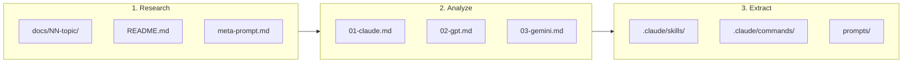

# AI Lab

[한국어](./README.ko.md)

> Research workspace for analyzing hyped LLM tools and extracting actionable insights.

## Purpose

Study trending LLM tools, frameworks, and patterns to:

1. **Research** - Deep-dive into concepts and implementations
2. **Analyze** - Compare approaches across different AI models (Claude, GPT, Gemini)
3. **Extract** - Create reusable artifacts (skills, prompts, patterns)

## Workflow



## Example: Component Architect

Recent research on "when to use Command vs Skill vs Agent":

| Phase | Output |
|-------|--------|
| Research | [`docs/01-component-architect/`](./docs/01-component-architect/) |
| Multi-model analysis | Claude, GPT-4, Gemini perspectives |
| Extracted artifact | [`.claude/skills/component-architect/`](./.claude/skills/component-architect/) |

## Directory Structure

```
ai-lab/
├── docs/                     # Research documents
│   └── 01-component-architect/
│       ├── README.md         # Topic overview
│       ├── meta-prompt.md    # Reusable prompt
│       └── research/         # Multi-model analysis
├── .claude/                  # Claude Code artifacts
│   ├── skills/               # Extracted skills
│   └── commands/             # Custom commands
├── refs/                     # Reference repositories (gitignored)
├── AGENTS.md                 # AI agent instructions
└── README.md
```

## Research Topics

| # | Topic | Status | Artifact |
|---|-------|--------|----------|
| 01 | [Component Architect](./docs/01-component-architect/) | Done | [Skill](./.claude/skills/component-architect/) |
| 02 | [Naming Convention](./docs/02-naming-convention/) | Done | Reference doc |

## Adding New Research

1. Create `docs/NN-topic-name/`
2. Add `README.md` with topic overview
3. Include `meta-prompt.md` if applicable
4. Run against multiple models, save to `research/`
5. Extract reusable artifacts to `.claude/skills/` or elsewhere

## For AI Agents

See [AGENTS.md](./AGENTS.md) for workspace context and instructions.

## License

MIT
