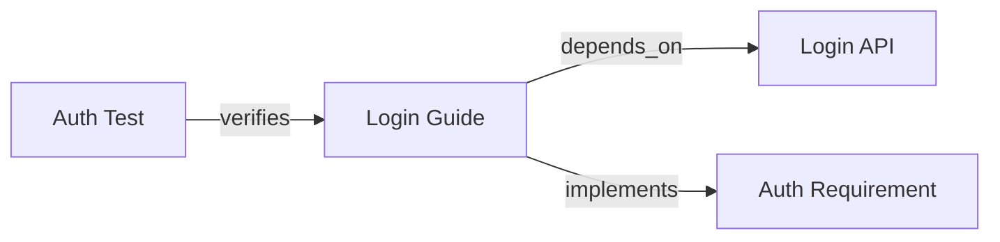

# 확장된 메타 프롬프트 아키텍처

> AI 에이전트를 위한 그래프 기반 문서 시스템 설계에 관한 심층 연구 보고서

---

## 1. 서론: 문서화 패러다임의 전환과 AI 에이전트의 부상

소프트웨어 엔지니어링의 역사에서 기술 문서화는 주로 인간 독자를 위해 설계되어 왔습니다. 개발자가 코드를 이해하고 시스템을 운영하며 문제를 해결하는 데 필요한 지식을 전달하는 것이 주된 목적이었기에, **가독성(readability)** 과 **검색 가능성(searchability)** 이 핵심 지표였습니다.

그러나 대규모 언어 모델(LLM) 기반의 AI 에이전트(AI Agent)가 개발 라이프사이클의 능동적인 참여자로 등장함에 따라, 기존의 문서화 시스템은 근본적인 한계에 직면하게 되었습니다. AI 에이전트는 인간과 달리 직관적 추론이나 암묵적 지식의 연결을 자연스럽게 수행하지 못하며, 대신 **명시적 컨텍스트(Explicit Context)** 와 **구조화된 데이터(Structured Data)** 에 의존하여 추론을 수행합니다.

본 연구 보고서는 이러한 간극을 메우기 위해 **'확장된 메타 프롬프트(Extended Meta Prompt)'** 라는 새로운 개념을 중심으로 한 AI 에이전트 기반 문서 시스템 아키텍처를 제안합니다.

### 핵심 아이디어

이 아키텍처의 핵심은 문서의 메타데이터(Frontmatter)를 단순한 태그나 날짜 정보를 넘어선, **문서 간의 위상학적 관계(Topological Relationships)를 정의하는 그래프의 인접 리스트(Adjacency List)** 로 재정의하는 것입니다.

이를 통해:
- 비정형 텍스트로 구성된 문서 저장소를 정교한 **지식 그래프(Knowledge Graph)** 로 변환
- AI 에이전트가 이를 순회하며 **할루시네이션(Hallucination) 없는 정밀한 추론** 수행

### 1.1 연구의 배경 및 필요성

기존의 검색 증강 생성(RAG, Retrieval-Augmented Generation) 방식은 주로 **벡터 유사도(Vector Similarity)** 에 의존합니다.

사용자의 질문과 유사한 텍스트 청크(Chunk)를 검색하여 LLM에 제공하는 방식은 일반적인 질의응답에는 유효하지만, 복잡한 시스템 아키텍처를 이해하거나 상호 의존성이 강한 모듈 간의 관계를 파악해야 하는 **코딩 에이전트(Coding Agent)** 에게는 불충분합니다.

**예시**: "인증 모듈을 수정하면 어떤 다운스트림 서비스가 영향을 받는가?"라는 질문에 답하기 위해서는 텍스트의 유사성이 아닌, **시스템 구성 요소 간의 논리적 연결(Logical Connectivity)** 을 이해해야 합니다.

확장된 메타 프롬프트 아키텍처는 문서 내에 **'그림자 그래프(Shadow Graph)'** 를 구축함으로써 이 문제를 해결합니다.

### 1.2 보고서의 구성 및 범위

본 보고서는 다음과 같은 핵심 영역을 다룹니다:

| 영역 | 내용 |
|------|------|
| **이론적 배경** | 지식 그래프와 문서화의 융합, GraphRAG의 원리 |
| **스키마 설계** | AI 에이전트를 위한 최적의 Frontmatter 필드 정의 (Diátaxis, Arc42 등 참조) |
| **시스템 아키텍처** | 마크다운 문서를 그래프로 변환하고 인덱싱하는 파이프라인 설계 |
| **에이전트 통합** | Cursor, Windsurf, Aider 등 최신 AI 개발 도구와의 연동 패턴 |
| **구현 로드맵** | Python 기반의 그래프 빌더 구현 및 CI/CD 자동화 전략 |

---

## 2. 이론적 토대: 문서 그래프와 컨텍스트 엔지니어링

AI 에이전트가 문서를 '이해'한다는 것은 텍스트의 의미론적 벡터 공간을 탐색하는 것을 넘어, **정보의 구조적 위상을 파악하는 것**을 의미합니다.

### 2.1 그래프 이론의 문서화 적용

전통적인 문서 시스템은 트리(Tree) 구조, 즉 폴더와 파일의 계층 구조에 기반합니다. 그러나 소프트웨어 시스템의 아키텍처, 데이터 흐름, 의존성은 트리 구조보다는 **네트워크(Network)** 또는 **유향 그래프(Directed Graph)** 에 가깝습니다.

| 요소 | 설명 |
|------|------|
| **노드(Nodes)** | 개별 마크다운 파일(`.md`, `.mdx`)이 그래프의 노드가 됨. 각 노드는 고유한 식별자(URI)를 가지며, 특정 주제나 컴포넌트를 캡슐화 |
| **엣지(Edges)** | 문서 간의 관계. 기존의 하이퍼링크가 '참조(Reference)'라는 단일 의미만 가졌다면, 확장된 메타 프롬프트에서는 `depends_on`, `implements`, `tests`, `deprecates` 등 풍부한 **의미론적 관계(Semantic Relations)** 를 정의 |
| **속성(Properties)** | 각 노드와 엣지는 속성을 가짐. 노드의 속성은 Frontmatter에 정의된 메타데이터(작성자, 상태, 버전 등) |

이러한 그래프 구조는 AI 에이전트가 **"멀티 홉(Multi-hop)" 추론**을 가능하게 합니다.

### 2.2 인접 리스트로서의 Frontmatter

확장된 메타 프롬프트의 핵심 아이디어는 **YAML Frontmatter를 그래프의 인접 리스트로 활용**하는 것입니다.

별도의 그래프 데이터베이스(Neo4j 등)를 구축하지 않고도, 마크다운 파일 자체에 그래프 구조를 내재화함으로써 **"Docs as Code"** 철학을 유지하면서도 강력한 관계형 데이터 모델을 구현할 수 있습니다.

| 기존 방식 (하이퍼링크) | 확장된 메타 프롬프트 | AI 에이전트 관점 |
|------------------------|---------------------|------------------|
| `[로그인 API](./login.md)` | `related: urn:api:login` | 메타데이터는 즉시 구조화된 데이터로 로드됨 |
| 암묵적 관계 (문맥 의존) | 명시적 관계 (`type: depends_on`) | 관계의 성격을 결정론적으로 파악 가능 |
| 단방향 연결 | 양방향 추적 가능 (역인덱싱) | "이 문서를 참조하는 모든 문서" 파악 가능 |

### 2.3 의미론적 밀도와 토큰 효율성

LLM의 컨텍스트 윈도우(Context Window)는 유한하며, 긴 컨텍스트를 처리할 때:
- 비용과 지연 시간 증가
- **"Lost in the Middle"** 현상으로 정확도 저하

따라서 에이전트에게 전체 문서를 제공하는 대신, **가장 밀도 높은 정보만을 선별하여 제공하는 전략**이 필요합니다.

**컨텍스트 그래프(Context Graph)** 개념은 이러한 최적화를 가능하게 합니다:
- 에이전트가 특정 작업 수행 시, 전체 문서가 아닌 해당 작업과 **위상학적으로 연결된 부분 그래프(Subgraph)** 만을 추출하여 컨텍스트로 주입

---

## 3. 확장된 메타 프롬프트 스키마 설계

성공적인 AI 기반 문서 시스템을 구축하기 위해서는 엄격하고 표준화된 메타데이터 스키마가 필수적입니다.

> 이 스키마는 Google 기술 문서 스타일 가이드, Diátaxis 프레임워크, Arc42 아키텍처 템플릿의 모범 사례를 통합하여 설계되었습니다.

### 3.1 식별 및 분류 필드 (Identity & Classification)

#### 3.1.1 고유 식별자 (URN 기반 ID)

파일 경로는 리팩토링 과정에서 변할 수 있으므로, 에이전트에게는 **불변의(immutable) 식별자**가 필요합니다.

```yaml
id: urn:auth:oauth2:flow_diagram
# 형태: urn:domain:component:concept
```

**예시**:
- `urn:auth:oauth2:flow_diagram`
- `urn:billing:stripe:integration_guide`

**AI 이점**: 에이전트가 파일 이동이나 이름 변경에도 관계없이 일관된 참조를 유지할 수 있습니다.

#### 3.1.2 문서 유형 (DocType Taxonomy)

Diátaxis 프레임워크에 기반하여 문서의 유형을 명시합니다:

| type | 설명 | AI 인식 방식 |
|------|------|-------------|
| `tutorial` | 학습 중심 | "단계별 교육 자료" |
| `howto` | 과업 중심 | "실행 가능한 절차" |
| `reference` | 정보 중심 | "사실 관계의 원천(Source of Truth)" |
| `explanation` | 이해 중심 | "배경 지식 및 맥락" |
| `adr` | 아키텍처 결정 기록 | "설계 제약 조건" |

#### 3.1.3 상태 및 생명주기 (Status & Lifecycle)

에이전트가 오래된 정보나 아직 확정되지 않은 정보를 사실로 착각하는 것을 방지합니다.

```yaml
status: stable  # draft | review | stable | deprecated | legacy
version: v2.0.0+
last_updated: 2025-01-20
```

> **Deep Insight**: `deprecated` 상태의 문서는 "참조는 하되, 새로운 코드 생성 시에는 따르지 말 것"이라는 암묵적 지시를 내포합니다.

### 3.2 관계형 그래프 필드 (The Graph Layer)

이 아키텍처의 핵심인 관계 정의 필드입니다. 이 필드들은 문서 간의 **유향 엣지(Directed Edges)** 를 형성합니다.

```yaml
relationships:
  # 구조적 의존성 (Hard Dependencies)
  depends_on:
    - urn:api:user_service
    - urn:schema:user_table
  
  # 구현 관계 (Implementation)
  implements:
    - urn:req:auth_security_policy_v2
    
  # 테스트 커버리지 (Testing)
  tested_by:
    - urn:test:auth_integration_suite
    
  # 개념적 연결 (Semantic Links)
  related_concepts:
    - urn:concept:jwt
    - urn:concept:sso
    
  # 대체/계승 관계 (Evolution)
  supersedes:
    - urn:doc:legacy_auth_guide
```

| 필드 | 설명 | 용도 |
|------|------|------|
| `depends_on` | 이 문서가 작동하기 위해 필요한 선행 조건 | 변경 영향도 분석(Impact Analysis) 시 역방향 탐색 |
| `implements` | 특정 요구사항이나 설계 사양을 구현함을 명시 | 요구사항 추적성(Traceability) 제공 |
| `tested_by` | 관련 테스트 케이스 문서나 코드 파일로의 링크 | 코드 수정 후 실행해야 할 테스트 식별 |

### 3.3 컨텍스트 제어 지시어 (Context Control Directives)

문서 자체에 대한 메타데이터가 아니라, **이 문서를 사용하는 에이전트에 대한 지시사항**을 포함합니다.

```yaml
agent_instructions: |
  이 문서는 레거시 시스템에 관한 것입니다. 
  신규 개발 시에는 urn:new_system을 참조하고, 
  이 내용은 마이그레이션 목적으로만 사용하십시오.

context_depth: 1  # 그래프상에서 몇 단계(hop) 깊이까지 로드할지
tokens: 2500      # 대략적인 토큰 수 (빌드 시 자동 계산 가능)
```

### 3.4 JSON Schema 정의

이 Frontmatter 스키마는 시스템적으로 검증되어야 합니다:

```json
{
  "$schema": "http://json-schema.org/draft-07/schema#",
  "type": "object",
  "properties": {
    "id": { 
      "type": "string", 
      "pattern": "^urn:[a-z0-9_:-]+$" 
    },
    "type": { 
      "enum": ["tutorial", "howto", "reference", "explanation", "adr"] 
    },
    "relationships": {
      "type": "object",
      "properties": {
        "depends_on": { "type": "array", "items": { "type": "string" } },
        "tested_by": { "type": "array", "items": { "type": "string" } }
      }
    },
    "agent_instructions": { "type": "string" }
  },
  "required": ["id", "type", "status"]
}
```

---

## 4. 시스템 아키텍처 및 파이프라인

확장된 메타 프롬프트가 실제 개발 워크플로우에서 작동하려면, 정적인 마크다운 파일을 동적인 지식 그래프로 변환하고 서빙하는 파이프라인이 필요합니다.

### 4.1 1단계: 저작 및 소스 제어

모든 문서화의 시작점은 Git 저장소입니다. **"Docs as Code"** 원칙에 따라 문서는 코드와 함께 버전 관리됩니다.

- **저장소 구조**: 모노레포 환경에서는 `docs/` 디렉토리에 중앙 집중화하거나, 각 서비스의 `README.md` 및 `docs/` 폴더에 분산 저장. 그래프 구조(ID 기반 연결)를 사용하므로 물리적 폴더 구조의 제약에서 자유롭습니다.

- **유효성 검사 (Pre-commit Hook)**: 개발자가 문서를 커밋할 때, `frontmatter-validator` 또는 커스텀 Python 스크립트가 실행되어 필수 필드 누락이나 잘못된 URN 참조를 차단합니다.

### 4.2 2단계: 그래프 빌더 및 인덱싱 엔진

CI/CD 파이프라인(GitHub Actions 등)에서 실행되는 이 단계는 마크다운 파일을 파싱하여 기계가 읽을 수 있는 그래프 데이터로 변환합니다.

#### 4.2.1 파싱 및 추출

Python 기반의 빌더 스크립트(`graph_builder.py`)가 다음 작업을 수행합니다:

1. **Frontmatter 파싱**: `python-frontmatter` 라이브러리를 사용하여 YAML 블록을 객체로 변환
2. **청킹(Chunking)**: 마크다운 본문을 의미론적 단위로 분할. 헤더(`#`, `##`)를 기준으로 계층적 청킹 수행

> ⚠️ **전략적 고려사항**: 코드 블록은 절대 분할되어서는 안 됩니다. 코드 블록이 잘릴 경우 에이전트의 코드 이해도가 급격히 저하됩니다.

#### 4.2.2 그래프 합성

추출된 메타데이터를 바탕으로 전체 시스템의 지식 그래프를 메모리상에 구축합니다 (NetworkX 활용):

1. **노드 생성**: 각 문서를 노드로 추가
2. **엣지 연결**: `relationships` 필드를 순회하며 노드 간 엣지 생성
3. **역인덱싱(Reverse Indexing)**: "Doc A"가 "Doc B"를 참조(`depends_on`)한다면, "Doc B"에도 "Doc A"에 의해 참조됨(`referenced_by`)이라는 역방향 엣지를 자동으로 추가

#### 4.2.3 하이브리드 인덱싱

구축된 데이터는 두 가지 형태의 인덱스로 저장됩니다:

| 인덱스 유형 | 저장 방식 | 용도 |
|-------------|----------|------|
| **벡터 인덱스** | Pinecone, Supabase pgvector | 의미론적 검색(Semantic Search) |
| **그래프 인덱스** | `docs_graph.json` 또는 Neo4j/Memgraph | 구조적 관계 탐색 |

### 4.3 3단계: 에이전트 인터페이스 및 컨텍스트 주입

AI 에이전트가 저장된 지식에 접근하는 방식입니다. **Model Context Protocol (MCP)** 가 이 계층의 표준 인터페이스 역할을 합니다.

**DeepSearch 알고리즘**:

1. **초기 검색**: 사용자의 자연어 쿼리를 벡터 검색하여 가장 관련성 높은 '시드 노드(Seed Node)'를 찾음
2. **그래프 확장**: 시드 노드를 중심으로 `context_depth` 설정만큼 인접 노드를 탐색(BFS/DFS)
3. **컨텍스트 조립**: 시드 노드의 본문 + 인접 노드의 요약 + 그래프 구조(Mermaid 다이어그램 등)를 결합하여 에이전트에게 전달

---

## 5. 에이전트 상호작용 패턴 및 도구 설정

### 5.1 IDE 에이전트: Cursor 및 Windsurf

#### 5.1.1 Cursor: `.cursorrules`를 통한 강제적 컨텍스트 로딩

```markdown
# Rules for Markdown & Documentation Files

- ALWAYS parse the YAML frontmatter at the top of the file immediately upon opening.
- Identify the `id` and `relationships` fields.
- If `relationships.depends_on` is present, look for files with matching IDs in the `docs_graph.json` index.
- SUGGEST to the user: "This document depends on [X] and [Y]. Should I load them into context?"
- When answering questions, prioritize information from `relationships.implements` linked specs over general knowledge.
```

#### 5.1.2 Windsurf: `global_rules.md`와 Cascade 메모리

```markdown
# Documentation System Rules

- This project uses a Graph-based Documentation System.
- Metadata is stored in YAML frontmatter.
- Edges are defined in `relationships` object.
- DO NOT hallucinate dependencies; verify them against the `docs_graph.json` file.
- Use the provided Mermaid diagrams to visualize system architecture before suggesting code changes.
```

### 5.2 자율 에이전트: Aider 및 Claude Code

CLI 기반의 자율 에이전트는 전체 저장소를 스캔하는 능력이 뛰어납니다. 이들에게는 **AGENTS.md** 파일이 그래프의 진입점(Entry Point) 역할을 합니다.

```markdown
# AI Agent Briefing

## Documentation System
- This repository uses Extended Meta Prompts.
- **Index File**: `.index/docs_graph.json` (Contains full adjacency list)
- **Schema**: Defined in `.schemas/frontmatter_schema.json`

## Key Concepts Map
- **Auth System**: `urn:sys:auth` → defines login flow, user schema
- **Payment System**: `urn:sys:pay` → depends on `urn:sys:auth`

## Task Instructions
When modifying code, always check the `tested_by` field in the corresponding doc to find regression tests.
```

### 5.3 시각적 컨텍스트: Mermaid 다이어그램 활용

텍스트뿐만 아니라 시각적 구조도 에이전트에게 유용한 컨텍스트입니다.

**자동 생성 예시** (`login.md` 하단에 자동 삽입):



에이전트는 이 코드를 보고 "Login Guide는 Auth Requirement를 구현하며, Auth Test에 의해 검증된다"는 사실을 단번에 파악합니다.

---

## 6. 사례 연구: DeepSearch 워크플로우 시뮬레이션

### 시나리오

> "사용자 인증 흐름을 JWT에서 OAuth2로 마이그레이션하려고 하는데, 어떤 컴포넌트를 수정해야 하고 사이드 이펙트는 무엇인가?"

### 6.1 기존 시스템의 한계

**Vector RAG**:
- "JWT", "OAuth2" 키워드가 포함된 문서를 찾음
- 하지만 "결제 서비스"가 인증 모듈에 의존한다는 사실이 문서에 명시적 텍스트로 없으면(코드에만 있다면), 검색 결과에서 누락

**결과**: 에이전트는 인증 모듈 수정만 제안하고, 결제 서비스의 장애 가능성을 경고하지 못합니다.

### 6.2 확장된 메타 프롬프트 시스템의 대응

1. **쿼리 분석 및 시드 탐색**:
   - "인증 흐름(Authentication Flow)" 문서를 시드 노드(`urn:doc:auth_flow`)로 식별

2. **그래프 순회 (Graph Traversal)**:
   - Frontmatter의 `relationships`를 확인
   - **정방향 탐색**: `urn:doc:auth_flow`가 `depends_on`하는 라이브러리 식별
   - **역방향 탐색(Impact Analysis)**: `referenced_by` 엣지를 추적하여 `urn:doc:payment_service`와 `urn:doc:user_dashboard`가 이 문서를 참조하고 있음을 발견

3. **컨텍스트 조립**:
   - `auth_flow.md` (본문)
   - `payment_service.md` (요약: "이 서비스는 인증 토큰을 필요로 함")
   - `integration_test_plan.md` (테스트 목록)

4. **답변 생성**:
   > "인증 흐름 수정 시 결제 서비스와 대시보드에 영향이 갈 수 있습니다. 특히 `urn:test:payment_auth_check` 테스트를 반드시 실행해야 합니다."

---

## 7. 구현 가이드 및 권장 사항

### 7.1 데이터 포맷 및 스토리지

- **Frontmatter**: 가독성을 위해 YAML 사용
- **그래프 교환 포맷**: JSON이 적합

```json
{
  "nodes": [{"id": "...", "metadata": {...}}],
  "edges": [{"source": "...", "target": "...", "relation": "..."}]
}
```

> NetworkX의 `node_link_data` 포맷과 호환되도록 설계

### 7.2 마이그레이션 전략

기존 문서를 한 번에 변환하는 것은 불가능합니다. **점진적 마이그레이션 전략**이 필요합니다:

1. **Identity First**: 모든 문서에 고유 `id`와 `type`을 부여하는 것부터 시작. 스크립트로 파일 경로 기반의 임시 ID 생성 가능

2. **LLM-Assisted Tagging**: 기존 문서의 내용을 LLM에게 제공하고, "이 문서가 의존하는 다른 문서의 ID를 추출하라"는 프롬프트를 사용하여 `relationships` 필드를 반자동으로 채움

3. **CI Gatekeeper**: 신규 문서에 대해서는 엄격한 Frontmatter 규칙을 적용하여 점진적으로 그래프의 품질을 높임

### 7.3 성능 최적화

- **캐싱**: 그래프 빌드 시 변경된 파일만 부분적으로 다시 파싱하는 **증분 빌드(Incremental Build)** 구현
- **청크 크기**: 의미론적 단위(단락 또는 섹션)로 쪼개고, 각 청크가 부모 문서의 ID를 가리키도록

---

## 8. 결론 및 향후 전망

확장된 메타 프롬프트 아키텍처는 기술 문서화를 인간을 위한 '참조 도서관'에서 **AI 에이전트를 위한 '지능형 인프라'** 로 격상시킵니다.

Frontmatter에 명시적인 그래프 구조를 도입함으로써, AI 에이전트가 겪는 가장 큰 문제인 **맥락의 부재(Lack of Context)** 와 **할루시네이션**을 구조적으로 해결할 수 있습니다.

### 핵심 제언

| 원칙 | 설명 |
|------|------|
| **명시성이 지능을 낳는다** | 관계를 암묵적인 텍스트로 남겨두지 말고, Frontmatter에 명시적인 데이터로 기록 |
| **그래프는 인프라다** | 문서 간의 연결 정보를 코드 의존성만큼이나 중요하게 관리하고 CI/CD로 검증 |
| **표준 프로토콜을 따르라** | MCP와 같은 표준 인터페이스를 통해 에이전트가 이 그래프에 접근할 수 있도록 경로를 열어줌 |

이 아키텍처의 채택은 AI 에이전트와의 협업 효율성을 비약적으로 높이며, 엔지니어링 팀의 생산성을 극대화하는 결정적인 투자가 될 것입니다.

---

## 참고 자료

| 주제 | 출처 |
|------|------|
| Chunking Strategies | [Pinecone](https://www.pinecone.io/learn/chunking-strategies/) |
| GraphRAG | [IBM](https://www.ibm.com/think/topics/graphrag) |
| Knowledge Graph Markdown | [GitHub - krml](https://github.com/edwardanderson/krml) |
| Diátaxis Framework | [diataxis.fr](https://diataxis.fr/) |
| Arc42 Template | [arc42.org](https://arc42.org/overview) |
| MADR (ADR) | [adr.github.io/madr](https://adr.github.io/madr/) |
| Cursor Rules | [cursor.com/docs](https://cursor.com/docs/context/rules) |
| AGENTS.md | [agents.md](https://agents.md/) |
| Mermaid Diagrams | [GitHub Blog](https://github.blog/developer-skills/github/include-diagrams-markdown-files-mermaid/) |
| Microsoft GraphRAG | [microsoft.github.io/graphrag](https://microsoft.github.io/graphrag/) |
