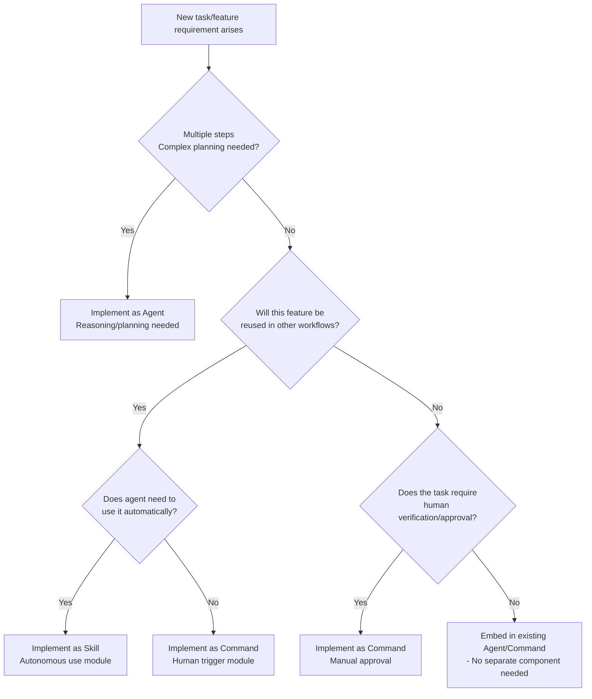

# AI Agent Architecture: Command, Skill, Agent Design Guide

## A. Concept Definitions & Boundaries (Precise Separation)

### Background on Terminology Consistency

The terms "Command", "Skill", and "Agent" are used slightly differently across various AI agent ecosystems.

| Framework                        | Terminology Usage                                              |
| -------------------------------- | -------------------------------------------------------------- |
| OpenAI LangChain / Autonomous Agents | Centered on "Tools" and "Actions", rarely uses "Skill"        |
| Cursor / Claude Code / OpenCode  | Clearly distinguishes Commands, Skills, Agents                 |
| Microsoft Semantic Kernel        | Calls function collections "Skills" but has no "Command" concept |

In **Claude Code/OpenCode-based environments**, Command/Skill/Agent are officially defined, so we distinguish concepts according to this standard.

---

### Command

> **"What to do"** - Precise instruction

**Definition:**

- Primarily triggered directly by humans using slash ("/") command format
- Deterministically requires the agent to perform a specific task
- Markdown script containing fixed prompts or procedures
- Stored globally or locally in the project
- File name becomes the slash command name (e.g., `commands/deploy.md` → `/deploy`)

**Input/Output:**

- **Input:** Receives parameters as needed and inserts them into prompts (e.g., `/release 1.2.3`)
- **Output:** Response or code changes produced by the agent executing the Command content

**State/Side Effects:**

- Consumes context only at execution time (no burden normally)
- May cause side effects such as actual tool calls or code changes during execution

**Failure:**

- Immediately reports error or retries on tool errors or unmet conditions
- Causes: Incorrect arguments, tool failures, prompt limitations, etc.

**Boundaries:**

- Only operates when **explicitly called** by user or parent agent
- Agent does not automatically select Commands
- Not conditionally loaded like Skills

---

### Skill

> **"How to do it"** - Reusable knowledge/procedure

**Definition:**

- Module bundling specialized knowledge and steps for a specific domain or task area
- Agent automatically loads based on situation, or user calls when needed
- Managed as folder units (domain containers)
- Composed of `SKILL.md` metadata and subordinate workflow files

**Input/Output:**

- **Input:** Trigger conditions (keywords, situations) are defined, automatically loads when relevant
- **Output:** No independent final output → Injected into agent conversation context to change behavior/response

**State/Side Effects:**

- Primarily prompt-level knowledge
- May include scripts or resource files (CLI scripts, etc.) when needed
- Skill itself has no state and behaves the same each time it's loaded

**Failure:**

- Loading failure is rare (if keyword matching fails, it simply doesn't load)
- Errors in Skill procedures may cause failure during agent execution

**Boundaries:**

- Always operates within the agent's context
- **Does not reason or plan on its own**
- LLM decides whether and in what order to use Skills
- Key difference from Command: **Automatically loads when relevant**
- Understood as "knowledge/procedures the agent knows"

---

### Agent

> **"Who performs the work"**

**Definition:**

- Intelligent work coordinator
- LLM instance (or process) given a specific role and goal
- Also called "worker profile"

**Key Functions:**

- Receives user input or parent commands (goals) and establishes plans (Workflow/Plan)
- Selects and loads necessary Skills
- Calls appropriate tools (functions, CLI) to perform work
- Reasons through multiple steps for complex problem solving
- Creates **Sub-agents** in parallel when needed to divide work

**Input/Output:**

- **Input:** Human prompts or parent system instructions → Set as **Goal**
- **Output:** Produces final results (explanations, code, summaries, etc.) or passes to other agents/systems

**State:**

- Maintains memory/context of conversation history, progress, etc.
- Has its own system prompt (role instructions) and tool access scope
- Uses independent context window when needed (prevents main agent context pollution)

**Side Effects:**

- Executes all actions that affect the external world through tools
- Code modifications, web data collection, CI pipeline execution, etc.
- **Layer where permission management and restrictions are important**

**Failure:**

- Goal unachievable, infinite loops, context overflow, accumulated tool failures, etc.
- Retries with own heuristics or terminates after reporting intermediate results and failure causes

**Boundaries:**

- Does not create new knowledge on its own
- Operates within given model and Skills/Tools
- Each Agent is an independent execution unit with **separate system prompt and permissions**
- One Agent can create another Agent (operates in isolated context)
- Difference from Skill: Skill is static knowledge, **planning/reasoning subject is the Agent**

**Alternative Terminology Mapping Table:** Similar terms across major frameworks:

#### Command (Cursor/Claude Code)

| Other Environment Term | Description |
|------------------------|-------------|
| Workflow / Slash Command | "Workflow" in Claude Code documentation is same as former "Command" |
| Function / Tool Action | Pre-defined function calls in OpenAI function calling |
| Intent Trigger | Specific command called by user in conversational bots |

#### Skill (Agent Skill Standard)

| Other Environment Term | Description |
|------------------------|-------------|
| Skill | Same (modularized conversation skills in IBM Watson Assistant, etc.) |
| Knowledge Pack / Rule | Early Cursor versions used Rules like Skills |
| Prompt Template / Chain | Chains or prompt sets designed for specific tasks in LangChain |

#### Agent (Claude/Cursor)

| Other Environment Term | Description |
|------------------------|-------------|
| Sub-agent | User-defined agent in Claude |
| AI Worker / Bot | General autonomous agents |
| Planner / Orchestrator | Semantic Kernel's Plan is similar to Agent |
| Assistant Instance | Assistant that operates according to prompt in OpenAI API |

#### Tool (Function/API/CLI)

| Other Environment Term | Description |
|------------------------|-------------|
| Tool | Same (LangChain, etc.) |
| MCP Function | Claude's Model-Context-Protocol tool |
| Function (API) | OpenAI function |
| Action | Actions taken by LLM in ReAct framework |

> **Summary:** Command is called "Workflow" or "Slash command" depending on the environment, and Skill may be treated similarly to "Rule" or simple prompt templates in other contexts. Agent is also commonly called "autonomous agent" or "Subagent" (sub-agent).

**10 Boundary Cases Often Confused – Q/A Format Test:**

Below are 10 cases where Command, Skill, and Agent boundaries are easily confused, organized as Q&A.

**1. Q: "Can I call multiple skills sequentially inside a command?"**

**A:** Yes, it's possible.

- Command is essentially a script that executes one designated workflow
- That procedure can load multiple Skills or include multiple steps
- Example: `/release` command does "load release skill → perform checklist → load notification skill → send notification"
- Command's role: Bundles multiple tasks for convenient execution with a single trigger

**Caveats:**
- Command itself only follows a set order, doesn't reason
- Agent monitors whether each step succeeds
- On failure, stops next step or handles rollback

**2. Q: "If a Skill includes both LLM prompts and tool calls, doesn't it make its own judgments and become the same as an agent?"**

**A:** They are different.

**Skill Characteristics:**
- Just a predefined instruction set, **doesn't judge on its own (loop)**
- Even if procedures like "run tests after code change" are written, the execution subject is the Agent
- Even when including tool calls, it's telling the Agent "use it this way"
- The Skill file itself doesn't have an embedded execution engine

**Agent Characteristics:**
- Reads Skill content and follows it while controlling sequence
- Agent performs branching or additional judgment when needed during execution
- Self-reasoning and decision-making for new situations

> **Analogy:** Skill = "script", Agent = "interprets and executes the script, adapts when necessary"

**3. Q: "Can an agent automatically use certain Commands?"**

**A:** Yes, in certain implementations it's possible.

**When Possible:**
- In some frameworks like Cursor, agents can autonomously execute Commands based on situation
- When "multi-step workflow" is required, if a registered Command is found, it can be called like a tool

**General Principles:**
- Commands are principally for explicit human instructions
- In Claude Code, Command has been reorganized as "Workflow"
- Agents primarily act autonomously based on Skills
- Commands are principally manual triggers; Skills/Tools are used for automatic decision-making

**Design Recommendations:**
- If you want an agent to automatically call a Command
- → It's clearer to promote that Command's content to a Skill or integrate it into Agent logic

**4. Q: "If knowledge must always be applied without human direct invocation, what's better than a Skill?"**

**A:** Using a **Rule** is appropriate.

**Skill Limitations:**
- Instructions that must always be applied to all requests, like "coding style guide"
- If made as a Skill, may be missed because it only responds to related keywords

**How to Apply Rules:**
- Set as permanent rules in system prompt
- Add as always-applied rules in Cursor's `.cursor/rules/`

**Summary:**
- Global invariant rules → Agent's basic knowledge or separate Rule
- Skill → Limited to **"modules added when needed"**

**5. Q: "Both Command and Skill are reusable, when should I make a Skill vs Command?"**

**A:** Decide based on usage method and role.

| Category | Skill | Command |
|----------|-------|---------|
| **Usage Timing** | Agent recognizes need and loads itself | User specifies timing and executes |
| **Purpose** | Module referenceable by other Skills or Agents | Like a UI shortcut for combined task invocation |
| **Content** | Contains logic or policies | Combined task execution |

**Selection Criteria:**
- "Should the agent decide when to use this feature on its own?" → **Skill**
- "Should I command it each time?" → **Command**

**6. Q: "If there are multiple Agents, can they share one Skill?"**

**A:** Yes, Skills are general-purpose modules that can be shared by multiple agents.

**Shareability:**
- Example: Logging Skill → Both developer agent and testing agent can use it
- In Claude or Cursor environments, Skills are open standards
- Designed to be compatible across multiple platforms

**Caveats:**
- Each Agent uses Skills only within its own permission/role scope
- When specific tools (e.g., deployment permissions) are needed, only Agents with access to those tools will work properly
- Concurrency issues are usually absent, but avoid designs where Skills modify the same resource (e.g., temp files)

**7. Q: "If I make one agent handle everything internally, are Skills or Sub-agents really necessary?"**

**A:** Not recommended. Putting all instructions into one Agent is an anti-pattern.

**Problems:**
- May seem simple at first but Agent prompt becomes bloated
- Duplication creates management difficulties and confusion
- Claude also evaluates "agents are better when concise and specialized"

**Advantages of Skill/Sub-agent:**

| Method | Effect |
|--------|--------|
| Separate knowledge as Skills | Remove duplication between multiple Agents, save context |
| Separate roles as Sub-agents | Enables parallel processing, advantageous for context management |

**Recommendations:**
- Common logic → Modularize as Skills
- Independent work → Separate as Sub-agents

**8. Q:** "If there are too many Skills, won't the agent get confused about what to use?"

**A:** Skill explosion can be managed through administration.

**Systematic Solutions:**
- When Skills exceed dozens, Claude etc. only loads a few relevant ones through Skill discovery
- In well-designed environments, Agent analyzes prompt → selects most appropriate Skill
  - Keyword matching
  - Vector search
- No major performance issues even with many Skills

**Administrator's Role:**
- Describe clearly "when to use" for each Skill
- Clean up overlapping Skills
- Categorize Skills by domain
- Periodically archive or consolidate infrequently used ones

**Example:**
- 5 "database\_\*" skills → Bundle into one "Database" Skill with 5 workflows
- Reduces Agent confusion + easier maintenance

**9. Q:** "Is overusing Commands bad? e.g., 2 separate commands build-api, build-ui vs one build skill."

**A:** Avoid excessive command separation.

**Problems:**
- Too many Commands makes it hard for users to remember or find them
- Potential conflict with Skill-based automation

**Recommended Solutions:**
- Multiple Commands doing similar work → Consolidate into one Skill + one Command
- Example: `/build-api`, `/build-ui` (similar procedures) → Common Build skill + `/build api` parameter for branching

**Principles:**
- Keep Command list small, memorable, and stable
- Delegate detailed logic to Skills
- Commands = UI/UX convenience means (not logic storage means)
- Unify same type of work into one Command

**10. Q:** "If a procedure in a Skill must be executed every time, isn't it better to just make it a Command instead of keeping it as a Skill?"

**A:** Yes.

**Skill Characteristics:**
- An option that agents **"use when needed"**
- If it's a procedure that's always used in specific scenarios, there's little benefit to separating it as a Skill

**Recommended Design:**
- Procedures that must be executed every time → Include directly in Command or Agent's inherent workflow
- Example: "Leave audit log after user login"
  - If separated as Skill → Risk of agent missing it
  - → Include in Agent's basic scenario or specify as a step in Command sequence

**When to Separate as Skill:**
- When reused intermittently across multiple scenarios
- Limited to when there's value in separating for management

## B. Relationship Model (Association Structure)

### 1. Hierarchy

System composition takes a hierarchical form where higher layers orchestrate lower ones.

```
Agent (Top Level)
  └── Workflow/Plan
        └── Command / Skill
              └── Tool (API, CLI, Function)
```

#### Agent Layer

- Receives user intent and sets goals
- Performs reasoning and planning with unique context/role
- Creates multiple Sub-agents in parallel when needed to parallelize work
- Decides which Skills and Commands to use
- Manages tool access

#### Command/Workflow Layer

- Executes specific procedures that Agent must perform
- In Claude Code, "Workflow" has similar meaning to Commands
- Mini-script describing the order of Skill and Tool calls
- Without Command, Agent directly calls Skills/Tools according to its own Plan

#### Skill Layer

- Agent loads corresponding Skill when specific domain work is needed
- Can load multiple Skills together at once (e.g., tanstack + panda-css)
- Provides additional knowledge, checklists, templates, etc. to Agent
- Agent calls Tools according to workflow presented by Skill

#### Tool Layer

- Executes actual programming functions, external APIs, CLI commands, DB queries, etc.
- Example: file search tool, gh CLI execution
- Execution results (JSON, command output, etc.) are returned to Agent

---

**Advantages of Layer Separation: Separation of Concerns**

| Layer | Role |
|-------|------|
| Agent | "What to do" (plan/decision-making) |
| Skill | "How to do it" (providing validated procedures) |
| Tool | Actual execution |

**Example:** Agent decides "Let's refactor this code" → Skill provides tanstack usage → Tool executes file writing

**When Structure Breaks:**
- Hardcoding detailed procedures in Agent → Loses Skill layer benefits
- Skill indiscriminately executes tools directly → Side effects occur without Agent control

### 2. Contract – I/O and Exception Policies Between Layers

Each layer must have clear interfaces (input/output) and failure handling conventions.

---

#### Agent Contract

Agent receives **goal/request (Input)** from user and returns **solution (Output)**.

**Input Format:**
- Free natural language
- Structured specification (JSON) given by parent system

**Output Format:**
- Answer to show user
- Generated code
- Reports, etc.

**Failure Handling:**

| Situation | Handling Method |
|-----------|-----------------|
| Timeout | Notify as `ERROR_TIMEOUT` if not completed within specified time/steps |
| Tool Error | Self-retry up to certain count (e.g., 3 times), ask user for additional info if impossible |
| Missing Required Field | Return error immediately (e.g., `{"error": "missing field X"}`) |

**Skill/Tool Interaction Contract:**
- When loading Skill, only read description field first and add minimum to context
- Lazy-load actual body when needed (token optimization)
- Tool calls put JSON arguments according to function signature, parse return value JSON
- If Tool throws exception/error, handle with standard field like `failure_reason`

> **Summary:** Agent contract = "Given this input, internally use Skills/Tools to return this form of output. Provide standard error response in failure situations. Stop and report if unable to complete within appropriate count and time."

---

#### Command Contract

Command is a parameterized prompt template with defined arguments and result formats.

**Input Contract:**
- Example: `/deploy <env>` command only allows `dev`/`prod` for `<env>` argument
- On wrong value input: outputs `ERROR: invalid environment`
- Consumes input through positional parameters like `${1}`, `${2}`
- Agent inserts user-provided arguments into positions to complete prompt

**Output Contract:**
- Command itself is a procedure, not a final response
- When completed, Agent summarizes work results or provides output
- Example: After `/code-review` execution, "Code review completed" + list of found issues

**Failure Handling:**
- On internal tool failure: Report in format `<toolname> FAILED: <reason>`
- Idempotent design: System integrity maintained even if executed twice with same parameters
- Support dry-run mode (e.g., `/deploy --dry-run`)
- Specify timeout policy (e.g., `ERROR: Deployment timed out` if deployment not completed within 5 minutes)

> **Key:** Command should be treated as a small program with Input → Prompt/Skill → Tool → Output flow, specifying Input/Output/Failure conditions

---

#### Skill Contract

Skill is a modular function provided to Agent, so **trigger** and **content** contracts are key.

**Trigger Contract:**
- Define `name`, `description`, `USE WHEN` keywords in Skill's metadata (YAML frontmatter)
- Specify "Load this Skill when prompt has X keyword or situation"
- Specify "This Skill should not be used in these situations"
- Example: Logging Skill's description with `USE WHEN: code logging, debug` / `DO NOT USE WHEN: database transaction`

**Content Contract:**
- Describe format and intent of instructions in Skill body
- Example: "When this Skill is loaded, Agent must perform 3-step checklist"
- When accompanied by Tool (script), include that tool's input/output contract
- When "Success Criteria" section is provided, Agent uses those criteria to determine task completion

**Error/Exception Handling:**
- Skill loading failure is rare
- Errors in Skill (e.g., typos) can cause errors during Agent execution
- Agent reports error with Skill name (e.g., `ERROR in Skill 'X': ...`)
- Or tries Plan B without Skill

**Time/Resource Policy:**
- Limit maximum number of parallel loads during auto-load
- Limit tokens put into context at once
- Anthropic Claude: Reference description first, full insert only needed Skills (token optimization)

> **Why Important?** Skills are written by multiple people and auto-selected by Agent, so without clear contracts, wrong Skills may be loaded causing incorrect behavior

---

#### Tool Contract

Tools are mostly defined by function signatures or CLI interfaces.

**Definition Methods:**
- Function-type tools: Specify argument types/required/return structure with JSON Schema
- CLI tools: Define command options and output format
- Agent (or Skill) calls according to this schema

**Error Handling:**
- API calls: Return HTTP status code or error message
- CLI: Exit code or stderr
- Agent recognizes `exit code != 0` as failure
- Deliver standard error like `TOOL_FAILED` to user

**Time Limits:**
- Each tool call has individual timeout/retry policy
- Example: Web search tool times out after 30 seconds

**Security:**
- Tools only work within Agent's permission scope
- Example: "File delete tool" cannot access prod directory

**Data Contract:**
- Document units and meanings of returned data
- Example: Embedding tool always returns 1536-dimensional vector as float32

> **Key:** Tool layer contract is API contract between external systems and Agent, requiring same rigor as general software API design

In summary, each layer must clearly define input/output format, error handling, time/resource limits exchanged with higher/lower layers. Following this makes the system predictable and robust. When contracts are violated (e.g., Skill outputs larger text than expected, exceeding context), default safeguards in upper layers to control or truncate are also needed.

### 3. Operations (Ops) – Version Control, Testing, Monitoring, Rollback

AI agent systems also need operations/maintenance principles like software.

---

#### Versioning

It's good to give version identification to each Command, Skill, and Agent.

**Version Management Methods:**
- Keep CHANGELOG in Skill folder
- Add `version: 1.2` field in Skill YAML frontmatter
- Notify team members when changing skills/commands
- Decide whether to keep old version files on version conflicts
- Manage releases by version when deploying as plugins (e.g., Claude Plugins)

**Backward Compatibility:**
- New Skills/Commands maintain same interface as previous versions
- Separate major changes with new name or major version
- Explicitly mark as `Agent v2` when changing Agent's prompt structure or usage

**Operational Strategy:**
- Deploy only stable versions to production environment
- Test experimental changes in separate branch/folder (e.g., `.assistant_dev/`) then merge
- Document version management and apply with team consensus

---

#### Testing

Agent components follow unit test + integration test strategy.

**Unit Tests:**
- Verify expected output for input prompts for Commands and Skills
- Example: `/add-user John` Command execution → Confirm "User John created" included in response
- Skill unit test: Simulate Agent behavior change when Skill is loaded
- Example: Confirm Skill's checklist items are actually performed by checking logs

**Integration Tests:**
- Check entire agent workflow by scenario
- Example: "Bug → Fix → PR creation" agent test
  - Provide virtual codebase and bug
  - Observe whether Agent creates PR
- Use Mock Tools (e.g., mock Git tool to only imitate responses without push)
- Measure performance

**Simulation:**
- Regularly simulate important workflows with dry-run
- Example: Deployment agent runs periodically in staging environment
- Consider LLM response non-determinism → Repeat tests multiple times for reliability improvement
- Integrate all tests into CI → Automatic verification when adding new Skills/Commands
- Early detection of hallucinations or policy violations (use Anthropic eval, etc.)

---

#### Observability

Running agent systems must be transparently monitored through logs, traces, and metrics collection.

**Logs:**
- Record all Commands executed by Agent, Skills loaded, Tool calls in chronological order
- Attach trace ID or session ID to each log item
- Track connected flow from specific user request → sub-agent → command → tool call
- Example: `trace abcd-1234` logs "User request received → Agent Plan established → Skill X loaded → Tool Y called → Completed"

**Metrics:**
- Collect key performance indicators:
  - Average token usage
  - Response time
  - Success rate
  - Retry count
  - Error type frequency
- Per-layer statistics: "How many times was this Skill called?", "What's failure rate for specific Command?"
- Visualize with dashboards → Quickly detect anomalies (e.g., sudden failure rate increase)

**Tracing:**
- Introduce distributed tracing concepts like OpenTelemetry
- Reconstruct decision path within Agent
- Automatically track by tagging major steps
- Track response times for external API calls → Identify bottlenecks

**Alerts:**
- Notify team channel on errors or important events
- Example: "Deployment agent failed 3 consecutive times - verification needed"
- Thorough observation improves root cause analysis and improvement speed

---

#### Rollback

When problems occur from incorrect Skill/Command/Agent updates, you must be able to quickly return to previous stable state.

**Version Rollback:**
- Use version control like Git to tag previous versions
- Revert to that version when problems occur
- Launch darkly approach: Apply new version only to specific users or percentage
- Agent duplication: On new version error, immediately terminate session → Retry with previous Agent instance

**State Rollback:**
- When side effects occur during agent execution (e.g., file creation, permission changes)
- Restore to original state with predetermined cleanup procedures
- Example: "New project creation" agent fails midway → Execute rollback command to delete created files
- Need transactional response when affecting external systems (deployment, payment, etc.)

**User Notification:**
- When rollback occurs, notify "X operation failed, restored to previous state"
- Log the rollback situation itself and analyze cause
- Reflect in next patch

---

#### Summary: Why This Structure is Good

| Perspective | Advantage | When It Breaks |
|-------------|-----------|----------------|
| **Hierarchy** | Manage complexity through modularization and role separation, maximize reusability | When boundaries become ambiguous (e.g., putting everything in one place) |
| **Contract** | Predictable with clear interface definitions, easy debugging | When implemented with implicit assumptions (e.g., writing Skills without documentation) compatibility issues occur |
| **Operations** | Ensure reliability through thorough version/test/monitoring | Unilateral changes without operational procedures cause failures and confusion |

## C. Decision Rules for "When to Create What" (Decision Tree + Checklist)

**Decision Tree (Designation Flowchart):**



Explaining the above decision diagram in text:

**1. Is the task multi-step complex?** Example: Problem that doesn't end with a single prompt, requiring planning/branching/iteration?

- Yes → Consider a new Agent. (This task consists of multiple sub-tasks and must proceed while self-thinking/reasoning, so Agent is suitable)
- No → (Go to step 2)

**2. Will this feature be reused across multiple workflows?** That is, is there modularization value? (Is it a specialized routine usable elsewhere?)

- Yes → (Go to step 3)
- No → (Go to step 4)

**3. Does the agent need to use this feature automatically?** Is it knowledge/procedure that the agent should use on its own based on situation, without user instructing each time?

- Yes → Implement as Skill. (As part of Agent's "brain" to pull out anytime)
- No → Implement as Command. (Reused, but explicit call is desired each time)

**4. Is human verification or approval needed?** (Dangerous or expensive task where auto-execution is risky and user must trigger/verify individually to be safe?)

- Yes → Implement as Command. (Execute under user approval. e.g., production deployment)
- No → No new component needed. (Can be handled sufficiently as one step of existing Agent, so no need to separate Skill/Command/Agent)

Following this decision flow, you can quickly classify whether a given requirement is Agent, Skill, or Command.

**Design Selection Checklist:** (Answer "yes/no" to each question to decide)

| Question | Example Situation | Conclusion |
|----------|-------------------|------------|
| **High reusability?** | This logic will likely be used in multiple other agents/commands | → Skill candidate |
| **External side effects/risks?** | System changes, data deletion, cost incurrence | → Make user approve via Command, or include confirmation step in Agent |
| **Must human directly trigger?** | Execute only at specific times, no automation needed | → Command is appropriate |
| **Deterministic stability needed?** | Need almost same result for same input each time | → Specify procedure in Skill/Command or rule-based handling (safer than Agent free reasoning) |
| **Multi-step planning/branching needed?** | Different actions based on conditions, possibility of loops | → Agent needed (Skill/Command only have fixed order) |
| **Security/permission boundary exists?** | Customer data access, permission restrictions, isolation needed | → Isolate as separate Agent or separate as Command to control permissions |
| **High execution cost?** | API costs, massive model token consumption | → Prevent abuse as explicit Command or add caching/reconfirmation step in Agent |

**How to Use:**
- Weight design towards side with more "YES"
- Reusability Yes + Side effects Yes → Implement as Command and reuse Skill internally
- Low reusability and simple → Add procedure to existing Agent without separate component

## D. Design Templates (Spec Forms)

Below are standard spec writing templates for Command, Skill, and Agent respectively. In practice, copy this form to write specifications for each component.

### 1. Command Spec Template

**Command Name:** `<short, clear command name>`  
**Purpose:** Specify the intent and work this Command does in one line.

- _Example:_ `/deploy` – _"Deploy latest code to specified environment."_

**Out of Scope:** Specify scope this Command doesn't perform or handle.

- _Example:_ "Does not handle infrastructure provisioning; rollback on deployment failure is not covered."

**Inputs (Input Schema):**

- **Parameters:** List of allowed arguments/options with meaning and type.
  - _Example:_ `<env>` (string) – Deployment target environment, one of `"dev"` or `"prod"`.
  - _Example:_ `--dry-run` (flag) – Perform step verification only without actual deployment.
- **Input Example:** Include actual call example.
  - _Example:_ `/deploy prod --dry-run`

**Process:** Describe internal procedures performed when Command executes, in order. (Use pseudo-code if needed)

1. Validate input parameter validity (e.g., check `env` value).
2. Load related Skill (e.g., load `Deployment` skill to get checklist).
3. Execute tool (e.g., run `deploy_script.sh env=... dry-run`).
4. Check result and handle success/failure branches.
5. Generate summary result response for user.

**Output (Output Schema):** Output format Agent provides to user after Command execution.

- **Success:** Message or output format on success.
  - _Example:_ "✅ Deployment to **prod** successful. (Version 1.2.3 deployed)"
- **Failure:** Standard error format on failure.
  - _Example:_ "❌ Deployment failed – _Timeout connecting to server_"
- **Output Artifacts:** External resources created/modified.
  - _Example:_ Deployment log file (`logs/deploy_<env>.log`) updated.

**Failure Modes & Errors:** Specify possible failure scenarios and handling methods.

- _Example:_ `INVALID_ENV` – Unsupported environment argument → **Immediate error response**, no deployment attempt.
- _Example:_ `DEPLOY_TIMEOUT` – Deployment script timeout → **Return error message**, (if needed) **attempt cleanup**.
- _Example:_ `DEPLOY_PARTIAL_FAIL` – Only some services deployed → **Warning message** + **additional action guide** provided.

**Safety Constraints:** Security/permission/execution safety measures.

- _Security:_ Production (`prod`) deployment requires **additional confirmation question**. (e.g., "Are you sure?")
- _Permission:_ Agent performs this Command execution only with **specific IAM role** (permission isolation).
- _Dry-run:_ Execute in `--dry-run` mode by default and get user confirmation, or require `--force` option for actual execution.
- _Rate Limit:_ Limit to once per day (prevent duplicate deployments).

**Versioning:**

- **Current Version:** v1.0 (2026-01-24) – Initial creation.
- **Change Log:**
  - v1.1 – _Planned change:_ Adding different script support per environment.
- **Backward Compatibility:** Maintain input parameters and output format in v1.x. Parameter changes possible in v2.0.

**Testing:**

- **Unit Tests:** Run markdown command file with small context agent for each argument combination, verify expected response.
  - _Example:_ `/deploy dev` → Confirm response includes "successful". `/deploy invalid` → Confirm "INVALID_ENV" error.
- **Integration Tests:** Run with dry-run on actual staging environment to check logs/system impact. (CI pipeline nightly)
- **Simulation:** Regularly run dry-run mode for production to detect early failures from script/API changes.

**Observability:**

- **Logging:** Log each step (validation, skill load, tool call results) with `COMMAND=deploy` tag during execution.
- **Metrics:** Collect `deploy_success_count`, `deploy_failure_count`, `deploy_duration_ms` metrics and dashboard them.
- **Traceability:** Store Trace ID linked with parent Agent conversation. Reproduce entire process with that ID when problems occur.
- **Notifications:** Notify slack channel of prod deployment success/failure results.

**Owners & Reviewers:**

- **Owner:** DevOps Team – Alice (alice@example.com)
- **Reviewer:** ML Platform Team – Bob, and Security Team – Charlie (approver list)

**Notes:** (Other notes)

- Actual deployment proceeds only for artifacts that passed CI pipeline beforehand.
- It's good for Agent to verify all code changes are committed before executing this Command (under review).

### 2. Skill Spec Template

**Skill Name:** `<Domain>.<Skill>` (domain and skill identifier)  
**Description (Purpose/Use Case):** Describe in detail the problem domain this Skill handles and usage triggers.

- _Example:_ **Logging.Skill** – _"Use when adding/modifying logging in code. Do not use in other contexts. (Use when: adding log statements or adjusting log levels. Do NOT use when: database transactions or UI text.)"_

**Not for Use (Non-purpose/Limitations):** Cases or limitations where agent should not misuse this Skill.

- _Example:_ "This skill doesn't help in Debugging situations – use Debug.Skill instead"
- _Example:_ "This skill is not suitable for analyzing large log data (context limitations)"

**Skill Files Structure:** (SKILL.md and accompanying file composition)

```
skills/
└── Logging/                    # Domain folder
    ├── SKILL.md                # Main skill definition
    ├── Workflows/
    │   ├── AddLog.md           # New log addition procedure
    │   └── AdjustLevel.md      # Log level adjustment procedure
    └── Tools/
        └── format_log.py       # (Example) Log format validation script
```

- **Context Files:** Specify additional documents to load as reference besides SKILL.md.
  - _Example:_ `Conventions.md` – Project common logging conventions description (referenced in SKILL.md body).
- **Tools:** Description and path of accompanying tools/scripts.
  - _Example:_ `Tools/format_log.py` – Python script, checks format rules given log message as argument, returns result JSON.

**Skill Triggers (Trigger Conditions):** Specific patterns for when agent should load this Skill.

- _Example:_ User request or Agent goal contains **"log", "logging", "log level"** keywords → Trigger.
- _Example:_ In file change context, when `*.log` file is target → Trigger.
- _Negative Triggers:_ _"Even if user uses 'log' word, ignore if different meaning like `logistics`"_
- **Trigger Implementation:** (Implementation method in framework)
  - _Example:_ List keywords in _USE WHEN_ clause in Claude Skill YAML frontmatter `description`.

**Inputs to Skill:** Context or variables the Skill assumes. (Not explicit function arguments, but describe **required prerequisites**)

- _Example:_ "Code file content Agent is currently editing" (referenced as `<<file_content>>` placeholder in Skill content).
- _Example:_ "Log level user wants (e.g., INFO→DEBUG)" – Agent must have figured this out.

**Skill Content (Content Description):** Describe logic and role of SKILL.md and workflows.

- **Overall Structure:**
  - SKILL.md: YAML frontmatter + **Workflow Routing table** and **skill description** in body.
  - Workflows: Each detailed work procedure (e.g., AddLog.md is 1)determine log location 2)code insertion 3)format validation 4)test etc.).
- **Example Workflow:** (Summary of one workflow)
  - _Example:_ **AddLog.md** – "When Agent executes this workflow, guides to add entry log at function start. 1) Identify function name and input values, 2) Insert `logger.info()` code at that location, 3) Check message format with `format_log.py` tool, 4) Summarize results."
- **Skill Usage in Agent:**
  - _Example:_ "After loading SKILL.md, Agent reads `## Workflow Routing` table to **select and execute workflow file matching user intent**. When 'log level change' keyword detected, proceeds to AdjustLevel.md."

**Output/Effect:** Expected Agent behavior or external effects from applying Skill.

- _Example:_ "Agent will produce a code diff adding the log line."
- _Example:_ "Agent's answer includes a confirmation that logging conventions were followed."
- (Skill itself has no output, but describe characteristics of Agent results)

**Quality/Validation Points (Stability/Validation Points):** Accuracy and safeguards for Skill content.

- _Example:_ "To prevent inserted log code from causing compile errors, include `build passes` in success conditions."
- _Example:_ "On Format validation script error, Agent only gives 'format validation failed' warning and continues (no fatal stop)."
- _Example:_ "Even after Skill execution, if result differs from expected, Agent should ask user confirmation question ('Is this log addition outputting the information you want?')."

**Failure Modes:** Situations that could go wrong when applying Skill and responses.

- _Example:_ **NoLogLib:** When logging library import is missing in code → Agent notifies "logging library import needed" then includes import statement addition step.
- _Example:_ **MultiChoice:** Multiple log insertion locations appear confusing Agent → Agent selects only one optimal location per Skill instructions, asks user if ambiguous.

**Testing:**

- **Unit (Prompt) Test:** Simulate by injecting Skill's Workflow into Agent with small example to verify proper operation.
  - _Example:_ Simple function code + "add log" request + only this Skill loaded → Confirm Agent generates diff adding one log line.
- **Integration Test:** Test user scenarios with Skill included in full Agent.
  - _Example:_ User requests "Put debug log in this function" → Confirm Agent loads Logging.Skill and gives result.
- **Negative Test:** Test that Skill trigger doesn't malfunction.
  - _Example:_ Verify Logging.Skill is not loaded when "modify shipping(logistics) module" is requested.
- **Automated Validation:** Unit test tools included in Skill (`format_log.py`) (correct format/wrong format input cases).

**Observability:**

- **Usage Logging:** When this Skill is loaded, record in log like `SKILL=Logging loaded (trigger=keyword 'log')`.
- **Metrics:** Measure `skill_logging_usage_count`, `skill_logging_success_rate`. (Success rate calculated by whether Agent work completed without errors after Skill application)
- **Performance:** Monitor Skill body token count and actual input frequency to understand average token increase. (Consider separation if too large)
- **Feedback Collection:** When collecting user feedback on agent results ("This log addition was useful/useless"), evaluate Skill effectiveness.

**Versioning:**

- **Version:** v1.0 – Basic log addition/level adjustment functionality.
- **History:** (Version change history)
  - v1.1 – 2026-02-10: Added workflow for batch changing existing log levels during level adjustment.
- **Compatibility:** List of other agents using this Skill (DevAgent v2.0, etc.). Notify compatibility impact when changing.

**Owner:** Backend Team – Dave (dave@example.com)

**Notes:**

- Written according to company coding rules document (link).
- Related Skill: Debug.Skill (may be loaded together, so adjusted keywords to avoid trigger conflicts with Debug.Skill description).

### 3. Agent Spec Template

**Agent Name:** `<agent name>` – (Name representing role if possible, e.g., _"QA-BugHunter-Agent"_)  
**Goal:** Describe the top-level purpose this Agent should solve or perform.

- _Example:_ "Find cause from bug report and complete code fix and PR."

**Scope & Role:** Agent's responsibility scope and limitations.

- _Example:_ "Bug resolution within codebase. Product issue analysis outside system is out of scope."
- _Example:_ "Makes code fixes and tests on its own, but final PR merge requires human review."

**Inputs:** Content format Agent receives as arguments.

- _Example:_ User prompt: "Bug description" (natural language) + (optional) related issue ID.
- _Example:_ JSON received via API call: { "bug_description": "...", "steps_to_reproduce": "..." }
- Prior context: (if any) Previous conversations or related files.

**Outputs:** Results Agent produces.

- _Example:_ Problem cause analysis explanation + fixed code patch (diff) + PR link.
- _Example:_ Or "Resolution failed" report and additional action suggestions.
- Output format: Markdown report, JSON (for API response), etc.

**System Prompt:** Default prompt/personality/rules set for Agent.

You are a code assistant specialized in bug fixing…
• Always provide code diffs in markdown format.
• If uncertain, ask user for clarification rather than guessing.

(Write Agent's initial prompt content like above. Include security requirements or speech style rules.)

**Accessible Tools & Skills:** List of tools/skills this Agent can use and permissions.

- **Tools:**
  - FileSearch Tool – _"Search codebase by keyword"_ (read-only, access to entire project directory).
  - CodeEditor Tool – _"Modify/write code"_ (writable within specific paths, test code location restricted).
  - TestRunner Tool – _"Run tests"_ (local tests only without network).
  - WebSearch Tool – _"Open web search"_ (**disabled** in this agent for security).
- **Skills:**
  - Logging.Skill, Debug.Skill – (auto-load when needed)
  - CodingGuidelines.Skill – (provides project coding style & naming conventions)
  - _Note:_ This Agent does not load Skills other than above (e.g., UI.Skill and other unrelated domains excluded).
- **Permissions:**
  - GitHub API token (repository access O, organization management X)
  - No Prod DB access (prevent data changes)
  - Confidential file access restricted (some directories read prohibited)

**Planning & Workflow:** Steps and decision flow Agent goes through to solve problems.

1. **Problem Understanding:** Analyze bug description to extract reproduction clues. Ask user additional questions if needed (1+ times).
2. **Locate Issue:** Search related code with FileSearch tool. Read related code snippets to diagnose cause.
3. **Devise Fix:** Plan fix approach matching problem cause. (Auto-load CodingGuidelines.Skill when needed to reference style)
4. **Apply Fix:** Modify that part with CodeEditor tool.
5. **Test Fix:** Run TestRunner tool. Branch based on results for success/failure.
   - If tests fail → Analyze error logs and return to **step 2** for additional fix attempt (max 2 loop iterations).
6. **Prepare PR:** When tests pass, refer to Logging.Skill etc. to add log/comment improvements. Push new branch and create PR with GitHub API tool.
7. **Output Result:** Output summary answer of "bug cause and fix" to user, attach PR link. Guide next steps to reviewers if needed.

**Success Criteria:** When Agent considers work "complete."

- Success when all related tests pass & PR creation is complete.
- Or complete when user confirms "This is enough."
- (If above conditions not met, consider it failure and report)

**Failure Modes & Recovery:** Expected failure scenarios and Agent responses.

- **Unreproducible Bug:** Bug cannot be reproduced → Request additional info from user. If can't find after 2 attempts, report "Cannot reproduce" and terminate.
- **Fix not Found:** Tests still fail after 3 attempts → Upload partially fixed content as PR and message "Complete resolution failed, requesting additional help." (Add warning label to PR).
- **Tool Error:** Tool usage error (e.g., FileSearch timeout) → Retry that step (max 2 times), if still fails, inform user "Some automatic search failed" and request manual verification.
- **Permission Denied:** Attempted action is permission-prohibited → Stop immediately, report permission issue to user. (e.g., "Cannot access database").
- **Context Overflow:** Too many sub-agents spawned, context insufficient → Summarize current progress (using Summarize Skill) to clear context and continue.
- **Fatal Error:** (Corner case) Agent gets stuck in loop due to logic error → Force terminate after timeout (e.g., 10 minutes), apologize to user and provide logs.

**Safeguards:** Protection measures at Agent level.

- **Ask vs Assume:** In ambiguous situations, don't proceed with own judgment, **ask user for confirmation** first (prevent hallucination).
- **No Secrets in Output:** Prohibit exposure of environment variables or passwords – mask or stop response if detected.
- **Rate Limit:** This Agent runs only one session/one user at a time (doesn't create multiple PRs in parallel).
- **Confirmation:** User confirmation before dangerous actions – (e.g., "Do you really want to proceed?" before mass code deletion).
- **Performance Guard:** Max 5 parallel sub-agents (prevent token overload), 2-minute time limit per sub-agent.

**Collaboration (Human Intervention Points):**

- Human review required after PR creation → Agent doesn't auto-merge.
- When agent asks uncertain parts, wait until user answers (session maintained max 1 hour).
- For long tasks (e.g., tests 30+ minutes), relay progress to user ("Running tests…") – (user can cancel).

**Logging & Monitoring:**

- This Agent logs all major events (`AGENT=BugHunter step=LocateIssue time=...`).
- Attach used skills/tools summary to log with results (for reproducibility).
- Metrics: Track bug_fix_success_rate, avg_fix_iterations, avg_time_to_fix.

**Testing Plan:**

- **Scenario Tests:** End-to-end tests with various bug scenarios (e.g., null pointer exception, calculation errors, etc.).
- **Edge Case Tests:** Test Agent responses for cases like bugs with insufficient reproduction info, permission-less action requests, etc.
- **Regression Tests:** Give previously solved bugs again to confirm same fix output (verify Agent upgrade didn't change results).
- **Load Test:** Observe resource usage and conflicts when multiple bug requests come in simultaneously (5 in parallel) (this Agent has parallel limits, but for multiple users).

**Deployment & Versioning:**

- Version v1.0 – Initial deployment (using Claude-2 100k context)
- v1.1 planned – Model change to GPT-4 (expecting more accurate fixes), tool permissions to be reviewed for this.
- Rollout: v1.1 applied only to internal test group first, then full application when stable.
- Previous version fallback: Keep v1.0 Agent config settings available to revert on serious bugs.

**Owner & Team:** ML Platform Team – Lead: Erin (erin@example.com)  
**Stakeholders:** QA Team, Backend Team (operating Agent output quality feedback loop)

**Notes:**

- This Agent strongly depends on internal `CodingGuidelines.Skill` – Testing this Agent needed when that Skill is updated.
- Future improvement: Complex issues are difficult with LLM alone, so reviewing integration of similar history search (past bug resolution history).

## E. Example Designs (Applying to My Workflows)

This section covers two workflow examples:
1. "New app creation scaffolding + CI setup"
2. "Bug report → Reproduction → Cause analysis → PR creation"

Each case describes file structure, naming conventions, brief implementation, and operational scenarios.

### Example 1: New App Creation Scaffolding + CI Setup

**Scenario:**
- User requests "Create a new project for me"
- Perform basic code scaffolding + CI pipeline setup
- Multiple steps needed: Create project structure → Write CI config file → Initialize repository

**Component Separation:**

| Component | Name | Role |
|-----------|------|------|
| **Command** | `/init-project` | Command executed by human, receives project name etc. as parameters and triggers agent |
| **Agent** | `ProjectInitAgent` | Project initialization specialist agent, performs multi-step from scaffolding to CI setup |
| **Skills** | `Scaffold.Skill`, `CI.Skill` | Domain-specific knowledge (language-specific templates/directory structure, CI tool writing guidelines) |
| **Tools** | Git CLI, FileWrite, etc. | Perform actual work (create-react-app CLI, etc.) |

> **Structure:** Command → Agent → (Skills) → Tools

**File/Folder Structure Example:** (Assuming .assistant/ directory usage based on internal framework)

```
.assistant/
├── commands/
│   └── init-project.md           # /init-project Command script
├── agents/
│   └── ProjectInitAgent.md       # Project initialization agent definition
└── skills/
    ├── Scaffold/                 # Scaffold.Skill domain
    │   ├── SKILL.md              # Scaffolding skill overview (trigger: "new project", language keywords, etc.)
    │   └── Workflows/
    │       ├── CreateStructure.md  # Directory/file creation procedure
    │       └── InitRepo.md         # Git init & first commit procedure
    └── CI/                       # CI.Skill domain
        ├── SKILL.md              # CI skill overview (trigger: "CI", "pipeline", etc.)
        └── Workflows/
            └── SetupPipeline.md  # CI YAML writing and CI setup procedure
```

**Naming Convention:**

| Item | Rule | Example |
|------|------|---------|
| Command file | lowercase/kebab-case, intuitive | `init-project.md` |
| Agent file | UpperCamelCase + "Agent" Suffix | `ProjectInitAgent.md` |
| Skill directory | TitleCase domain name | `Scaffold`, `CI` |
| Workflow file | PascalCase task name | `CreateStructure.md`, `SetupPipeline.md` |

> **Key:** Role should be clearly evident from naming

**Minimal Implementation (Pseudo-code Level):**

**commands/init-project.md:** (No YAML – if Cursor-style Command then markdown only)

```markdown
/init-project <project_name> [--language <lang>]

- Load the `Scaffold` skill and `CI` skill.
- Ask the ProjectInitAgent to create a new project named "$1" (language: $2).
```

Explanation: This Command simply receives project name and language, pre-loads related Skills and requests Agent to start work. (Either @mention Agent directly to call it, or induce agent behavior with internal prompt)

**agents/ProjectInitAgent.md:** (System role and instructions inside)

```yaml
name: ProjectInitAgent
description: "An agent that scaffolds a new project and sets up CI."
tools: ["FileWrite", "GitInit", "TemplateFetch", ...]
```

```markdown
---

## Instructions:

1. Ensure the "Scaffold" skill is loaded for project structure templates.
2. Ensure the "CI" skill is loaded for CI configuration templates.
3. Plan: Determine appropriate project structure based on language.
4. Step 1: Create base project files and folders (use FileWrite tool).
5. Step 2: Initialize git repository (use GitInit tool), commit scaffold.
6. Step 3: Set up CI pipeline (create CI YAML, commit).
7. Final: Confirm success with project name.
8. If any step fails, report error and abort further steps.
```

(System prompt also includes above procedure + safeguards: "if prod deployment, skip", etc.)

**skills/Scaffold/SKILL.md:**

```yaml
name: Scaffold
description: |
  Project scaffolding instructions.
  USE WHEN: "new project", "initialize repository", "project structure", etc.
  WHEN NOT: used for adding features to existing project.
```

```markdown
---

## Workflow Routing

| Workflow            | Trigger keywords                      | File                         |
| ------------------- | ------------------------------------- | ---------------------------- |
| **CreateStructure** | "new project", "scaffold", "template" | Workflows/CreateStructure.md |
| **InitRepo**        | "git init", "initialize repository"   | Workflows/InitRepo.md        |

## About

This skill provides templates and steps to scaffold a new software project. It covers directory structure, sample files, and repository initialization.
```

**skills/Scaffold/Workflows/CreateStructure.md:**

```markdown
**Goal:** Create base structure for a new $LANG project named $PROJECT_NAME.

1. Determine standard structure for $LANG (use included templates or convention).
2. Create directory named `$PROJECT_NAME` (if not exists).
3. Inside it, create subdirectories (src/, tests/, etc.) and placeholder files (README.md, main file).
4. Use FileWrite tool for each file.
5. (If language requires build config or package file, create it from template.)
6. Ensure no file collisions; if directory already exists, warn and stop.
```

**skills/CI/Workflows/SetupPipeline.md:**

```markdown
**Goal:** Set up CI pipeline (GitHub Actions) for the new project.

1. Create `.github/workflows/ci.yml` with a basic build/test pipeline.
   - Use a template: for $LANG, include relevant setup (e.g., install deps, run tests).
2. Ensure the pipeline triggers on push.
3. Commit the `ci.yml` file to the repository (Agent will use Git tool).
4. Verify syntax if possible (optional: if `gh` CLI available for validation).
```

**Operational Scenarios:**

#### ✅ Success Path

| Step | Action |
|------|--------|
| 1. Command input | Developer enters `/init-project MyApp --language python` in VSCode Chat |
| 2. Agent startup | Load Scaffold and CI skills (skill content included in Agent context) |
| 3. Plan establishment | "Step1: Create structure → Step2: Git init → Step3: CI setup" |
| 4. Step1 | Create folders/files with Scaffold.Skill's CreateStructure workflow (FileWrite tool) |
| 5. Step2 | Execute `git init` with InitRepo workflow (GitInit tool) and initial commit |
| 6. Step3 | Write `.github/workflows/ci.yml` and commit with CI.Skill's SetupPipeline |
| 7. Complete | "✅ MyApp project creation and CI pipeline setup complete." + file list output |

- Structure and CI files actually created in repo folder
- Each step logged normally, metrics success count increased

#### ❌ Failure Scenarios

**1. Folder Collision:**
- Agent detects error in Step1 ("directory exists")
- Immediately stops with message: "❌ Project directory already exists. Please choose a different name or empty the folder."
- Rollback: Delete if some files were written, if before GitInit just leave folder and terminate
- User takes action then retries

**2. Git Not Installed:**
- GitInit tool error occurs
- Report "Git not installed: please install git and try again"

#### 🔄 Rollback Policy

- This workflow is relatively **idempotent**
- Created files are not fatal even if failed (user can delete manually)
- Guidance required on intermediate failure: "CI setup failed, please add manually"

**Transaction Strength Options:**
- Create files in temp directory, move when all steps succeed
- Adopted sequential creation model due to implementation complexity

> **Key:** Clearly inform user so they can take next action

### Example 2: Bug Report → Reproduction → Cause Analysis → PR Creation

**Scenario:**
- QA or user reports bug
- AI agent reproduces bug → fixes code → creates GitHub PR
- Complex multi-step work performed primarily by Agent, step-by-step function modularization

**Component Separation:**

| Component | Name | Role |
|-----------|------|------|
| **Command** | `/fix-bug` | Triggers bug fix process. Receives bug ID or description as argument. Chat invocation or issue tracker integration |
| **Agent** | `BugFixAgent` | Bug resolution specialist agent. Performs "reproduce→find cause→fix→verify→PR" |

**Skills:**

| Skill | Role |
|-------|------|
| `Diagnosis.Skill` | Analysis routines by bug symptom (null pointer vs performance bug, etc.) |
| `CodingGuidelines.Skill` | Project coding standards/best practices (ensures fix quality) |
| `Testing.Skill` | Test writing/execution related knowledge |
| (Optional) `Logging.Skill`, `Security.Skill` | Contextual skills |

**Tools:**

| Tool | Purpose |
|------|---------|
| `RunApp` / `RunTests` | Execute app or test cases (bug reproduction) |
| `ReadLog` | Extract error logs/stack traces |
| `CodeSearch` | Code search (find similar error patterns) |
| `FileEdit` | Code modification |
| `GitHubAPI` | Branch push and PR creation |
| `NotifyAssignee` | (Optional) Notify team channel on PR creation |

**File/Folder Structure Example:**

```
.assistant/
├── commands/
│   └── fix-bug.md                # /fix-bug Command
├── agents/
│   └── BugFixAgent.md            # Bug fix agent definition
└── skills/
    ├── Diagnosis/
    │   ├── SKILL.md
    │   └── Workflows/
    │       ├── NullPointer.md
    │       ├── PerfIssue.md
    │       └── ...               # (Various bug type response workflows)
    ├── CodingGuidelines/
    │   ├── SKILL.md
    │   └── ...                   # (Project coding standard related docs)
    └── Testing/
        ├── SKILL.md
        └── Workflows/
            ├── Reproduce.md      # Reproduction method (test case writing, etc.)
            └── RegressionTest.md # Post-fix regression test procedure
```

Naming Convention:
• fix-bug.md command – intuitive, snake-case or kebab-case.
• BugFixAgent.md – clear role, PascalCase+Agent.
• Skills: Diagnosis, CodingGuidelines, Testing – clear domain names. Diagnosis workflow files named by specific bug type.
• Tools configured likely via Agent YAML or platform config, not in our repo structure (except perhaps script wrappers).

**Pseudo-code Implementation Summary:**

**commands/fix-bug.md:**

```markdown
/fix-bug <issue_id_or_title>

- Summon @BugFixAgent to analyze and resolve the bug "$1".
- Provide any available details from issue tracker for context.
```

Explanation: When called like /fix-bug 101, fix-bug.md command calls BugFixAgent while providing environment info (bug ID 101 issue content) as input. Command itself doesn't contain detailed logic, just serves as agent execution trigger role.

**agents/BugFixAgent.md:**

```yaml
name: BugFixAgent
description: "Agent that reproduces bugs, fixes code, and creates a PR."
configuration:
  model: Claude-2
  max_iterations: 10
  tools: [RunApp, RunTests, ReadLog, SearchCode, EditFile, GitHubCreatePR]
  skills: [Diagnosis, CodingGuidelines, Testing]
```

```markdown
---

## Behavior:

You are a software bug fixer agent. Follow this high-level process:

1. Understand bug description and context (if not clear, ask user clarifying questions).
2. Reproduce the bug: use RunTests or RunApp tool with provided steps.
   - If reproduction fails, try alternate inputs or ask for more info.
3. Once reproduced, identify root cause: use ReadLog for error, SearchCode for error patterns, etc.
   - Load "Diagnosis" skill to guide analysis based on error type.
4. Devise a fix and implement it: edit code (EditFile tool).
   - Follow coding best practices (CodingGuidelines skill loaded).
5. Test the fix: run tests again to confirm bug is resolved and no new issues.
   - If tests fail, iterate fix (go back to step 3 or 4 up to 2 retries).
6. If fix is successful, run additional regression tests (Testing skill might help).
7. Create a Git branch and commit changes, open a Pull Request (GitHubCreatePR tool).
8. Summarize the bug cause and fix in the PR description and in the response to user.
9. If at any point something is unclear or cannot be resolved, communicate failure to user with reasons.

## Constraints:

- Ensure no sensitive data is included in outputs (strip any secrets from logs).
- Limit context: prefer using sub-agents for extensive search if needed (like context search agent).
- Adhere to project coding standards (CodingGuidelines skill ensures this).

## Confirmation:

- Before applying fix or creating PR in a critical module, consider asking user for confirmation if unsure about side-effects.
```

**Skills usage:**

| Skill | Purpose |
|-------|---------|
| `Diagnosis.SKILL.md` | Trigger-based routing: "NullPointerException" → `NullPointer.md`, "Timeout" → `PerfIssue.md` |
| `CodingGuidelines.SKILL.md` | Provides style rules: function names start with verb, unit tests required for new code, etc. |
| `Testing.SKILL.md` | Regression test writing guide, test coverage assurance, test generation for uncovered scenarios |

**Tools Operation:**

| Tool | Operation |
|------|-----------|
| `RunApp` | Execute program with sample input |
| `RunTests` | Execute test suite |
| `ReadLog` | Used when Agent parses test results |
| `SearchCode` | grep or semantic code search |
| `EditFile` | Apply patch |
| `GitHubCreatePR` | Compose commit message, branch name, PR title/description (including fix summary) |

> Tools are configured with JSON I/O and executed in underlying system

**Operational Scenarios:**

#### ✅ Success Case

**Start:** QA executes `/fix-bug #101` (or "Fix this issue" → assistant internally calls fix-bug)

| Step | Action | Details |
|------|--------|---------|
| 0 | Agent start | Receives issue #101 info as Input (NullPointerException error report) |
| 1 | Understanding | If additional info needed, asks "Reproduction method?" → "Error when clicking A feature" |
| 2 | Reproduction | Execute app with RunApp tool → Error occurs → Get stack trace with ReadLog |
| 3 | Cause analysis | Load Diagnosis.Skill → Confirm `ModuleX line 45` with SearchCode → Find unhandled null in `obj.getName()` |
| 4 | Fix | Reference CodingGuidelines.Skill → Add null-check or use Optional with EditFile |
| 5 | Test | Execute RunTests → All tests pass, RunApp re-execution → no crash |
| 6 | Regression | Reference Testing.Skill, write new unit test if needed |
| 7 | PR | GitHubCreatePR: branch `bugfix-101-nullptr`, commit message `Fix NPE in ModuleX (fixes #101)` |
| 8 | Complete | "✅ Bug #101 reproduction and fix complete. Cause: obj null unhandled. PR link." |

**Result:**
- PR uploaded to GitHub, CI passes
- Complete once Maintainer merges
- Agent full action recorded in logs, metrics++ (success count)
- QA team channel notification: "Agent fixed bug 101, PR ready for review."

#### ❌ Failure/Exception Scenarios

**1. Reproduction Failure:**
- Agent unable to reproduce bug after multiple attempts
- Request additional info from user → Terminate if no info available
- Output: "❌ Unable to reproduce: Could not reproduce the problem with provided information. Please provide additional info."
- PR not created, metrics failure count recorded

**2. Cause Analysis Failure:**
- Reproduction succeeded but cannot identify clear cause through code analysis
- Graceful fail when iteration limit reached
- Output: "Could not automatically identify cause. Suspected issue in Y area, developer verification needed."
- Option: Draft PR with "Needs Investigation" label

**3. Fix Regression:**
- Other tests fail after bug fix
- Stop after max 2 retries still fail
- Output: "Partially fixed but not all tests passed. Opened PR, manual fix needed."
- Policy choice:
  - Create PR to preserve work (mark incomplete)
  - Or provide only diff in chat

**4. Permission Error:**
- GitHub token expired or no PR creation permission
- Output: "❌ Fix completed but PR creation failed (permission error). Manual branch push and PR needed."
- Provide patch file if branch push fails
- Code changes only local, safe

**5. Environment Constraints:**
- Test execution timeout (context/time limit)
- Output: "Tests took over 10 minutes and were stopped. Manual test verification needed."

#### 🔄 Rollback Policy

**Basic Principles:**
- Most work within development environment, low need for automatic rollback
- Safety ensured through no git commits/PR on failure

**Policy Options:**

| Situation | Handling Method |
|-----------|-----------------|
| Complete failure | No PR created, only local changes preserved |
| Partial success | Draft PR or diff via chat |
| Failure after PR creation | Upload as Draft or Close PR |

**Safeguards:**
- All Agent actions performed in local branch
- Even if PR creation fails, local commits preserved → User can manually push
- Fatal side effects (wrong code merge) prevented by human-in-the-loop review

> **Key:** Focus on **accurately reporting status at intermediate failure and providing outputs (diff, etc.)** rather than rollback

⚠️ **Organizational Guardrail:** Agent outputs always go through human-in-the-loop review before merge

## F. Anti-patterns & Guardrails

Finally, we organize 12 failure/misuse patterns that frequently appear in Command/Skill/Agent design/operations and their prevention measures. Each item provides symptoms of the anti-pattern and **organizational rule responses (guardrails)**.

### 1. Skill Spaghetti

**Symptoms:**
- Numerous Skills proliferate with unclear boundaries
- Skills with overlapping functions exist (e.g., DBQuery vs Database)
- Too much responsibility in one Skill → becomes huge
- Agent loads wrong Skills
- Same content duplicated across multiple Skills → maintenance nightmare

**Guardrails:**

| Rule | Description |
|------|-------------|
| **Domain-based Classification** | Define clear domain/responsibility areas. Review whether overlaps with existing ones before adding new Skill |
| **Skill Registry Table** | Maintain catalog documenting all Skills' names, purposes, triggers |
| **Periodic Refactoring** | Quarterly skill list review. Consolidate/delete infrequently used or duplicate ones |
| **Max Size Rule** | Consider separation if Skill file exceeds 500 lines |
| **Clear Triggers** | Specify USE WHEN/WHEN NOT conditions. Request modification if ambiguous |
| **Linting** | Operate script detecting trigger keyword conflicts |

### 2. Command Overuse

**Symptoms:**
- Creating Commands for trivial features → dozens of slash commands
- Users need to remember too many commands → confusion
- Many commands with similar patterns (e.g., `/create-class`, `/create-interface`, `/create-enum`)
- User commanding even things agent could handle itself → reduced automation benefits

**Guardrails:**

| Rule | Description |
|------|-------------|
| **Feature Consolidation** | Combine similar features into one and distinguish with parameters (`/create code --type=class\|interface\|enum`) |
| **Stable Command Set** | Maintain command count under 10. Addition requires code review approval |
| **Naming Convention** | Use intuitive, general verbs (`/create`, `/update`, `/delete`), detailed actions as arguments |
| **Auto-suggestion** | Handle automatically executable ones as Skills (e.g., auto-use Optimize.Skill when performance issues detected) |
| **Review Checklist** | Self-ask 3 questions: "Frequently used?", "Can it be combined?", "Can Agent handle it automatically?" |
| **Deprecation** | Mark unused commands as Deprecated then remove, hide from autocomplete |

### 3. Agent Omnipotence Mania

**Symptoms:**
- Giving Agent excessive omnipotent roles (treating as absolute AI)
- Putting all detailed knowledge into Agent prompt
- Expecting Agent to do everything without Skills
- One Agent covers all work (coding, docs, deployment, design)
- Agent prompt becomes thousands of lines → context overflow, increased strange behavior, security risks

**Guardrails:**

| Rule | Description |
|------|-------------|
| **Single Responsibility** | Only clearly limited role per Agent (separate coding Agent, deployment Agent) |
| **Skills & Subagents Usage** | Skill-ify knowledge, separate procedures as Subagents. Keep main prompt within 300~400 lines |
| **Permission Scoping** | Grant only minimum permissions per Agent. Separate permissions if tools/API keys are excessive |
| **Eval & Audit** | Periodic behavior evaluation. Judge as excessive complexity on abnormal signs |
| **Team Training** | Educate concept "Agent is not omnipotent, collaborates with Skills/Commands" |

### 4. Unbounded Tool Usage

**Symptoms:**
- Agent uses tools without restrictions
- Overlooking external side effects when designing Commands/Skills
- Scripts in Skills overuse disk
- "delete all data" tool used without filter → system safety/security issues
- No fallback logic for tool failures → agent stops/produces wrong output

**Guardrails:**

| Rule | Description |
|------|-------------|
| **Tool Whitelist/Scopes** | Define whitelist and scope for each Agent (file writing only in `/project` folder) |
| **Dangerous Tool Confirmation** | Secondary confirmation procedure for dangerous tools (deleteDB) (wait for approval) |
| **Resource Limits** | Time/memory limits (stop external API after 5 seconds) |
| **Error Handling Defaults** | Unified return format on failure (`"error": "message"`) |
| **Observability** | Log tool calls `TOOL=<name> ARGS=<..>` |
| **SecOps Review** | Security team risk assessment on new tool introduction (prompt leak, transactionality, etc.) |

### 5. Hallucinations / Lack of Source Attribution

**Symptoms:**
- Agent/Skill confidently generates incorrect information (hallucination)
- No source indication when summarizing documents → trust issues
- Adding inferences different from facts in bug cause explanations
- Unknown source basis → reduced accuracy, verification difficulty

**Guardrails:**

| Rule | Description |
|------|-------------|
| **Ask when unsure** | "Ask rather than guess when uncertain" rule (system prompt/Skill) |
| **Citations Protocol** | Require citing document path/title when answering from knowledge base |
| **Verification Step** | Verify actual values with Tool before producing important results, use Self-critique subagent |
| **Human Review** | Human confirmation before important decisions (code deletion, cost billing) |
| **Testing for Truthfulness** | Regular testing of Knowledge-based Skills (against ground truth) |
| **User Education** | Guide "Trust agent answers but verify", recommend source confirmation |

### 6. Not Invented Here for Skills

**Symptoms:**
- Re-describing already abstracted Skills/Commands in Agent prompts without knowing
- Creating new commands with duplicate implementation (e.g., "test execution" Skill exists but writing again)
- Knowledge spreads everywhere → consistency loss, omissions when modifying

**Guardrails:**

| Rule | Description |
|------|-------------|
| **Discoverability** | Use Skill/Command catalog. Search first when creating new Agent |
| **Code Review Check** | Reviewer confirms "Can't we use existing Skill?" |
| **Convention** | When writing procedures in Agent prompts, recommend "express as Skill/Command calls" |
| **Internal Marketplace** | Operate shared library of useful Skills/Agents |
| **Dead Skill Metrics** | Monitor unused Skills. Promote or remove if 0 calls |

### 7. Context Overflow/Pollution

**Symptoms:**
- Agent loads too many Skills at once
- Conversation history becomes massive without summarization → context window saturation
- Including all detailed rules in System prompt → becomes long
- LLM performance degradation, cost increase, context overflow errors

**Guardrails:**

| Rule | Description |
|------|-------------|
| **Lazy Loading** | Delay Skill loading until needed (description only first) |
| **Context Trimming** | Auto-summarize when exceeding certain tokens (compact at 75%+) |
| **Subagent Delegation** | Delegate large info processing to Subagents to maintain main context |
| **Skill Count Limit** | Load max N Skills (e.g., 3) per request |
| **Cost Monitoring** | Monitor token usage, alert when threshold exceeded |
| **Conciseness Principle** | System prompt core only, details separated as Skills |

### 8. Ignoring Failure Paths

**Symptoms:**
- Designing only for "happy path" (normal scenarios)
- No mention when Skill fails
- Agent retries infinitely on tool failure → stops
- No rollback plan → data inconsistency
- Wrong answers or silent stops on exceptions

**Guardrails:**

| Rule | Description |
|------|-------------|
| **Failure Mode Enumeration** | Specify failure scenarios per component at design time. Habituate "What if X fails?" |
| **Default Error Responses** | "I'm sorry, I couldn't…" standard error response requesting debugging cooperation |
| **Time-out & Stop Criteria** | Set max count/time (3 retries, 5min) then graceful failure |
| **Transaction Guard** | Dry-run verification before committing external changes. Don't proceed on failure |
| **Error Logging & Alert** | Record detailed error logs and team alerts, DevOps monitoring |
| **User Guidance** | Include next step suggestions in failure responses ("Check logs", "Request from human") |

### 9. Lack of Testing & Evaluation

**Symptoms:**
- Deploying Skills/Agents roughly thinking "it's just prompts"
- Wrong results in edge cases (trigger mismatch on Korean input, etc.)
- Agent mishandles important parts
- Previous scenarios break on version updates

**Guardrails:**

| Rule | Description |
|------|-------------|
| **Mandatory Test Cases** | Must attach key scenario test cases to PR |
| **Automated CI Testing** | Simple verification like function call simulation, checking keyword inclusion |
| **Evaluation harness** | Score with LLM eval frameworks (langsmith, Anthropic eval) |
| **Manual UAT** | Manual testing in staging. Required for high-risk agents |
| **Gradual Rollout** | Phased release: internal subset users → company-wide expansion |
| **Feedback Loop** | Collect feedback via "Was this response helpful?" button, etc. |

### 10. Poor Observability

**Symptoms:**
- No way to monitor agents
- Insufficient logs on error occurrence → hard to reproduce
- Lack of performance/usage data → lost optimization opportunities
- Can't identify which step is slow

**Guardrails:**

| Rule | Description |
|------|-------------|
| **Structured Logging** | Standardized log format (JSON/key=value). `[Agent=BugFix step="RunTests" result="fail" time=3.2s]` |
| **Central Log Store** | Unified log collection (ELK stack, etc.) for searchability |
| **Trace IDs** | Required trace IDs, distinguish with thread ID for parallel subagents |
| **Metric Dashboard** | KPI dashboard with success rate, error rate, avg latency, etc. Review at least weekly |
| **Alerting** | PagerDuty alert when error rate exceeds 5%, response time exceeds 30s |
| **Playback Tool** | Agent session replay functionality (for failure analysis) |
| **Privacy in Logs** | Sensitive info masking, PII filter applied |
| **Regular Log Review** | Regular log sampling for anomaly detection |

### 11. Versioning Chaos

**Symptoms:**
- Different versions per user when Skill/Command changes → result inconsistency
- Modifications without compatibility consideration → Agent/Skill version mismatch errors
- Version mixing during rollout → consistency broken

**Guardrails:**

| Rule | Description |
|------|-------------|
| **Semantic Versioning** | Increment Major for big changes, specify version requirements in Agent meta (`requires Logging.Skill >=2.0`) |
| **Update Process** | Central management deployment. Notify deployment schedule, provide sync script |
| **Backward Stubs** | Maintain wrapper for old version calls for operation period. Output Deprecate warnings |
| **Single Source of Truth** | Manage definitions only in central repo. Prevent fork divergence |
| **Changelog** | Must update CHANGELOG.md when changing Skill/Agent |
| **Compatibility Matrix Test** | Test whether new Skill version is compatible with existing Agents |
| **Feature Flags** | New/old version branching logic for gradual deployment (reduces risk) |

### 12. Poor Documentation/Naming

**Symptoms:**
- Insufficient description in Skill/Command/Agent files
- Ambiguous names make intent hard to understand (e.g., `MiscSkill` with multiple functions mixed)
- No Agent spec → don't know usage → reinvention

**Guardrails:**

| Rule | Description |
|------|-------------|
| **Template-Driven Docs** | Write documentation for all components according to Spec Template |
| **Self-Describing Naming** | Names that reveal role. Prohibit `Misc`, `TestAgent` → `BuildAgent`, `DeployAgent` |
| **Code Review Enforcement** | Review check: "Is name intuitive?", "Is spec filled out?" |
| **Onboarding Guide** | Organize Command/Skill/Agent relationship diagram and explanations in wiki |
| **Examples in Docs** | Include usage examples (input→output) in documentation |
| **Naming Convention** | Define project-wide naming rules (skill: noun/verb, agent: role+Agent) |

---

> **Summary:** Following these 12 anti-patterns and countermeasures allows long-term healthy and scalable maintenance of Command–Skill–Agent architecture.

**Effective Operational Process:**
```
Design Principles → Rules → Tool Application
```

Especially many issues can be automatically detected/prevented at **code review** and **CI stages**.

⸻

## G. Questions to Verify in My Environment

> Ambiguous or prerequisite-required items

| Item | Question | Considerations |
|------|----------|----------------|
| **Framework Selection** | Which agent framework are you using? | Claude Code itself vs internal fork/custom. Terminology and directory structure must be adapted to environment |
| **Tool Calling Method** | How will you call tools? | Choose between OpenAI Function Calling / Anthropic MCP / Direct CLI wrapper calls |
| **Knowledge Storage Integration** | How will you provide MD documents as Skill context? | Decide between vector DB search vs grep search |
| **Multiple LLMs** | Are you using OpenAI and Claude together? | Role division possible based on model strengths (e.g., Claude for code writing, GPT-4 for explanations) |
| **Security Policy** | How will you enforce rules like no Prod access? | Verify technical means like namespace isolation, permission tokens |
| **Performance/Cost Goals** | What's the "token efficiency" criterion? | e.g., Under 10k tokens per response. Skill loading method tuning needed |

⚠️ These matters affect design details, so they must be **decided in consultation with relevant departments/teams**.

## H. Next Actions (1-Week Plan)

| Day | Step | Detailed Content |
|-----|------|------------------|
| **Day 1** | Finalize Environment Details | Team discussion on above question list. Document LLM API/platform, tool integration method, security requirements. Adjust design details |
| **Day 2** | Workflow Classification | Collect existing manual task list → Classify as Command/Skill/Agent candidates. Classify 5 frequently done tasks following decision tree |
| **Day 3-4** | Skeleton Implementation | Select 2~3 representative workflows. Create `.assistant` folder structure, write files following Spec template (pseudo level). Verify operation with external tools as mocks |
| **Day 5** | Tool Integration and Testing | Connect actual tools (functions, APIs). Implement FileWrite, GitHub API, etc. End-to-end testing and error log collection |
| **Day 6** | Review and Pilot | Team code/prompt review session. Anti-pattern checklist verification. Small developer pilot usage and feedback collection |
| **Day 7** | Documentation and Training | Document structure and usage in README/internal wiki. Share Command list, Skill/Agent design intentions. Reflect feedback |
| **Afterwards** | Formal Application Plan | Organize additional work based on pilot results (Skill additions, performance tuning). Assign to next sprint. Establish security team review schedule |

---

> **Summary:** Through this 1-week plan, you can **create small success cases first**, then gradually expand the system.
