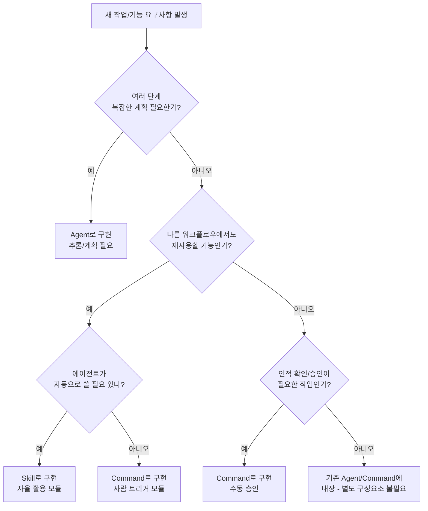

# AI Agent 아키텍처: Command, Skill, Agent 설계 가이드

## A. 개념 정의 & 경계 (정확한 분리)

### 용어 정합성 배경

"Command", "Skill", "Agent"라는 용어는 AI 에이전트 생태계마다 약간씩 다르게 쓰입니다.

| 프레임워크                       | 용어 사용                                            |
| -------------------------------- | ---------------------------------------------------- |
| OpenAI LangChain / 자율 에이전트 | "툴(Tool)"과 "액션(Action)" 중심, "Skill" 용어 드묾  |
| Cursor / Claude Code / OpenCode  | Commands, Skills, Agents 명확히 구분                 |
| Microsoft Semantic Kernel        | 함수 모음을 "Skill"이라 부르지만 "Command" 개념 없음 |

**Claude Code/OpenCode 기반 환경**에서는 Command/Skill/Agent가 공식적으로 정의되어 있으므로, 이 표준에 따라 개념을 구분합니다.

---

### Command (명령)

> **"무엇을 할지"** 에 대한 정확한 지시

**정의:**

- 주로 사람이 슬래시("/") 명령 형태로 직접 트리거
- 에이전트에게 특정 작업 수행을 결정적으로 요구
- 고정된 프롬프트 또는 절차를 담은 마크다운 스크립트
- 프로젝트 전역 또는 로컬에 저장
- 파일 이름이 슬래시 명령 이름이 됨 (예: `commands/deploy.md` → `/deploy`)

**입력/출력:**

- **Input:** 필요시 파라미터를 받아 프롬프트에 삽입 (예: `/release 1.2.3`)
- **Output:** 에이전트가 Command 내용을 실행한 결과로 산출하는 응답 또는 코드 변경

**상태/부작용:**

- 실행 시점에만 컨텍스트를 소비 (평소에는 부담 없음)
- 실행 시 실제 툴 호출이나 코드 변경 등의 부작용 발생 가능

**실패:**

- 툴 오류나 조건 불충족 시 즉시 오류 보고 또는 재시도
- 원인: 잘못된 인수, 툴 실패, 프롬프트 한계 등

**경계:**

- 사용자 또는 상위 에이전트가 **명시적으로 호출**하는 경우에만 동작
- 에이전트가 자동으로 Command를 선택하지 않음
- Skills처럼 조건부 로드되지 않음

---

### Skill (기술)

> **"어떻게 할지"** 에 대한 재사용 가능한 지식/절차

**정의:**

- 특정 도메인 또는 작업 영역의 전문 지식과 단계를 묶은 모듈
- 에이전트가 상황에 따라 알아서 로드하거나 사용자가 필요시 호출
- 폴더 단위(도메인 컨테이너)로 관리
- `SKILL.md` 메타데이터와 하위 워크플로우 파일들로 구성

**입력/출력:**

- **Input:** 트리거 조건(키워드, 상황)이 정의되어 있어 relevant 시 자동 로드
- **Output:** 독자적인 최종 출력 없음 → 에이전트 대화 컨텍스트에 주입되어 행동/응답 변화

**상태/부작용:**

- 주로 프롬프트 수준의 지식
- 필요시 스크립트나 리소스 파일(CLI 스크립트 등) 포함 가능
- Skill 자체는 상태를 가지지 않고 불러올 때마다 동일하게 동작

**실패:**

- 로딩 실패는 드묾 (키워드 매칭 안 되면 애초 로드 안 됨)
- Skill 내 절차 오류 시 에이전트가 해당 지시 수행 중 실패 가능

**경계:**

- 항상 에이전트의 맥락 속에서 동작
- **스스로 추론하거나 계획하지 않음**
- LLM이 Skill 사용 여부와 순서를 결정
- Command와 달리 **자동으로 Relevant 시 로드**되는 것이 핵심
- "에이전트가 아는 지식/절차"로 이해

---

### Agent (에이전트)

> **"누가 일을 수행하는가"** 에 해당

**정의:**

- 지능적인 작업 조정자
- LLM 인스턴스(혹은 프로세스)에 특정 역할과 목표를 부여한 것
- "작업자 프로필(worker profile)"이라고도 함

**주요 기능:**

- 사용자 입력이나 상위 명령(목표)을 받아 계획(Workflow/Plan) 수립
- 필요한 Skill을 선택 및 로드
- 적절한 툴(함수, CLI) 호출해 작업 수행
- 복잡한 문제 해결을 위해 여러 단계 추론
- 필요시 병렬로 **Sub-agent(하위 에이전트)** 생성해 작업 분담

**입력/출력:**

- **Input:** 사람의 프롬프트나 상위 시스템의 지시 → **목적(Goal)**으로 설정
- **Output:** 최종 결과(설명, 코드, 요약 등) 산출 또는 다른 agent/시스템에 전달

**상태:**

- 대화 내역, 진행 상황 등의 메모리/컨텍스트 유지
- 자체적인 시스템 프롬프트(역할 지침)과 도구 접근 권한 스코프 보유
- 필요시 독립된 컨텍스트 창 사용 (메인 에이전트 컨텍스트 오염 방지)

**부작용:**

- 툴을 통해 외부 세계에 영향을 미치는 모든 행위 실행
- 코드 수정, 웹 데이터 수집, CI 파이프라인 실행 등
- **권한 관리 및 제한이 중요한 계층**

**실패:**

- 목적 달성 불가, 무한 루프, 컨텍스트 초과, 툴 실패 누적 등
- 자체 휴리스틱으로 재시도하거나 중간 결과와 실패 원인 보고 후 종료

**경계:**

- 스스로 새로운 지식을 만들어내지 않음
- 주어진 모델과 Skill/Tool 내에서 작동
- 각 Agent는 **별도 시스템 프롬프트와 권한**을 가진 독립 실행 단위
- 하나의 Agent가 또 다른 Agent를 생성 가능 (격리된 컨텍스트에서 동작)
- Skill과의 차이: Skill은 정적 지식, **계획/추론 주체는 Agent**

**대안 용어 매핑 표:** 주요 프레임워크별로 위 개념과 유사한 용어를 정리하면:

#### Command (Cursor/Claude Code)

| 타 환경 용어 | 설명 |
|-------------|------|
| Workflow / Slash Command | Claude Code 문서에서 "Workflow"는 과거 "Command"와 동일 |
| Function / Tool Action | OpenAI 함수호출에서 미리 정의된 함수 호출 |
| Intent Trigger | 대화형 봇에서 사용자가 호출하는 특정 명령 |

#### Skill (Agent Skill 표준)

| 타 환경 용어 | 설명 |
|-------------|------|
| Skill | 동일 (IBM Watson Assistant 등에서 모듈화된 대화 스킬) |
| Knowledge Pack / Rule | Cursor 초기버전에서 Rules를 Skill처럼 사용 |
| Prompt Template / Chain | LangChain에서 특정 작업용으로 짜여진 체인 또는 프롬프트 세트 |

#### Agent (Claude/Cursor)

| 타 환경 용어 | 설명 |
|-------------|------|
| Sub-agent | Claude에서 사용자 정의 에이전트 |
| AI Worker / Bot | 일반적인 자율 에이전트 |
| Planner / Orchestrator | Semantic Kernel의 Plan은 Agent 유사 |
| Assistant Instance | OpenAI API에서 프롬프트에 따라 동작하는 어시스턴트 |

#### Tool (함수/API/CLI)

| 타 환경 용어 | 설명 |
|-------------|------|
| Tool | 동일 (LangChain 등) |
| MCP Function | Claude의 Model-Context-Protocol 툴 |
| Function (API) | OpenAI 함수 |
| Action | ReAct 프레임워크에서 LLM이 취하는 행동 |

> **요약:** Command는 환경에 따라 "Workflow"나 "Slash 명령"으로 불리며, Skill은 다른 맥락에서 "Rule"이나 단순 프롬프트 템플릿과 유사하게 취급될 수 있습니다. Agent는 흔히 "자율 에이전트" 혹은 "Subagent" (하위 에이전트) 등의 용어로도 불립니다.

**서로 혼동하기 쉬운 경계 사례 (10가지) – Q/A 형태 테스트:**

아래는 Command, Skill, Agent의 경계를 혼동하기 쉬운 사례 10가지를 질의응답으로 정리했습니다.

**1. Q: "커맨드(명령) 내부에서 여러 스킬을 순차로 호출해도 되나요?"**

**A:** 가능합니다.

- Command는 본질적으로 하나의 지정된 워크플로우를 실행하는 스크립트
- 그 절차 안에 여러 Skill을 로드하거나 여러 단계를 포함할 수 있음
- 예: `/release` 커맨드가 "release 스킬 로드 → 체크리스트 수행 → notification 스킬 로드 → 알림 전송"
- Command의 역할: 여러 작업을 단일 트리거로 묶어 편리하게 실행

**주의사항:**
- Command 자체는 정해진 순서를 따를 뿐 추론하지 않음
- 각 단계의 실행 성공 여부는 에이전트가 모니터링
- 실패 시 다음 단계 중단 또는 롤백 처리

**2. Q: "Skill이 LLM 프롬프트와 툴 호출까지 다 포함하면, 혼자 판단도 하니 에이전트랑 다를 게 없지 않나요?"**

**A:** 다릅니다.

**Skill의 특성:**
- 사전 정의된 지침 세트일 뿐 **스스로 판단(loop)**하지 않음
- "코드 변경 후 테스트 실행" 같은 절차가 쓰여 있어도, 실행 주체는 Agent
- 툴 호출 포함 시에도 Agent에게 "이렇게 써라"라고 알려주는 것
- Skill 파일 자체에 실행 엔진이 내장된 것이 아님

**Agent의 특성:**
- Skill 내용을 읽고 따라하며 순서 제어
- 도중에 분기나 추가 판단 필요 시 Agent가 수행
- 새로운 상황에 대해 자체 추론과 의사결정

> **비유:** Skill = "스크립트", Agent = "스크립트를 해석·실행하고 필요하면 응용"

**3. Q: "에이전트가 자동으로 어떤 Command를 사용할 수도 있나요?"**

**A:** 예, 특정 구현에서는 가능합니다.

**가능한 경우:**
- Cursor 등 일부 프레임워크에서는 에이전트가 상황에 따라 Command 자율 실행 가능
- "multi-step workflow" 요구 시, 등록된 Command를 발견하면 툴처럼 호출

**일반 원칙:**
- Command는 원칙적으로 사람의 명시적 지시를 위한 것
- Claude Code에서는 Command가 "Workflow"로 개념 재편
- 에이전트는 주로 Skill 기반으로 자율 행동
- Command는 수동 트리거가 원칙, 자동 의사결정에는 Skill/Tool 활용

**설계 권장사항:**
- 에이전트가 Command를 자동 호출하게 하려면
- → 그 Command 내용을 Skill로 승격시키거나 Agent logic에 통합하는 편이 더 명확

**4. Q: "사람이 직접 호출하지 않아도 항상 적용돼야 하는 지식이라면 Skill 대신 뭐가 좋을까요?"**

**A:** **Rule(규칙)**을 사용하는 것이 적합합니다.

**Skill의 한계:**
- "코딩 스타일 가이드"처럼 모든 요청에 항상 적용되어야 하는 지침
- Skill로 만들면 관련 키워드에만 반응하므로 누락될 수 있음

**Rule 적용 방법:**
- 시스템 프롬프트의 항상적 규칙으로 설정
- Cursor의 `.cursor/rules/`에 상시 적용 규칙으로 추가

**정리:**
- 전역 불변 규칙 → Agent의 기본 지식이나 별도 Rule
- Skill → **"필요할 때 추가되는 모듈"**로 한정

**5. Q: "Command와 Skill 둘 다 재사용 가능한데, 언제 Skill로 만들고 언제 Command로 만들까요?"**

**A:** 사용 방식과 역할에 따라 결정합니다.

| 구분 | Skill | Command |
|------|-------|---------|
| **사용 시점** | 에이전트가 필요를 스스로 인지해서 로드 | 사용자가 그 시점을 지정하여 실행 |
| **용도** | 다른 Skill이나 Agent에서도 참조 가능한 모듈 | UI 단의 단축키처럼 조합된 작업 호출 |
| **내용** | 논리나 정책을 담음 | 조합된 작업 실행 |

**선택 기준:**
- "이 기능을 에이전트가 언제 쓸지 스스로 판단하게 둘까?" → **Skill**
- "매번 내가 명령해서 쓰게 할까?" → **Command**

**6. Q: "여러 Agent가 있는데, 하나의 Skill을 함께 써도 되나요?"**

**A:** 예, Skill은 범용 모듈이므로 여러 에이전트가 공유 가능합니다.

**공유 가능성:**
- 예: Logging Skill → 개발자용 에이전트, 테스트용 에이전트 모두 사용 가능
- Claude나 Cursor 환경에서는 Skill이 개방형 표준
- 여러 플랫폼 간에도 호환 가능하게 설계됨

**주의사항:**
- 각 Agent는 자신의 권한/역할 범위 내에서만 Skill 활용
- 특정 툴(예: 배포 권한) 필요 시, 해당 툴 접근권한이 있는 Agent에서만 정상 작동
- 동시성 문제는 보통 없으나, Skill이 같은 리소스(예: 임시 파일)를 수정하는 설계는 피할 것

**7. Q: "한 에이전트 내부에서 모든 걸 다 처리하게 만들면 Skill이나 Sub-agent가 꼭 필요할까요?"**

**A:** 권장되지 않습니다. 모든 지침을 하나의 Agent에 집어넣는 것은 안티패턴입니다.

**문제점:**
- 처음에는 간단해 보여도 Agent 프롬프트가 비대해짐
- 중복이 생겨 관리 어려움과 혼동 발생
- Claude도 "에이전트는 간결하고 특화될수록 좋다"고 평가

**Skill/Sub-agent의 장점:**

| 방법 | 효과 |
|------|------|
| Skill로 지식 분리 | 여러 Agent간 중복 제거, 컨텍스트 절약 |
| Sub-agent로 역할 분리 | 병렬처리 가능, 컨텍스트 관리 유리 |

**권장사항:**
- 공통 로직 → Skill로 모듈화
- 독립 작업 → Sub-agent로 분리

**8. Q:** "Skill이 너무 많아지면 오히려 에이전트가 뭘 써야 할지 혼란스럽지 않을까요?"

**A:** Skill 폭발은 관리로 해결 가능합니다.

**시스템적 해결:**
- Skill이 수십 개 넘어서면 Claude 등은 Skill 디스커버리 통해 관련된 몇 개만 로드
- 잘 설계된 환경에서는 Agent가 프롬프트 분석 → 가장 어울리는 Skill 선택
  - 키워드 매칭
  - vector search
- Skill 수가 많아져도 성능상 큰 문제 없음

**관리자 역할:**
- 각 Skill에 "언제 써야 하는지" 명확한 설명 기술
- 중복되는 Skill 정리
- 도메인별로 Skill 카테고리화
- 사용 빈도 낮은 것 주기적으로 아카이빙 또는 통합

**예시:**
- "데이터베이스\_\*" 스킬 5개 → 하나의 "Database" Skill에 워크플로우 5개로 묶기
- Agent 혼란 감소 + 유지보수 용이

**9. Q:** "Command를 남발하면 안 좋나요? 예: build-api, build-ui 따로 커맨드 2개 vs build 스킬 하나."

**A:** 과도한 커맨드 분리는 피하십시오.

**문제점:**
- Command 개수가 너무 많으면 사용자가 기억하거나 찾기 어려움
- Skill 기반 자동화와 충돌 가능성

**권장 해결책:**
- 비슷한 작업을 하는 여러 Command → 하나의 Skill + 하나의 Command로 통합
- 예: `/build-api`, `/build-ui` (절차 유사) → 공통 Build 스킬 + `/build api` 파라미터로 분기

**원칙:**
- Command 목록은 적고 기억하기 쉽게, 안정적으로 유지
- 세부 로직은 Skill에 위임
- 커맨드 = UI/UX 편의 수단 (로직 보관 수단 아님)
- 같은 종류의 작업은 하나의 Command로 일원화

**10. Q:** "Skill에 담긴 절차가 매번 반드시 실행돼야 한다면, 굳이 Skill로 둘 필요 없이 그냥 Command로 만드는 게 낫나요?"

**A:** 그렇습니다.

**Skill의 특성:**
- 에이전트가 **"필요시 사용"**하는 옵션
- 특정 시나리오에서 항상 쓰이는 절차라면 Skill로 분리하는 이점 적음

**권장 설계:**
- 매번 실행되어야 하는 절차 → Command나 Agent 본연의 워크플로우에 직접 포함
- 예: "사용자 로그인 후 audit 로그 남김"
  - Skill로 분리 시 → 에이전트가 놓칠 위험
  - → Agent의 기본 시나리오에 포함 또는 Command 시퀀스의 한 단계로 명시

**Skill로 분리하는 경우:**
- 여러 시나리오에서 간헐적으로 재사용될 때
- 분리해 관리할 가치가 있을 때로 한정

## B. 관계 모델 (연관 구조)

### 1. 계층 구조 (Hierarchy)

시스템 구성은 계층적으로, 상위 계층이 하위를 오케스트레이션하는 형태를 취합니다.

```
Agent (최상위)
  └── Workflow/Plan (계획)
        └── Command / Skill
              └── Tool (API, CLI, 함수)
```

#### Agent 계층

- 사용자 의도를 받아 목표 설정
- 고유한 컨텍스트/역할로 추론 및 계획 수행
- 필요시 여러 Sub-agent를 병렬 생성하여 작업 병렬화
- 어떤 Skill과 Command를 사용할지 결정
- 툴 접근 관리

#### Command/Workflow 계층

- Agent가 수행해야 할 구체 절차를 실행
- Claude Code에서 "Workflow"는 Commands와 유사한 의미
- Skill 및 Tool 호출 순서를 기술한 미니 스크립트
- Command가 없으면 Agent가 자체 Plan에 따라 Skill/Tool을 직접 호출

#### Skill 계층

- Agent가 특정 도메인 작업 필요시 대응하는 Skill 로드
- 한 번에 여러 Skill 함께 로드 가능 (예: tanstack + panda-css)
- 추가 지식, 체크리스트, 템플릿 등을 Agent에게 제공
- Agent는 Skill이 제시한 워크플로우대로 Tool 호출

#### Tool 계층

- 실제 프로그래밍 함수, 외부 API, CLI 명령, DB 쿼리 등 실행
- 예: 파일 검색 툴, gh CLI 실행
- 실행 결과(JSON, 명령 출력 등)는 다시 Agent에게 반환

---

**계층 분리의 장점: 관심사의 분리**

| 계층 | 역할 |
|------|------|
| Agent | "무엇을 할지" (플랜/의사결정) |
| Skill | "어떻게 할지" (검증된 절차 제공) |
| Tool | 실제 실행 |

**예시:** Agent가 "이 코드를 리팩토링하자" 결정 → Skill이 tanstack 사용법 제공 → Tool이 파일쓰기 실행

**구조가 깨지는 경우:**
- Agent에 상세 절차까지 하드코딩 → Skill 계층 이점 상실
- Skill이 무분별하게 툴을 직접 실행 → Agent 통제 없이 부작용 발생

### 2. 계약 (Contract) – 계층 간 I/O 및 예외 정책

각 계층은 인터페이스(입출력)와 실패 처리 규약을 명확히 가져야 합니다.

---

#### Agent Contract

Agent는 **사용자로부터 목표/요청(Input)**을 받고 **해결책(Output)**을 반환합니다.

**입력 형태:**
- 자유 자연어
- 상위 시스템이 준 구조화된 명세(JSON)

**출력 형태:**
- 사용자에게 보여줄 답변
- 생성된 코드
- 보고서 등

**실패 시 처리:**

| 상황 | 처리 방식 |
|------|-----------|
| 타임아웃 | 지정된 시간/스텝 내에 완료 못 하면 `ERROR_TIMEOUT` 형태로 알림 |
| 툴 오류 | 일정 횟수(예: 3회)까지 자체 재시도, 불가 시 사용자에게 추가 정보 질문 |
| 필수 필드 누락 | 즉시 오류 반환 (예: `{"error": "missing field X"}`) |

**Skill/Tool 상호작용 계약:**
- Skill 로드 시 description 필드만 먼저 읽어 컨텍스트에 최소한만 추가
- 실제 본문은 필요할 때 Lazy-load (토큰 최적화)
- Tool 호출은 함수 시그니처에 맞게 JSON 인자를 넣고, 반환값 JSON을 파싱
- Tool이 예외/오류를 throw하면 `failure_reason` 등의 표준 필드로 처리

> **요약:** Agent 계약 = "이런 입력이 오면 내부적으로 Skill/Tool을 활용하여 이런 형태의 출력을 돌려준다. 실패 상황에서는 표준 에러 응답을 준다. 진행 중 적정 횟수와 시간 이내에 완료 못 하면 중지하고 보고한다."

---

#### Command Contract

Command는 파라미터화된 프롬프트 템플릿으로서, 정해진 인자와 결과 형태를 가집니다.

**입력 계약:**
- 예: `/deploy <env>` 커맨드는 `<env>` 인자로 `dev`/`prod`만 허용
- 잘못된 값 입력 시 `ERROR: invalid environment` 출력
- `${1}`, `${2}` 같은 위치 매개변수를 통해 입력 소비
- Agent는 사용자가 준 인자를 해당 위치에 삽입해 프롬프트 완성

**출력 계약:**
- Command 자체는 최종응답이 아닌 절차
- 완료되면 Agent가 작업 결과를 요약해주거나 산출물 제공
- 예: `/code-review` 실행 후 "코드 리뷰를 완료했습니다" + 발견된 이슈 목록

**실패 처리:**
- 내부 툴 실패 시: `<툴이름> FAILED: <reason>` 형식으로 보고
- idempotent 설계: 같은 파라미터로 두 번 실행해도 시스템 무결성 유지
- dry-run 모드 지원 (예: `/deploy --dry-run`)
- 타임아웃 정책 명시 (예: 배포 5분 내 미완료 시 `ERROR: Deployment timed out`)

> **핵심:** Command는 입력 인자 → 프롬프트/Skill → 툴 → 출력의 플로우를 갖는 작은 프로그램으로 취급하여 Input/Output/Failure 조건을 명세해야 함

---

#### Skill Contract

Skill은 Agent에 제공되는 모듈식 기능이므로, **트리거**와 **내용**의 계약이 핵심입니다.

**트리거 계약:**
- Skill의 메타데이터(YAML frontmatter)에 `name`, `description`, `USE WHEN` 키워드 정의
- "프롬프트에 X 키워드나 상황이면 이 Skill을 로드한다" 명시
- "이 Skill은 이런 상황에는 쓰지 않는다" 명시
- 예: Logging Skill의 description에 `USE WHEN: code logging, debug` / `DO NOT USE WHEN: database transaction`

**내용 계약:**
- Skill 본문에 지시사항의 형식과 의도 기술
- 예: "이 Skill이 로드되면, Agent는 반드시 3단계 체크리스트를 수행한다"
- Tool(script) 동반 시 해당 툴의 입력/출력 계약도 포함
- "성공 기준" 섹션 제공 시 Agent는 해당 기준으로 작업 완료 여부 판단

**오류/예외 처리:**
- Skill 자체 로드 실패는 드묾
- Skill 내 오류(예: 오타)가 Agent 수행 중 오류 유발 가능
- Agent는 Skill명을 밝히며 오류 보고 (예: `ERROR in Skill 'X': ...`)
- 또는 Skill 없이 플랜 B 시도

**시간/리소스 정책:**
- 자동 로드 시 최대 병렬 로드 개수 제한
- 한 번에 컨텍스트에 넣는 토큰 수 제한
- Anthropic Claude: description만 우선 참고, 필요한 Skill만 풀 삽입 (토큰 최적화)

> **왜 중요한가?** Skill은 여러 사람이 작성하고 Agent가 자동선택하므로, 명확한 계약이 없으면 잘못된 Skill이 불려 엉뚱한 행동을 할 수 있음

---

#### Tool Contract

Tool은 대부분 함수 시그니처나 CLI 인터페이스로 정의됩니다.

**정의 방식:**
- 함수형 툴: JSON Schema로 인자 타입/필수여부/반환 구조 명세
- CLI 툴: 명령어 옵션과 출력 포맷 정의
- Agent(혹은 Skill)는 이 스키마를 준수하여 호출

**오류 처리:**
- API 호출: HTTP 상태코드나 에러메시지 반환
- CLI: 종료코드나 stderr
- Agent는 `exit code != 0`이면 실패로 인지
- 사용자에게 `TOOL_FAILED` 같은 표준 에러 전달

**시간 제한:**
- 각 툴 호출은 개별 타임아웃/재시도 정책 보유
- 예: 웹 검색 툴은 30초 후 타임아웃

**보안:**
- 툴은 Agent 권한 범위 내에서만 작동
- 예: "파일삭제 툴"은 prod 디렉토리 접근 불가

**데이터 계약:**
- 반환 데이터의 단위와 의미 문서화
- 예: Embedding 툴은 항상 1536차원 벡터를 float32로 반환

> **핵심:** Tool 계층 계약은 외부 시스템과 Agent 간의 API 계약이므로, 일반 소프트웨어 API 설계와 동일한 엄밀함이 요구됨

요약하면, 각 계층은 상하위와 주고받는 입력/출력 형태, 에러 처리, 시간/자원 한계 등을 명확히 정의해야 합니다. 이를 지키면 시스템이 예측가능하고 견고해집니다. 만약 계약을 어길 경우 (예: Skill이 예상보다 큰 텍스트를 내보내 컨텍스트를 초과), 상위 계층에서 이를 통제하거나 잘라내는 식으로 디폴트 안전장치를 마련해 두는 것도 필요합니다.

### 3. 운영 (Ops) – 버전 관리, 테스트, 모니터링, 롤백

AI 에이전트 시스템도 소프트웨어와 마찬가지로 운영/유지보수 원칙이 필요합니다.

---

#### 버전닝 (Versioning)

Commands, Skills, Agents 각각에 버전 식별을 부여하는 것이 좋습니다.

**버전 관리 방법:**
- Skill 폴더에 CHANGELOG 두기
- Skill YAML frontmatter에 `version: 1.2` 필드 추가
- 스킬/커맨드 변경 시 팀원에게 공지
- 버전 충돌 시 구버전 파일 유지 여부 결정
- 플러그인 형태 배포 시 (예: Claude Plugins) 버전별 릴리즈 관리

**하위호환성:**
- 새로운 Skill/Command는 이전 버전과 동일한 인터페이스 유지
- 큰 변경은 새 이름이나 major 버전으로 분리
- Agent의 프롬프트 구조나 사용 방법 변경 시 `Agent v2` 식으로 명시

**운영 전략:**
- 프로덕션 환경에는 안정 버전만 배포
- 실험적 변경은 별도 브랜치/폴더 (예: `.assistant_dev/`)에서 시험 후 머지
- 버전 관리는 문서화하고 팀원 합의하에 적용

---

#### 테스트 (Testing)

에이전트 구성요소는 단위 테스트 + 통합 테스트 전략을 가져갑니다.

**유닛 테스트:**
- Command와 Skill은 입력 프롬프트에 대한 예상 출력을 검증
- 예: `/add-user John` Command 실행 → "User John created" 포함 확인
- Skill 유닛 테스트: Skill 로드 시 Agent 행동 변화 시뮬레이션
- 예: Skill의 체크리스트 항목이 실제로 이행되는지 log 확인

**통합 테스트:**
- 전체 에이전트 워크플로우를 시나리오별로 검사
- 예: "버그 → 수정 → PR생성" 에이전트 테스트
  - 가상 코드베이스와 버그 제공
  - Agent가 PR까지 만드는지 관찰
- Mock Tool 사용 (예: Git 툴 모킹하여 push 없이 응답만 흉내냄)
- 성능 측정

**시뮬레이션:**
- 중요한 워크플로우는 dry-run으로 정기 시뮬레이션
- 예: 배포 에이전트는 staging 환경에서 주기적 실행
- LLM 응답의 비결정성 고려 → 테스트 여러 번 반복하여 신뢰도 향상
- 모든 테스트는 CI에 통합 → 새 Skill/Command 추가 시 자동 검증
- hallucination이나 정책 위반 조기 발견 (Anthropic eval 등 활용)

---

#### 관측 (Observability)

운영중인 에이전트 시스템은 로그, 추적, 메트릭 수집으로 투명하게 모니터링되어야 합니다.

**로그:**
- Agent가 실행한 모든 Command, Skill 로드, Tool 호출을 시간순 기록
- 각 로그 항목엔 trace ID나 세션 ID 첨부
- 특정 사용자 요청 → 하위 에이전트 → 커맨드 → 툴 호출까지 연결된 흐름 추적
- 예: `trace abcd-1234`로 "사용자 요청 수신 → Agent Plan 수립 → Skill X 로드 → Tool Y 호출 → 완료" 전체 로깅

**메트릭:**
- 주요 성능 지표 수집:
  - 평균 토큰 사용량
  - 응답 시간
  - 성공률
  - 재시도 횟수
  - 오류 유형 빈도
- 계층별 통계: "어떤 Skill이 몇 번 호출됐는지", "특정 Command 실패율은?"
- 대시보드로 시각화 → 이상 징후(예: 실패율 급등) 빠르게 감지

**트레이싱:**
- OpenTelemetry 같은 분산 트레이싱 개념 도입
- Agent 내 의사결정 경로 재구성
- 주요 단계에 태그를 달아 자동 추적
- 외부 API 호출 시 응답시간 등 추적 → 병목 파악

**알림:**
- 오류나 중요한 이벤트 발생 시 팀 채널로 알림
- 예: "배포 에이전트 3회 연속 실패 - 확인 필요"
- 관측을 철저히 해 두면 근본원인 분석과 개선 속도 향상

---

#### 롤백 (Rollback)

잘못된 Skill/Command/Agent 업데이트로 문제가 생길 경우, 신속히 이전 안정 상태로 돌아갈 수 있어야 합니다.

**버전 롤백:**
- Git 등 형상관리를 활용하여 이전 버전 태그
- 문제 발생 시 해당 버전으로 revert
- 런치 다크리 방식: 새 버전을 특정 사용자나 퍼센트만 적용
- Agent 이중화: 새 버전 오류 시 즉시 세션 종료 → 이전 Agent 인스턴스로 재시도

**상태 롤백:**
- 에이전트 실행 도중 부작용 발생 시 (예: 파일 생성, 권한 변경)
- 사전에 정해둔 정리 절차로 원상복구
- 예: "새 프로젝트 생성" 에이전트 중간 실패 → 만든 파일들 삭제하는 롤백 커맨드 실행
- 외부 시스템 영향 시 (배포, 결제 등) 트랜잭션적 대응 필요

**사용자 안내:**
- 롤백 발생 시 "X작업이 실패하여 이전 상태로 복구했습니다" 알림
- 롤백 상황 자체도 로그에 남기고 원인 분석
- 다음 패치에 반영

---

#### 요약: 왜 이런 구조가 좋은가?

| 관점 | 장점 | 깨지는 경우 |
|------|------|-------------|
| **계층 구조** | 모듈화와 역할분리를 통해 복잡성 관리, 재사용성 극대화 | 경계가 모호해지면 (예: 모든 걸 하나에 집어넣음) |
| **계약** | 명확한 인터페이스 정의로 예측 가능, 디버깅 용이 | 암묵적 가정에 의존해 구현 시 (예: 문서화 없이 Skill 작성) 호환성 문제 발생 |
| **운영** | 철저한 버전/테스트/모니터링으로 신뢰성 담보 | 운영절차 없이 변경을 일방적으로 하면 장애와 혼란 발생 |

## C. "언제 무엇을 만들지" 결정 규칙 (결정 트리 + 체크리스트)

**결정 트리 (Designation Flowchart):**



상기 의사결정 다이어그램을 텍스트로 설명하면:

**1. 작업이 다단계 복잡한가?** 예: 단일 프롬프트로 끝나지 않고, 계획/분기/반복이 필요한 문제인가?

- 예 → 새로운 Agent를 고려합니다. (이 작업은 여러 하위 작업으로 구성되고, 스스로 사고/추론하면서 진행해야 하므로 Agent 적합)
- 아니오 → (단계 2로)

**2. 이 기능이 여러 워크플로우에서 재사용되나?** 즉, 모듈화 가치가 있는가? (다른 곳에서도 써먹을 전문 루틴인가?)

- 예 → (단계 3로)
- 아니오 → (단계 4로)

**3. 에이전트가 자동으로 이 기능을 쓸 필요가 있나?** 사용자가 매번 지시하지 않아도, 상황에 따라 에이전트가 알아서 활용해야 하는 지식/절차인가?

- 예 → Skill로 구현. (Agent의 "두뇌" 일부로서 언제든 꺼내 쓰도록)
- 아니오 → Command로 구현. (재사용은 되지만, 항상 명시적 호출이 원하는 경우)

**4. 사람의 확인이나 승인이 필요한 작업인가?** (위험하거나 비용이 큰 작업으로, 자동 실행은 위험하고 사용자가 일일이 트리거/확인해야 안전한가?)

- 예 → Command로 구현. (사용자 승인 하에 실행되도록 함. 예: 프로덕션 배포)
- 아니오 → 새 구성요소 불필요. (그냥 기존 Agent의 한 단계로 충분히 처리 가능하므로, 굳이 Skill/Command/Agent 분리 안 함)

이 결정 흐름에 따라, 주어진 요구사항이 Agent인지 Skill인지 Command인지 빠르게 분류할 수 있습니다.

**설계 선택 체크리스트:** (각 질문에 "예/아니오"로 답해보며 결정)

| 질문 | 예시 상황 | 결론 |
|------|-----------|------|
| **재사용성 높은가?** | 여러 다른 에이전트/명령에서도 이 로직을 사용할 듯하다 | → Skill 후보 |
| **외부 부작용/위험 있는가?** | 시스템 변경, 데이터 삭제, 비용 발생 | → Command로 사용자 승인 거치게, 또는 Agent에 컨펌 단계 포함 |
| **사람이 직접 트리거해야 하나?** | 특정 시점에만 실행, 자동화 불필요 | → Command 적합 |
| **결정론적 안정성 필요?** | 매번 같은 입력에 거의 같은 결과 필요 | → Skill/Command에 절차 명시 또는 룰기반 처리 (Agent 자유 추론보다 안전) |
| **멀티스텝 계획/분기 필요?** | 조건에 따라 다른 조치, 루프 돌 가능성 | → Agent 필요 (Skill/Command는 고정 순서만) |
| **보안/권한 경계 있는가?** | 고객 데이터 접근, 권한 제한, 격리 필요 | → 별도 Agent로 격리 또는 Command로 분리해서 권한 통제 |
| **실행 비용이 큰가?** | API 비용, 모델 토큰 대량 소모 | → 명시적 Command로 남용 방지 또는 Agent에 캐싱/재확인 단계 |

**활용 방법:**
- "YES"가 많은 쪽으로 무게를 두고 설계
- 재사용성 Yes + 부작용 Yes → Command로 구현하고 내부에 Skill 재사용
- 재사용성 낮고 단순 → 별도 구성요소 없이 기존 Agent에 절차 추가

## D. 설계 템플릿 (스펙 폼)

아래에 Command, Skill, Agent 각각에 대한 표준 스펙 작성 템플릿을 제공합니다. 실무에서 이 폼을 복사하여 각 구성요소의 명세서를 작성하면 됩니다.

### 1. Command Spec Template

**Command Name:** `<짧고 명확한 명령 이름>`  
**Purpose (목적):** 이 Command의 의도와 하는 작업을 한 줄로 명시.

- _예:_ `/deploy` – _“지정한 환경에 최신 코드를 배포한다.”_

**Out of Scope (비목적):** 이 Command가 수행하지 않거나 다루지 않는 범위 명시.

- _예:_ “인프라 프로비저닝은 하지 않으며, 배포 실패시 롤백은 담당하지 않음.”

**Inputs (입력 스키마):**

- **Parameters:** 허용하는 인자/옵션 목록과 의미, 타입.
  - _예:_ `<env>` (string) – 배포 대상 환경, `"dev"` 혹은 `"prod"` 중 하나.
  - _예:_ `--dry-run` (flag) – 실제 배포하지 않고 단계 검증만 수행.
- **Input Example:** 실제 호출 예시를 함께 기술.
  - _예:_ `/deploy prod --dry-run`

**Process (절차):** Command 실행 시 수행되는 내부 절차를 순서대로 기술. (필요시 pseudo-code 사용)

1. 입력 파라미터 유효성 검사 (예: `env` 값 체크).
2. 관련 Skill 로드 (예: `Deployment` 스킬 로드하여 체크리스트 확보).
3. 툴 실행 (예: `deploy_script.sh env=... dry-run` 실행).
4. 결과 확인 및 성공/실패 분기 처리.
5. 사용자에게 요약 결과 응답 생성.

**Output (출력 스키마):** Command 실행 후 Agent가 사용자에게 제공하는 출력 형태.

- **Success:** 성공 시 메시지 또는 산출물 형식.
  - _예:_ “✅ Deployment to **prod** successful. (Version 1.2.3 deployed)”
- **Failure:** 실패 시 오류 표준 형식.
  - _예:_ “❌ Deployment failed – _Timeout connecting to server_”
- **Output Artifacts:** 생성/변경되는 외부 리소스.
  - _예:_ 배포 로그 파일 (`logs/deploy_<env>.log`) 업데이트.

**Failure Modes & Errors (실패 모드 및 에러 코드):** 가능한 실패 시나리오와 처리 방법 명시.

- _예:_ `INVALID_ENV` – 지원하지 않는 환경 인자 → **즉시 오류 응답**, 배포 시도 안 함.
- _예:_ `DEPLOY_TIMEOUT` – 배포 스크립트 타임아웃 → **오류 메시지 반환**, (필요시) **클린업** 시도.
- _예:_ `DEPLOY_PARTIAL_FAIL` – 몇 개 서비스만 배포됨 → **경고 메시지** + **추가 조치 가이드** 제공.

**Safety Constraints (안전장치):** 보안/권한/실행상의 안전 조치.

- _Security:_ 프로덕션(`prod`) 배포는 **추가 확인 질문** 요구. (예: “Are you sure?”)
- _Permission:_ 에이전트가 이 Command 실행시 **특정 IAM 역할**로만 수행 (권한 격리).
- _Dry-run:_ 기본적으로 `--dry-run`모드로 실행 후 사용자 확인 받거나, `--force` 옵션이 있어야 실제 실행.
- _Rate Limit:_ 하루 한 번만 실행 가능하도록 제한 (중복 배포 방지).

**Versioning (버전/호환성):**

- **Current Version:** v1.0 (2026-01-24) – 최초 작성.
- **Change Log:**
  - v1.1 – _변경예정:_ 환경별 다른 스크립트 지원 추가 예정.
- **Backward Compatibility:** v1.x 대에서는 입력 파라미터와 출력 포맷 유지. v2.0에서 파라미터 변화 가능.

**Testing (테스트 전략):**

- **Unit Tests:** 각 인자 조합별로 마크다운 명령 파일을 small context 에이전트로 실행, 기대 응답 검증.
  - _예:_ `/deploy dev` → “successful” 포함 응답 확인. `/deploy invalid` → “INVALID_ENV” 오류 확인.
- **Integration Tests:** 실제 스테이징 환경에 dry-run으로 실행해 로그/시스템 영향 확인. (CI 파이프라인 nightly)
- **Simulation:** 프로덕션에 대해 dry-run 모드로 정기 실행해, 스크립트/API 변경으로 인한 실패 조기 감지.

**Observability (관측):**

- **Logging:** 실행 시 각 단계 (검증, 스킬로드, 툴호출 결과)를 `COMMAND=deploy` 태그와 함께 로그.
- **Metrics:** `deploy_success_count`, `deploy_failure_count`, `deploy_duration_ms` 메트릭 수집 및 대시보드화.
- **Traceability:** Trace ID를 상위 Agent 대화와 연동해 저장. 문제 발생 시 해당 ID로 전체 과정 재현 가능.
- **Notifications:** prod 배포 성공/실패 결과를 슬랙 채널에 알림.

**Owners & Reviewers:**

- **Owner:** DevOps팀 – Alice (alice@example.com)
- **Reviewer:** ML Platform팀 – Bob, 및 시큐리티팀 – Charlie (승인자 목록)

**Notes:** (기타 참고사항)

- 실제 배포는 사전에 CI 파이프라인을 통과한 artefact에 대해서만 진행됨.
- 이 Command 실행 전에 Agent는 코드 변경사항이 모두 커밋되었는지 확인하는 것이 좋음 (추후 검토).

### 2. Skill Spec Template

**Skill Name:** `<Domain>.<Skill>` (도메인과 스킬 식별자)  
**Description (목적/사용처):** 해당 Skill이 다루는 문제 영역과 사용 트리거를 상세히 기술.

- _예:_ **logging skill** – _“코드에 로깅 추가/수정 작업 시 사용. 다른 맥락에서는 사용하지 말 것. (Use when: adding log statements or adjusting log levels. Do NOT use when: database transactions or UI text.)”_ [oai_citation:74‡youngleaders.tech](https://www.youngleaders.tech/p/claude-skills-commands-subagents-plugins#:~:text=1,for%20skills)

**Not for Use (비목적/한계):** 에이전트가 이 Skill을 잘못 사용하면 안 되는 경우나 한계.

- _예:_ “Debugging 상황에는 이 스킬이 도움 안 됨 – 대신 debug skill 사용”
- _예:_ “거대한 로그 데이터 분석에는 본 스킬 비적합 (context 한계)”

**Skill Files Structure:** (SKILL.md 및 부속 파일 구성)

```
skills/
└── logging/                    # Domain folder (kebab-case)
    ├── SKILL.md                # 메인 스킬 정의
    ├── workflows/
    │   ├── add-log.md          # 새 로그 추가 절차
    │   └── adjust-level.md     # 로그 레벨 조정 절차
    └── tools/
        └── format_log.py       # (예시) 로그 포맷 검증 스크립트
```

- **Context Files:** SKILL.md 외 참고로 불러올 추가 문서가 있으면 명시.
  - _예:_ `Conventions.md` – 프로젝트 공통 로깅 컨벤션 설명 (SKILL.md 본문에서 참조함).
- **Tools:** 동반하는 툴/스크립트 설명 및 경로.
  - _예:_ `tools/format_log.py` – Python script, 인자로 로그 메시지 주면 포맷 규칙 검사, 결과 JSON 리턴.

**Skill Triggers (트리거 조건):** 에이전트가 이 Skill을 언제 로드해야 하는지 구체적 패턴.

- _예:_ 사용자 요청이나 Agent 목표에 **“log”, “logging”, “로그레벨”** 키워드 포함 → Trigger.
- _예:_ 파일 변경 맥락에서 `*.log` 파일이 대상일 때 → Trigger.
- _Negative Triggers:_ _“사용자가 ‘로그’ 단어를 쓰더라도, `logistics`처럼 다른 의미면 무시”_
- **Trigger Implementation:** (프레임워크 상 구현 방법)
  - _예:_ Claude Skill YAML frontmatter의 `description`에 _USE WHEN_ 절에 키워드 나열.

**Inputs to Skill:** Skill이 전제로 하는 컨텍스트나 변수. (명시적인 함수 인자는 아니지만, **필요한 전제**를 기술)

- _예:_ “에이전트가 현재 편집 중인 코드 파일 내용” (Skill 내용에서 `<<file_content>>` placeholder로 참조).
- _예:_ “사용자가 원하는 로그 레벨 (e.g., INFO→DEBUG)” – Agent가 파악해놔야 함.

**Skill Content (내용 설명):** SKILL.md와 워크플로우들의 논리와 역할을 서술.

- **Overall Structure:**
  - SKILL.md: YAML frontmatter + 본문에 **Workflow Routing 표** 및 **스킬 설명**.
  - Workflows: 각각 세부 작업 절차 (예: add-log.md는 1)로그 위치 결정 2)코드 삽입 3)포맷 검증 4)테스트 등).
- **Example Workflow:** (한 워크플로우의 요약)
  - _예:_ **add-log.md** – “Agent가 이 워크플로우를 실행하면, 함수 시작 부분에 진입 로그를 추가하도록 안내. 1) 함수 이름과 입력값 식별, 2) 해당 위치에 `logger.info()` 코드 삽입, 3) `format_log.py` 툴로 메시지 포맷 검사, 4) 결과 요약.”
- **Skill Usage in Agent:**
  - _예:_ “Agent는 SKILL.md 로드 후, `## Workflow Routing` 테이블을 읽어 **사용자 의도에 맞는 워크플로우 파일**을 선택 실행함. ‘로그 레벨 변경’ 키워드 감지 시 adjust-level.md 로 진행.”

**Output/Effect:** Skill 적용으로 기대되는 Agent의 행동이나 외부 효과.

- _예:_ “Agent will produce a code diff adding the log line.”
- _예:_ “Agent’s answer includes a confirmation that logging conventions were followed.”
- (Skill 자체 출력 없음지만, Agent 결과의 특징 기술)

**Quality/Validation Points (안정성/검증 포인트):** Skill 내용의 정확성 및 안전장치.

- _예:_ “삽입된 로그 코드가 컴파일 에러를 일으키지 않도록, 성공 조건에 `build passes` 포함.”
- _예:_ “Format 검증 스크립트 에러 시, Agent는 ‘포맷 검증 실패’ 경고만 주고 진행 계속 (치명적 중단 안 함).”
- _예:_ “Skill 실행 후에도 결과가 기대와 다르면 Agent는 사용자에게 확인 질문을 해야 함 (‘이 로그 추가로 원하는 정보가 출력되나요?’).”

**Failure Modes:** Skill 적용 시 잘못될 수 있는 상황과 대응.

- _예:_ **NoLogLib:** 코드에 로깅 라이브러리 임포트가 안 된 경우 → Agent가 “logging 라이브러리 임포트 필요” 알림 후 import 구문 추가 단계 포함.
- _예:_ **MultiChoice:** 로그 삽입 위치가 여러 군데 나와 Agent가 혼란 → Agent는 Skill 지침에 따라 최적 위치 하나만 선택, ambiguous하면 사용자에게 물어봄.

**Testing (테스트 전략):**

- **Unit (Prompt) Test:** Skill의 Workflow가 제대로 작동하는지, 작은 예제로 Agent에 주입하여 시뮬레이션.
  - _예:_ 간단한 함수 코드에 “로그 추가” 요청 + 이 Skill만 로드 → Agent가 로그 한 줄 추가한 diff 생성 확인.
- **Integration Test:** 실제 Agent 전체에 Skill 포함해 사용자 시나리오 테스트.
  - _예:_ 사용자가 “이 함수에 디버그 로그 넣어줘” 요청 → Agent가 logging skill 로드하고 결과 주는지 확인.
- **Negative Test:** Skill 트리거가 오작동하지 않는지 테스트.
  - _예:_ “배송(logistics) 모듈 수정” 요청했을 때 logging skill이 로드되지 않는지 검증.
- **Automated Validation:** Skill 내 포함된 툴(`format_log.py`)을 단위 테스트 (올바른 포맷/잘못된 포맷 입력 케이스).

**Observability (관측):**

- **Usage Logging:** 이 Skill이 로드될 때 로그에 `SKILL=Logging loaded (trigger=keyword 'log')` 식으로 기록.
- **Metrics:** `skill_logging_usage_count`, `skill_logging_success_rate` 측정. (성공률은 Skill 적용 후 Agent 작업이 오류 없이 끝났는지로 계산)
- **Performance:** Skill 본문 토큰 수와 실제 투입 빈도를 모니터링하여, 평균 토큰 증량을 파악. (너무 크면 분리 고려)
- **Feedback Collection:** 에이전트 결과에 대해 사용자 피드백(“이 로그 추가가 유용했다/쓸데없었다”) 수집시, 해당 Skill 효과성을 평가.

**Versioning:**

- **Version:** v1.0 – 기본 로그 추가/레벨조정 기능.
- **History:** (버전 변경 내역)
  - v1.1 – 2026-02-10: 레벨 조정 시 기존 로그레벨 일괄 변경 워크플로우 추가.
- **Compatibility:** 이 Skill을 사용하는 다른 에이전트 (DevAgent v2.0 등) 리스트. 변경 시 호환성 영향 공지.

**Owner:** Backend팀 – Dave (dave@example.com)

**Notes:**

- 회사 코딩 규칙문서 (링크) 에 따라 작성됨.
- 관련 Skill: debug skill (함께 로드될 수 있으므로 트리거 충돌 주의 – debug skill description과 키워드 조정함).

### 3. Agent Spec Template

**Agent Name:** `<에이전트 이름>` – (가능한 역할을 나타내는 명칭, 예: _“qa-bug-hunter”_)  
**Goal (목표):** 이 Agent가 해결하거나 수행해야 하는 최상위 목적 기술.

- _예:_ “버그 리포트로부터 원인을 찾아 코드 수정 및 PR까지 완결하는 것.”

**Scope & Role (역할/책임):** Agent의 책임 범위와 한계.

- _예:_ “코드베이스 내 버그 해결. 시스템 외부의 제품 이슈 분석은 범위 밖.”
- _예:_ “스스로 코드 수정과 테스트까지 하지만, 최종 PR 머지는 사람 검토 필요.”

**Inputs (입력):** Agent가 인자로 받는 내용 형식.

- _예:_ 사용자 프롬프트: “버그 설명” (자연어) + (선택) 관련 이슈ID.
- _예:_ API 호출로 받는 JSON: { "bug_description": "...", "steps_to_reproduce": "..." }
- 선행 맥락: (있는 경우) 이전 대화나 관련 파일들.

**Outputs (출력):** Agent가 산출하는 결과물.

- _예:_ 문제 원인 분석 설명 + 수정된 코드 패치(diff) + PR 링크.
- _예:_ 혹은 “해결 실패” 보고 및 추가 조치 제안.
- 출력 형식: Markdown 리포트, JSON (API 응답일 경우), etc.

**System Prompt (시스템 지시):** Agent에게 설정된 기본 프롬프트/개성/규칙.

You are a code assistant specialized in bug fixing…
• Always provide code diffs in markdown format.
• If uncertain, ask user for clarification rather than guessing.

(위 같이, Agent 초기 프롬프트 내용을 기재. 보안 요구사항이나 말투 등의 규칙 포함.)

**Accessible Tools & Skills:** 이 Agent가 사용할 수 있는 툴/스킬 목록과 권한.

- **Tools:**
  - FileSearch Tool – _“키워드로 코드베이스 검색”_ (읽기 전용, 프로젝트 디렉토리 전체 접근).
  - CodeEditor Tool – _“코드 수정/쓰기”_ (특정 경로 내 쓰기 가능, 테스트 코드 위치 제한).
  - TestRunner Tool – _“테스트 실행”_ (네트워크 없이 로컬 테스트만).
  - WebSearch Tool – _“오픈 웹 검색”_ (**비활성화** in this agent for security).
- **Skills:**
  - logging skill, debug skill – (필요시 자동 로드)
  - coding-guidelines skill – (프로젝트 코딩 스타일 & 네이밍 규칙 제공)
  - _Note:_ 이 Agent는 위 이외 Skill은 로드하지 않음 (예: ui skill 등 비관련 도메인 제외).
- **Permissions:**
  - GitHub API 토큰 (레포지토리 접근 권한 O, 조직 관리 권한 X)
  - Prod DB 접근 없음 (데이터 변동 방지)
  - Confidential 파일 접근 제한 (일부 디렉토리 읽기 금지)

**Planning & Workflow:** Agent가 문제를 풀기 위해 거치는 단계 및 의사결정 흐름.

1. **Problem Understanding:** 버그 설명을 분석해 재현 단서를 추출. 필요한 경우 사용자에게 추가 질문 (1회 이상).
2. **Locate Issue:** FileSearch 툴로 관련 코드 탐색. 관련 코드 조각을 읽어 원인 진단.
3. **Devise Fix:** 문제 원인에 맞는 수정 방안을 플랜. (필요시 coding-guidelines skill 자동 로드하여 스타일 참고)
4. **Apply Fix:** CodeEditor 툴로 해당 부분 수정.
5. **Test Fix:** TestRunner 툴 실행. 결과에 따라 성공/실패 분기.
   - 만약 테스트 실패 → 오류 로그 분석하여 **2단계**로 돌아가 추가 수정 시도 (최대 2회 루프).
6. **Prepare PR:** 테스트 통과하면 logging skill 등 참고하여 로그/주석 추가 개선. GitHub API 툴로 새 브랜치 push 및 PR 생성.
7. **Output Result:** 사용자에게 “버그 원인과 수정 사항” 요약 답변 출력, PR 링크 첨부. 필요시 리뷰어에게 다음 단계 안내.

**Success Criteria (완료 기준):** Agent가 언제 작업을 “완료”로 간주하는지.

- 모든 관련 테스트 통과 & PR 생성까지 완료하면 성공.
- 또는 사용자 확인을 받아 “이 정도면 됐다” 응답 시 완료.
- (위 조건 만족 못 하면, 실패로 간주하고 보고)

**Failure Modes & Recovery:** 예상 가능한 실패 시나리오와 Agent 대처.

- **Unreproducible Bug:** 재현 안 되는 버그 → 사용자에게 추가 정보 요청. 2회 시도해도 못 찾으면 “재현 불가” 보고하고 종료.
- **Fix not Found:** 3번 시도까지 테스트 실패 → 부분적으로 고친 내용 PR 올리고 “완전 해결 실패, 추가 도움 요청” 메시지. (PR에 워닝 라벨 달기).
- **Tool Error:** 툴 사용 오류 (예: FileSearch 시간초과) → 해당 스텝 재시도 (최대 2회), 그래도 실패 시 사용자에게 “일부 자동 검색 실패” 알리고 수동 확인 요청.
- **Permission Denied:** 시도한 작업이 권한상 금지 → 즉시 중지, 사용자에게 권한 문제 보고. (ex: “데이터베이스에는 접근할 수 없습니다”).
- **Context Overflow:** 하위 에이전트 너무 많이 띄워 컨텍스트 부족 → 현재 진행 내용을 요약(Summarize Skill 이용)하여 컨텍스트 비우고 이어서 진행.
- **Fatal Error:** (코너 케이스) Agent 자체 논리 오류로 루프에 빠질 경우 → 타임아웃(예: 10분) 후 강제 종료, 사용자에게 사과 및 로그 제공.

**Safeguards (안전장치):** Agent 차원의 보호 장치.

- **Ask vs Assume:** 애매한 상황에서는 자체 판단으로 진행하지 말고 **사용자에게 확인 질문** 먼저 (hallucination 방지) [oai_citation:75‡builder.io](https://www.builder.io/blog/agent-skills-rules-commands#:~:text=not%20even%20your%20AI%20agent%2C,wants%20to%20read).
- **No Secrets in Output:** 환경 변수나 비밀번호 등 노출 금지 – 감지되면 마스킹 또는 응답 중단.
- **Rate Limit:** 이 Agent는 한 번에 한 세션/한 사용자만 실행 (병렬로 여러 PR 만들지 않음).
- **Confirmation:** 위험한 작업 전 사용자 컨펌 – (예: 대량 코드 삭제 전에 “정말 진행할까요?”).
- **Performance Guard:** Sub-agent 병렬 최대 5개 (토큰 부하 방지), 각 sub-agent 2분 타임 제한.

**Collaboration (사람 개입 지점):**

- PR 생성 후 반드시 사람 리뷰 → Agent는 자동 머지 안 함.
- 에이전트가 불확실한 부분 질문 시, 사용자가 답할 때까지 대기 (세션 유지 시간 최대 1시간).
- 긴 작업 (예: 테스트 30분 이상)은 중간 진행 상황을 사용자에게 중계 (“테스트 러닝 중…”) – (사용자 취소 가능).

**Logging & Monitoring:**

- 이 Agent는 모든 주요 이벤트를 로깅 (`AGENT=bug-hunter step=locate-issue time=...`).
- 사용된 스킬/툴 요약을 결과와 함께 로그에 첨부 (재현성 위해).
- Metric: bug_fix_success_rate, avg_fix_iterations, avg_time_to_fix 추적.

**Testing Plan:**

- **Scenario Tests:** 다양한 버그 시나리오로 end-to-end 테스트 (예: null pointer 예외, 계산 오류 등 각각).
- **Edge Case Tests:** 재현 정보 부족한 버그, 권한 없는 작업 요청 등의 케이스별 Agent 대응 검사.
- **Regression Tests:** 과거 해결했던 버그를 다시 주어 동일한 수정 출력 나오는지 확인 (Agent 업그레이드가 결과 바꾸지 않았는지).
- **Load Test:** 동시에 여러 버그 요청시 (병렬 5개) 리소스 사용 및 충돌 여부 관찰 (이 Agent는 병렬 제한 있지만, 여러 사용자 경우).

**Deployment & Versioning:**

- 버전 v1.0 – 초기 배포 (Claude-2 100k context 사용)
- v1.1 계획 – GPT-4로 모델 교체 (더 정확한 fix 기대), 이를 위해 tool 권한 재검토 예정.
- 롤아웃: v1.1은 내부 테스트 그룹에만 적용 후, 안정되면 전체 적용.
- 이전 버전 fallback: 심각한 버그 시 v1.0 Agent config로 되돌릴 수 있도록 설정 남김.

**Owner & Team:** ML Platform Team – 담당: Erin (erin@example.com)  
**Stakeholders:** QA팀, Backend팀 (Agent output 품질 피드백 루프 운영)

**Notes:**

- 이 Agent는 사내 `coding-guidelines skill`에 강하게 의존 – 해당 Skill 업데이트시 이 Agent 테스트 필요.
- 향후 개선: 복잡한 이슈는 LLM만으로 어려우므로, 유사 이력 검색(과거 버그 해결 내역) 통합 검토중.

## E. 예시 설계 (내 워크플로우 적용)

이 섹션에서는 두 가지 워크플로우를 예시로 다룹니다:
1. "신규 앱 생성 스캐폴딩 + CI 설정"
2. "버그 리포트 → 재현 → 원인 분석 → PR 생성"

각 사례마다 파일 구조, 명명법, 간략 구현, 운영 시나리오를 서술합니다.

### 예시 1: 신규 앱 생성 스캐폴딩 + CI 설정

**시나리오:**
- 사용자가 "새로운 프로젝트를 만들어줘"라고 요청
- 기본 코드 스캐폴딩 생성 + CI 파이프라인 설정까지 수행
- 여러 단계 필요: 프로젝트 구조 생성 → CI 설정 파일 작성 → 저장소 초기화

**구성 요소 분리:**

| 구성요소 | 이름 | 역할 |
|----------|------|------|
| **Command** | `/init-project` | 사람이 실행하는 명령, 프로젝트 이름 등 파라미터 입력 받아 에이전트 트리거 |
| **Agent** | `project-init-agent` | 프로젝트 초기화 전문 에이전트, 스캐폴드 생성부터 CI 설정까지 멀티스텝 수행 |
| **Skills** | `scaffold`, `ci` | 도메인별 지식 (언어별 템플릿/디렉토리 구조, CI 도구 작성 지침) |
| **Tools** | Git CLI, FileWrite 등 | 실제 작업 수행 (create-react-app CLI 등) |

> **구조:** Command → Agent → (Skills) → Tools

**파일/폴더 구조 예시:** (사내 프레임워크 기준으로 .assistant/ 디렉토리 사용 가정)

```
.assistant/
├── commands/
│   └── init-project.md           # /init-project Command 스크립트
├── agents/
│   └── project-init-agent.md     # 프로젝트 초기화 에이전트 정의
└── skills/
    ├── scaffold/                 # scaffold 스킬 도메인
    │   ├── SKILL.md              # 스캐폴딩 스킬 개요 (트리거: "새 프로젝트", 언어 키워드 등)
    │   └── workflows/
    │       ├── create-structure.md  # 디렉토리/파일 생성 절차
    │       └── init-repo.md         # Git init & 첫 커밋 절차
    └── ci/                       # ci 스킬 도메인
        ├── SKILL.md              # CI 스킬 개요 (트리거: "CI", "pipeline" 등)
        └── workflows/
            └── setup-pipeline.md  # CI YAML 작성 및 CI 설정 절차
```

**Naming Convention:**

| 항목 | 규칙 | 예시 |
|------|------|------|
| Command 파일 | kebab-case | `init-project.md` |
| Agent 파일 | kebab-case | `project-init-agent.md` |
| Skill 디렉토리 | kebab-case | `scaffold`, `ci` |
| Workflow 파일 | kebab-case | `create-structure.md`, `setup-pipeline.md` |

> **핵심:** 모든 구성요소는 일관성을 위해 kebab-case 사용

**최소 구현 (의사코드 수준):**

**commands/init-project.md:** (YAML 없음 – Cursor 스타일 Command라면 markdown만)

```markdown
/init-project <project_name> [--language <lang>]

- Load the `scaffold` skill and `ci` skill.
- Ask the project-init-agent to create a new project named "$1" (language: $2).
```

설명: 이 Command는 단순히 프로젝트명과 언어를 받아, 관련 Skill을 미리 로드하고 Agent에게 작업 시작하도록 요청하는 역할. (Agent를 직접 @멘션해 호출하거나, 내부 프롬프트로 agent 행동 유도)

**agents/project-init-agent.md:** (내부에 시스템 역할과 지시)

```yaml
name: project-init-agent
description: "An agent that scaffolds a new project and sets up CI."
tools: ["FileWrite", "GitInit", "TemplateFetch", ...]
```

```markdown
---

## Instructions:

1. Ensure the "scaffold" skill is loaded for project structure templates.
2. Ensure the "ci" skill is loaded for CI configuration templates.
3. Plan: Determine appropriate project structure based on language.
4. Step 1: Create base project files and folders (use FileWrite tool).
5. Step 2: Initialize git repository (use GitInit tool), commit scaffold.
6. Step 3: Set up CI pipeline (create CI YAML, commit).
7. Final: Confirm success with project name.
8. If any step fails, report error and abort further steps.
```

(시스템 프롬프트에는 위 절차+안전장치: "if prod deployment, skip" 등도 넣음.)

**skills/scaffold/SKILL.md:**

```yaml
name: scaffold
description: |
  Project scaffolding instructions.
  USE WHEN: "new project", "initialize repository", "project structure", etc.
  WHEN NOT: used for adding features to existing project.
```

```markdown
---

## Workflow Routing

| Workflow            | Trigger keywords                      | File                         |
| ------------------- | ------------------------------------- | ---------------------------- |
| **create-structure** | "new project", "scaffold", "template" | workflows/create-structure.md |
| **init-repo**        | "git init", "initialize repository"   | workflows/init-repo.md        |

## About

This skill provides templates and steps to scaffold a new software project. It covers directory structure, sample files, and repository initialization.
```

**skills/scaffold/workflows/create-structure.md:**

```markdown
**Goal:** Create base structure for a new $LANG project named $PROJECT_NAME.

1. Determine standard structure for $LANG (use included templates or convention).
2. Create directory named `$PROJECT_NAME` (if not exists).
3. Inside it, create subdirectories (src/, tests/, etc.) and placeholder files (README.md, main file).
4. Use FileWrite tool for each file.
5. (If language requires build config or package file, create it from template.)
6. Ensure no file collisions; if directory already exists, warn and stop.
```

**skills/ci/workflows/setup-pipeline.md:**

```markdown
**Goal:** Set up CI pipeline (GitHub Actions) for the new project.

1. Create `.github/workflows/ci.yml` with a basic build/test pipeline.
   - Use a template: for $LANG, include relevant setup (e.g., install deps, run tests).
2. Ensure the pipeline triggers on push.
3. Commit the `ci.yml` file to the repository (Agent will use Git tool).
4. Verify syntax if possible (optional: if `gh` CLI available for validation).
```

**운영 시나리오:**

#### ✅ 성공 경로

| 단계 | 동작 |
|------|------|
| 1. 명령 입력 | 개발자가 VSCode Chat에 `/init-project MyApp --language python` 입력 |
| 2. Agent 기동 | scaffold와 ci 스킬 로드 (스킬 내용이 Agent 컨텍스트에 포함) |
| 3. 계획 수립 | "Step1: 구조 생성 → Step2: Git init → Step3: CI 설정" |
| 4. Step1 | scaffold 스킬의 create-structure 워크플로우로 폴더/파일 생성 (FileWrite 툴) |
| 5. Step2 | init-repo 워크플로우로 `git init` 실행 (GitInit 툴) 및 초기 커밋 |
| 6. Step3 | ci 스킬의 setup-pipeline으로 `.github/workflows/ci.yml` 작성 및 커밋 |
| 7. 완료 | "✅ MyApp 프로젝트 생성 및 CI 파이프라인 설정 완료." + 파일 목록 출력 |

- 실제 repo 폴더에 구조와 CI 파일 생성됨
- 로그에 각 단계 정상 기록, metrics에 성공 카운트 증가

#### ❌ 실패 시나리오

**1. 폴더 충돌:**
- Agent Step1에서 오류 감지 ("directory exists")
- 즉시 중단 후 메시지: "❌ 프로젝트 디렉토리 이미 존재합니다. 다른 이름 선택하거나 폴더 비워주세요."
- 롤백: 일부 파일 썼다면 삭제, GitInit 전이면 폴더만 남기고 종료
- 사용자 조치 후 재시도

**2. Git 미설치:**
- GitInit 툴 에러 발생
- "Git 미설치: git 설치 후 다시 시도" 보고

#### 🔄 롤백 정책

- 이 워크플로우는 비교적 **idempotent**
- 실패해도 생성된 파일이 치명적이지 않음 (사용자가 직접 삭제 가능)
- 중간 실패 시 안내 필수: "CI 설정은 실패했으니 수동으로 추가 바랍니다"

**트랜잭션성 강화 옵션:**
- temp 디렉토리에 파일 생성 후 모든 단계 성공 시 이동
- 구현 복잡성으로 우선 순차 생성 모델 채택

> **핵심:** 사용자에게 명확히 알려 다음 액션을 취하게 하는 것

### 예시 2: 버그 리포트 → 재현 → 원인 분석 → PR 생성

**시나리오:**
- QA나 사용자가 버그 보고
- AI 에이전트가 버그 재현 → 코드 수정 → GitHub PR 생성
- 복합적인 멀티스텝 작업으로 Agent 중심 수행, 단계별 기능 모듈화

**구성 요소 분리:**

| 구성요소 | 이름 | 역할 |
|----------|------|------|
| **Command** | `/fix-bug` | 버그 수정 프로세스 트리거. 버그 ID나 설명을 인수로 받음. 채팅 호출 또는 이슈 트래커 연동 |
| **Agent** | `bug-fix-agent` | 버그 해결 전문 에이전트. "재현→원인찾기→수정→검증→PR" 수행 |

**Skills:**

| Skill | 역할 |
|-------|------|
| `diagnosis` | 버그 증상별 분석 루틴 (null pointer vs performance bug 등) |
| `coding-guidelines` | 프로젝트 코딩 표준/베스트프랙티스 (수정 품질 담보) |
| `testing` | 테스트 작성/실행 관련 지식 |
| (선택) `logging`, `security` | 맥락성 skill |

**Tools:**

| Tool | 용도 |
|------|------|
| `RunApp` / `RunTests` | 앱 또는 테스트 케이스 실행 (버그 재현) |
| `ReadLog` | 에러 로그/스택 추출 |
| `CodeSearch` | 코드 검색 (유사 에러 패턴 찾기) |
| `FileEdit` | 코드 수정 |
| `GitHubAPI` | 브랜치 푸시 및 PR 생성 |
| `NotifyAssignee` | (선택) PR 생성 시 팀 채널 알림 |

**파일/폴더 구조 예시:**

```
.assistant/
├── commands/
│   └── fix-bug.md                # /fix-bug Command
├── agents/
│   └── bug-fix-agent.md          # 버그 수정 에이전트 정의
└── skills/
    ├── diagnosis/
    │   ├── SKILL.md
    │   └── workflows/
    │       ├── null-pointer.md
    │       ├── perf-issue.md
    │       └── ...               # (다양한 버그유형 대응 워크플로우)
    ├── coding-guidelines/
    │   ├── SKILL.md
    │   └── ...                   # (프로젝트 코딩 표준 관련 docs)
    └── testing/
        ├── SKILL.md
        └── workflows/
            ├── reproduce.md      # 재현 방법 (테스트 케이스 작성 등)
            └── regression-test.md # 수정 후 회귀테스트 절차
```

Naming Convention:
• fix-bug.md command – kebab-case.
• bug-fix-agent.md – kebab-case.
• Skills: diagnosis, coding-guidelines, testing – kebab-case 도메인명. Diagnosis 워크플로우 파일은 구체적 버그 유형별 kebab-case 이름.
• Tools configured likely via Agent YAML or platform config, not in our repo structure (except perhaps script wrappers).

**의사코드 구현 요약:**

**commands/fix-bug.md:**

```markdown
/fix-bug <issue_id_or_title>

- Summon @bug-fix-agent to analyze and resolve the bug "$1".
- Provide any available details from issue tracker for context.
```

설명: /fix-bug 101 이라고 호출하면, fix-bug.md 커맨드가 bug-fix-agent를 호출하면서 환경정보(버그 ID 101번 이슈 내용)을 입력해줌. Command 자체가 상세 로직 담진 않고 에이전트 실행 트리거 역할.

**agents/bug-fix-agent.md:**

```yaml
name: bug-fix-agent
description: "Agent that reproduces bugs, fixes code, and creates a PR."
configuration:
  model: Claude-2
  max_iterations: 10
  tools: [RunApp, RunTests, ReadLog, SearchCode, EditFile, GitHubCreatePR]
  skills: [diagnosis, coding-guidelines, testing]
```

```markdown
---

## Behavior:

You are a software bug fixer agent. Follow this high-level process:

1. Understand bug description and context (if not clear, ask user clarifying questions).
2. Reproduce the bug: use RunTests or RunApp tool with provided steps.
   - If reproduction fails, try alternate inputs or ask for more info.
3. Once reproduced, identify root cause: use ReadLog for error, SearchCode for error patterns, etc.
   - Load "diagnosis" skill to guide analysis based on error type.
4. Devise a fix and implement it: edit code (EditFile tool).
   - Follow coding best practices (coding-guidelines skill loaded).
5. Test the fix: run tests again to confirm bug is resolved and no new issues.
   - If tests fail, iterate fix (go back to step 3 or 4 up to 2 retries).
6. If fix is successful, run additional regression tests (testing skill might help).
7. Create a Git branch and commit changes, open a Pull Request (GitHubCreatePR tool).
8. Summarize the bug cause and fix in the PR description and in the response to user.
9. If at any point something is unclear or cannot be resolved, communicate failure to user with reasons.

## Constraints:

- Ensure no sensitive data is included in outputs (strip any secrets from logs).
- Limit context: prefer using sub-agents for extensive search if needed (like context search agent).
- Adhere to project coding standards (coding-guidelines skill ensures this).

## Confirmation:

- Before applying fix or creating PR in a critical module, consider asking user for confirmation if unsure about side-effects.
```

**Skills usage:**

| Skill | 용도 |
|-------|------|
| `diagnosis/SKILL.md` | 트리거 기반 라우팅: "NullPointerException" → `null-pointer.md`, "Timeout" → `perf-issue.md` |
| `coding-guidelines/SKILL.md` | 스타일 규칙 제공: 함수명 동사 시작, 신규 코드 유닛테스트 필수 등 |
| `testing/SKILL.md` | 회귀 테스트 작성 가이드, 테스트 커버리지 확보, 미커버 시나리오용 테스트 생성 |

**Tools 동작:**

| Tool | 동작 |
|------|------|
| `RunApp` | 샘플 입력으로 프로그램 실행 |
| `RunTests` | 테스트 스위트 실행 |
| `ReadLog` | Agent가 테스트 결과 파싱 시 활용 |
| `SearchCode` | grep 또는 시맨틱 코드 검색 |
| `EditFile` | 패치 적용 |
| `GitHubCreatePR` | commit message, branch name, PR title/description 구성 (fix 요약 포함) |

> Tools는 JSON I/O로 구성되어 underlying system에서 실행

**운영 시나리오:**

#### ✅ 성공 케이스

**시작:** QA가 `/fix-bug #101` 실행 (또는 "이 이슈 고쳐줘" → 어시스턴트가 내부적으로 fix-bug 호출)

| Step | 동작 | 상세 |
|------|------|------|
| 0 | Agent 시작 | 이슈 #101 정보 Input으로 수신 (NullPointerException 에러 보고) |
| 1 | 이해 | 추가정보 필요 시 "재현 방법?" 질문 → "A 기능 클릭하면 에러" |
| 2 | 재현 | RunApp 툴로 앱 실행 → 에러 발생 → ReadLog로 스택트레이스 획득 |
| 3 | 원인 분석 | diagnosis 스킬 로드 → SearchCode로 `ModuleX line 45` 확인 → `obj.getName()` null 미처리 발견 |
| 4 | Fix | coding-guidelines 스킬 참고 → EditFile로 null-check 추가 또는 Optional 사용 |
| 5 | Test | RunTests 실행 → 모든 테스트 통과, RunApp 재실행 → no crash |
| 6 | Regression | testing 스킬 참고, 필요시 새 유닛테스트 작성 |
| 7 | PR | GitHubCreatePR: branch `bugfix-101-nullptr`, commit message `Fix NPE in ModuleX (fixes #101)` |
| 8 | 완료 | "✅ 버그 #101 재현 및 수정 완료. 원인: obj null 미처리. PR 링크." |

**결과:**
- GitHub에 PR 업로드, CI 통과
- Maintainer 머지만 하면 완료
- 로그에 agent 전체 액션 기록, metrics++ (success count)
- QA팀 채널 알림: "Agent fixed bug 101, PR ready for review."
#### ❌ 실패/예외 시나리오

**1. 재현 실패:**
- Agent가 여러 시도 후에도 버그 재현 불가
- 사용자에게 추가 정보 요청 → 정보 없으면 종료
- 출력: "❌ 재현 불가: 제공된 정보로는 문제 재현하지 못했습니다. 추가 정보를 주세요."
- PR 미생성, metrics failure count 기록

**2. 원인 분석 실패:**
- 재현 성공했으나 코드 분석으로 명확한 원인 파악 불가
- iteration limit 도달 시 graceful fail
- 출력: "원인을 자동으로 파악하지 못했습니다. Y영역 문제로 추정되며, 개발자 확인 필요."
- 옵션: Draft PR with "Needs Investigation" 라벨

**3. Fix 회귀:**
- 버그 수정 후 다른 테스트 실패
- 최대 2회 재시도 후에도 실패 시 중단
- 출력: "부분 수정했으나 모든 테스트 통과 못했습니다. PR 열었으니 수동 수정 필요."
- 정책 선택:
  - PR 생성하여 작업 보존 (incomplete 표시)
  - 또는 diff만 chat에 제공

**4. 권한 오류:**
- GitHub token 만료 또는 PR 생성 권한 없음
- 출력: "❌ 수정 완료되었으나 PR 생성 실패 (권한 오류). 수동으로 branch push 및 PR 필요."
- branch push 실패 시 patch 파일 제공
- 코드 변경은 로컬에만 있어 안전

**5. 환경 제약:**
- 테스트 실행 시간 초과 (context/time limit)
- 출력: "테스트가 10분 넘게 걸려 중단되었습니다. 수동으로 테스트 후 확인 필요."
#### 🔄 롤백 정책

**기본 원칙:**
- 대부분 개발 환경 내 작업으로 자동 롤백 필요성 낮음
- 실패 시 git 커밋/PR 미생성으로 안전 확보

**정책 옵션:**

| 상황 | 처리 방식 |
|------|-----------|
| 완전 실패 | PR 미생성, 로컬 변경만 보존 |
| 부분 성공 | Draft PR 또는 diff via chat |
| PR 생성 후 실패 | Draft로 올리거나 Close PR |

**안전장치:**
- 모든 Agent 행동은 로컬 branch에서 수행
- PR 생성 실패해도 로컬 commit 보존 → 사용자 수동 푸시 가능
- 치명적 부작용(잘못된 코드 머지)은 human-in-the-loop review로 예방

> **핵심:** 롤백보다는 **중간 실패 시 상태를 정확히 알리고 산출물(diff 등) 제공**에 중점

⚠️ **조직 가드레일:** Agent 출력은 항상 human-in-the-loop review 후 merge

## F. 안티패턴 & 가드레일

마지막으로, Command/Skill/Agent 설계/운영 시 자주 나타나는 실패/혼용 패턴 12가지와 그 방지책을 정리합니다. 각 항목마다 안티패턴의 증상과 **대응 조직 규칙(가드레일)**을 제공합니다.

### 1. 스킬 스파게티 – Skill Spaghetti

**증상:**
- 수많은 Skill이 난립하고 경계가 모호
- 서로 겹치는 기능의 스킬 존재 (예: DBQuery vs Database)
- 하나의 Skill에 너무 많은 책임 → 거대해짐
- 에이전트가 엉뚱한 Skill 로드
- 같은 내용이 여러 Skill에 중복 → 유지보수 악몽

**가드레일:**

| 규칙 | 설명 |
|------|------|
| **도메인 기준 분류** | 명확한 도메인/책임 영역 정의. 새 Skill 추가 전 기존 것과 겹치는지 검토 |
| **스킬 등록 표** | 모든 Skill의 이름, 목적, 트리거를 문서화한 카탈로그 유지 |
| **Periodic Refactoring** | 분기별 스킬 목록 리뷰. 사용 빈도 낮거나 중복인 것 통합/삭제 |
| **Max Size Rule** | Skill 파일이 500 lines 이상이면 분리 고려 |
| **명확한 트리거** | USE WHEN/WHEN NOT 조건 명시. 모호하면 수정 요구 |
| **Linting** | 트리거 키워드 충돌 감지 스크립트 운영 |

### 2. 커맨드 남발 – Command Overuse

**증상:**
- 사소한 기능마다 Command 생성 → 수십 개의 slash 명령
- 사용자가 너무 많은 명령 기억 필요 → 혼란
- 비슷한 패턴의 command 다수 (예: `/create-class`, `/create-interface`, `/create-enum`)
- agent가 자체 처리 가능한 일도 사용자가 일일이 명령 → 자동화 이점 감소

**가드레일:**

| 규칙 | 설명 |
|------|------|
| **기능 통합** | 유사 기능은 하나로 합치고 파라미터로 구분 (`/create code --type=class\|interface\|enum`) |
| **Stable Command Set** | Command 수 10개 이내 유지. 추가는 코드 리뷰 승인 필요 |
| **Naming Convention** | 직관적이고 범용적인 동사 위주 (`/create`, `/update`, `/delete`), 상세 동작은 인자로 |
| **Auto-suggestion** | 자동 실행 가능한 건 Skill로 처리 (예: 성능이슈 감지 시 optimize skill 자동 사용) |
| **Review Checklist** | "자주 쓰나?", "합칠 수 없나?", "Agent가 알아서 할 순 없나?" 3가지 자문 |
| **Deprecation** | 미사용 command는 Deprecated 표시 후 제거, 자동완성 숨김 |

### 3. 에이전트 만능주의 – Agent Omnipotence Mania

**증상:**
- Agent에게 과도한 만능 역할 부여 (절대자 AI 취급)
- 모든 세부 지식을 Agent 프롬프트에 몰아넣음
- Skill 없이 Agent가 다 알아서 하길 기대
- 한 Agent가 모든 업무 커버 (코딩, 문서, 배포, 디자인)
- Agent 프롬프트 수천 줄 → 맥락 초과, 이상행동 증가, 보안 위험

**가드레일:**

| 규칙 | 설명 |
|------|------|
| **Single Responsibility** | Agent 하나당 명확히 한정된 역할만 (코딩 Agent, 배포 Agent 분리) |
| **Skills & Subagents 활용** | 지식은 Skill화, 절차는 Subagent로 분리. 본체 프롬프트 300~400라인 이내 |
| **Permission Scoping** | Agent마다 최소 권한만 부여. 툴/API키 과다 시 권한 분리 |
| **Eval & Audit** | 주기적 behavior 평가. 이상 징후 시 복잡도 과다로 판단 |
| **Team Training** | "Agent는 만능 아님, Skill/Command와 협업" 개념 교육 |

### 4. 툴 오남용 및 부작용 관리 부족 – Unbounded Tool Usage

**증상:**
- Agent가 툴 호출 시 제약 없이 사용
- Command/Skill 설계 시 외부 부작용 간과
- Skill 내 스크립트가 디스크 과다 사용
- "delete all data" 툴 필터 없이 사용 → 시스템 안전성/보안 문제
- 툴 실패 시 대비 로직 없음 → 에이전트 멈춤/엉뚱한 출력

**가드레일:**

| 규칙 | 설명 |
|------|------|
| **Tool Whitelist/Scopes** | 각 Agent에 화이트리스트와 범위 정의 (파일쓰기는 `/project` 폴더만) |
| **Dangerous Tool Confirmation** | 위험 툴(deleteDB)은 2차 확인 절차 (승인 대기) |
| **Resource Limits** | 시간/메모리 제한 (외부 API 5초 초과 시 중단) |
| **Error Handling Defaults** | 실패 시 반환 형식 통일 (`"error": "message"`) |
| **Observability** | 툴 호출 로그 `TOOL=<name> ARGS=<..>` 남기기 |
| **SecOps Review** | 새 툴 도입 시 보안팀 위험평가 (prompt leak, 트랜잭션성 등) |

### 5. Hallucination & 출처 누락 – Hallucinations / Lack of Source Attribution

**증상:**
- Agent/Skill이 자신있게 잘못된 정보 생성 (hallucination)
- 문서 요약 시 출처 미표시 → 신뢰도 문제
- 버그 원인 설명에 사실과 다른 추론 추가
- 근거 출처 불명 → 정확성 저하, 검증 어려움

**가드레일:**

| 규칙 | 설명 |
|------|------|
| **Ask when unsure** | "확실치 않으면 추측말고 질문하라" 규칙 (시스템 프롬프트/Skill) |
| **Citations Protocol** | 지식베이스 답변 시 문서 경로/제목 인용 필수 |
| **Verification Step** | 중요 결과 산출 전 Tool로 실제 값 검증, Self-critique subagent 활용 |
| **Human Review** | 중요 결정(코드 삭제, 비용 청구) 전 사람 확인 |
| **Testing for Truthfulness** | Knowledge-based Skill 정기 테스트 (ground truth 대비) |
| **User Education** | "에이전트 답변 신뢰하지만 검증하라" 안내, 출처 확인 권장 |

### 6. 모듈 미사용 (재사용 무시) – Not Invented Here for Skills

**증상:**
- 이미 추상화된 Skill/Command를 모르고 Agent 프롬프트에 재기술
- 새로 커맨드 만들어 중복 구현 (예: "테스트 실행" Skill이 있는데 또 작성)
- 지식이 여기저기 퍼짐 → 일관성 상실, 수정 시 누락

**가드레일:**

| 규칙 | 설명 |
|------|------|
| **Discoverability** | Skill/Command 카탈로그 활용. 새 Agent 만들 때 먼저 검색 |
| **Code Review Check** | "기존 Skill로 쓸 수 있지 않을까?" 리뷰어 확인 |
| **Convention** | Agent 프롬프트에 절차 쓸 때 "Skill/Command 호출로 표현" 권장 |
| **Internal Marketplace** | 유용한 Skill/Agent 공유 라이브러리 운영 |
| **Dead Skill Metrics** | 미사용 Skill 모니터링. 0회 호출 시 홍보 또는 제거 |

### 7. 컨텍스트 창 오염 & 초과 – Context Overflow/Pollution

**증상:**
- Agent가 너무 많은 Skill 한꺼번에 로드
- 요약 없이 대화 내역 방대 → 컨텍스트 창 포화
- 모든 세부 규칙을 System prompt에 포함 → 길어짐
- LLM 성능 저하, 비용 증가, 컨텍스트 초과 에러

**가드레일:**

| 규칙 | 설명 |
|------|------|
| **Lazy Loading** | Skill은 필요 시점까지 로딩 미루기 (description만 우선) |
| **Context Trimming** | 일정 token 초과 시 자동 요약 (75% 넘으면 compact) |
| **Subagent 위임** | 대량 정보처리는 Subagent에 맡겨 메인 컨텍스트 유지 |
| **Skill 개수 제한** | 요청당 최대 N개(예: 3개) Skill만 로드 |
| **Cost Monitoring** | 토큰 사용량 모니터링, threshold 초과 시 alert |
| **간결성 원칙** | System prompt는 핵심만, 세세한 건 Skill로 분리 |

### 8. 오류 경로 미고려 – Ignoring Failure Paths

**증상:**
- "해피 패스"(정상 시나리오) 위주로만 설계
- Skill 실패 시 아무 언급 없음
- Agent 툴 실패 시 무한 재시도 → 멈춤
- 롤백 계획 없음 → 데이터 불일치
- 예외 발생 시 엉뚱한 답 또는 조용히 중단

**가드레일:**

| 규칙 | 설명 |
|------|------|
| **Failure Mode Enumeration** | 설계 시 구성요소별 실패 시나리오 명시. "X 안되면 어떻게?" 습관화 |
| **Default Error Responses** | "I'm sorry, I couldn't…" 표준 에러 응답으로 디버깅 협조 요청 |
| **Time-out & Stop Criteria** | 최대 횟수/시간 설정 (3 retries, 5min) 후 graceful failure |
| **Transaction Guard** | 외부 변경 시 dry-run 검증 후 commit. 실패 시 미진행 |
| **Error Logging & Alert** | 에러 상세 로그 기록 및 팀 알림, DevOps 모니터링 |
| **User Guidance** | 실패 응답에 다음 단계 제안 ("로그 확인", "사람에게 요청") |

### 9. 테스트/검증 부족 – Lack of Testing & Evaluation

**증상:**
- Skill/Agent를 "프롬프트니까 대충" 만들어 배포
- 엣지 케이스에서 엉뚱한 결과 (한국어 입력 시 트리거 미매칭 등)
- Agent가 중요 부분 잘못 처리
- 버전 업데이트 시 기존 시나리오 깨짐

**가드레일:**

| 규칙 | 설명 |
|------|------|
| **Mandatory Test Cases** | PR에 핵심 시나리오 테스트케이스 필수 첨부 |
| **Automated CI Testing** | 함수호출 simulate, 주요 키워드 포함 여부 등 간단 검증 |
| **Evaluation harness** | LLM eval 프레임워크(langsmith, Anthropic eval)로 점수 매기기 |
| **Manual UAT** | staging에서 수동 테스트. 고위험 agent는 필수 |
| **Gradual Rollout** | 내부 일부 사용자 → 전사 확산 단계적 릴리즈 |
| **Feedback Loop** | "이 응답 도움됐나요?" 버튼 등으로 피드백 수집 |

### 10. 로그/모니터링 부실 – Poor Observability

**증상:**
- 에이전트 모니터링 방법 없음
- 오류 발생 시 로그 불충분 → 재현 어려움
- 성능/사용 현황 데이터 부재 → 최적화 기회 상실
- 어떤 step에서 느린지 파악 불가

**가드레일:**

| 규칙 | 설명 |
|------|------|
| **Structured Logging** | 표준화된 로그 형식 (JSON/key=value). `[Agent=BugFix step="RunTests" result="fail" time=3.2s]` |
| **Central Log Store** | 로그 수집 통합 (ELK stack 등)으로 검색 가능하게 |
| **Trace IDs** | 추적 ID 필수, subagent 병렬 시 thread ID로 구분 |
| **Metric Dashboard** | 성공률, 오류율, avg latency 등 KPI 대시보드. 주 1회 이상 검토 |
| **Alerting** | 오류율 5% 초과, 응답시간 30초↑ 시 PagerDuty 알림 |
| **Playback Tool** | 에이전트 세션 리플레이 기능 (장애 분석용) |
| **Privacy in Logs** | 민감정보 마스킹, PII 필터 적용 |
| **Regular Log Review** | 정기 로그 샘플링으로 이상 탐지 |

### 11. 버전 관리 혼란 – Versioning Chaos

**증상:**
- Skill/Command 변경 시 사용자별 버전 다름 → 결과 불일치
- 호환성 고려 없이 수정 → Agent/Skill 버전 불일치 에러
- roll-out 중 버전 뒤섞임 → 일관성 깨짐

**가드레일:**

| 규칙 | 설명 |
|------|------|
| **Semantic Versioning** | 큰 변경은 Major 올리고, Agent meta에 버전 요구사항 명시 (`requires logging skill >=2.0`) |
| **Update Process** | 중앙 관리 배포. 배포일정 공지, sync script 제공 |
| **Backward Stubs** | 구버전 호출 대비 wrapper 유지 기간 운영. Deprecate 경고 출력 |
| **Single Source of Truth** | 중앙 리포에서만 정의 관리. 포크본 diverge 방지 |
| **Changelog** | Skill/Agent 변경 시 CHANGELOG.md 업데이트 필수 |
| **Compatibility Matrix Test** | 새 Skill 버전이 기존 Agent와 호환되는지 테스트 |
| **Feature Flags** | 점진 배포 시 새/구버전 분기 로직 (위험 낮춤) |

### 12. Documentation 및 Naming 문제 – Poor Documentation/Naming

**증상:**
- Skill/Command/Agent 파일에 설명 부족
- 이름이 모호해 의도 파악 어려움 (예: `MiscSkill`에 여러 기능 혼재)
- Agent spec 없음 → 사용법 모름 → 재발명

**가드레일:**

| 규칙 | 설명 |
|------|------|
| **Template-Driven Docs** | Spec Template에 따라 모든 구성요소에 문서 작성 |
| **Self-Describing Naming** | 역할이 드러나는 이름. `Misc`, `TestAgent` 금지 → `BuildAgent`, `DeployAgent` |
| **Code Review Enforcement** | "이름 직관적인가?", "스펙 채웠는가?" 리뷰 체크 |
| **Onboarding Guide** | Command/Skill/Agent 관계도와 설명을 위키에 정리 |
| **Examples in Docs** | 사용 예시 (input→output) 문서 포함 |
| **Naming Convention** | 프로젝트 전역 네이밍 규칙 정의 (skill: 명사/동사, agent: 역할+Agent) |

---

> **정리:** 이상 12개의 안티패턴과 대응책을 준수하면, Command–Skill–Agent 아키텍처를 장기적으로 건강하고 확장성 있게 유지할 수 있습니다.

**효과적인 운영 프로세스:**
```
설계 원칙 → 규칙 → 도구 적용
```

특히 **코드 리뷰**와 **CI 단계**에서 자동으로 많은 문제를 감지/예방할 수 있습니다.

⸻

## G. 내 환경에서 확인해야 할 질문 목록

> 모호하거나 전제 필요한 사항들

| 항목 | 질문 | 고려사항 |
|------|------|----------|
| **프레임워크 선택** | 어떤 에이전트 프레임워크를 사용하는가? | Claude Code 자체 vs 사내 포크/커스텀. 용어 적용과 디렉토리 구조를 환경에 맞춰야 함 |
| **툴 호출 방식** | 어떤 방식으로 툴을 호출할 것인가? | OpenAI Function Calling / Anthropic MCP / CLI wrapper 직접 호출 중 선택 |
| **지식 저장소 연계** | MD 문서를 Skill 컨텍스트로 어떻게 제공할 것인가? | 벡터DB 검색 vs grep 검색 방식 결정 |
| **다중 LLM** | OpenAI와 Claude를 병행 사용하는가? | 모델별 강점에 따라 역할 분담 가능 (예: 코드작성 Claude, 설명 GPT-4) |
| **보안 정책** | Prod 접근 금지 등 룰을 어떻게 enforce할 것인가? | 네임스페이스 격리, 권한 토큰 등 기술적 수단 확인 |
| **성능/비용 목표** | "토큰 효율" 기준은 무엇인가? | 예: 응답당 10k 토큰 이하. Skill 로딩 방식 튜닝 필요 |

⚠️ 이러한 사항은 설계 세부 설정을 좌우하므로, **관련 부서/팀과 협의**해 결정해야 합니다.

## H. 다음 액션 (1주일 계획)

| Day | 단계 | 상세 내용 |
|-----|------|-----------|
| **Day 1** | 환경 세부사항 확정 | 위 질문 목록에 대해 팀 논의. LLM API/플랫폼, 툴 통합 방식, 보안 요구 명문화. 설계 세부 조정 |
| **Day 2** | 워크플로우 분류 | 기존 수동 업무 목록 수집 → Command/Skill/Agent 후보로 분류. 자주 하는 5가지 작업을 결정 트리 따라 분류 |
| **Day 3-4** | 스켈레톤 구현 | 대표 워크플로우 2~3개 선정. `.assistant` 폴더 구조 생성, Spec 템플릿 따라 파일 작성 (pseudo 수준). 외부 툴은 mock으로 동작 검증 |
| **Day 5** | 툴 통합 및 테스트 | 실제 툴(functions, APIs) 연결. FileWrite, GitHub API 등 구현. End-to-end 테스트 및 오류 로그 수집 |
| **Day 6** | 리뷰 및 파일럿 | 팀 코드/프롬프트 리뷰 세션. 안티패턴 체크리스트 확인. 소수 개발자 파일럿 사용 및 피드백 수집 |
| **Day 7** | 문서화 및 교육 | README/내부 위키에 구조와 사용법 문서화. Command 목록, Skill/Agent 설계 의도 공유. 피드백 반영 |
| **이후** | 정식 적용 계획 | 파일럿 결과 기반 추가 작업 정리 (Skill 추가, 성능 튜닝). 다음 스프린트 배정. 보안팀 리뷰 일정 수립 |

---

> **정리:** 이 1주 계획을 통해 **작은 성공 사례**를 먼저 만들고, 점진적으로 시스템을 확장해 나갈 수 있습니다.
