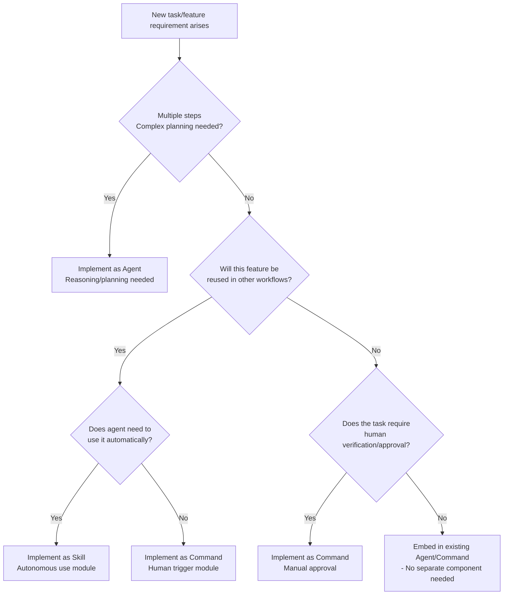

# C. Decision Rules for "When to Create What" (Decision Tree + Checklist)

## Decision Tree (Designation Flowchart)

## Decision Flow Explanation

**1. Is the task multi-step complex?** Example: Problem that doesn't end with a single prompt, requiring planning/branching/iteration?

- Yes → Consider a new Agent. (This task consists of multiple sub-tasks and must proceed while self-thinking/reasoning, so Agent is suitable)
- No → (Go to step 2)

**2. Will this feature be reused across multiple workflows?** That is, is there modularization value? (Is it a specialized routine usable elsewhere?)

- Yes → (Go to step 3)
- No → (Go to step 4)

**3. Does the agent need to use this feature automatically?** Is it knowledge/procedure that the agent should use on its own based on situation, without user instructing each time?

- Yes → Implement as Skill. (As part of Agent's "brain" to pull out anytime)
- No → Implement as Command. (Reused, but explicit call is desired each time)

**4. Is human verification or approval needed?** (Dangerous or expensive task where auto-execution is risky and user must trigger/verify individually to be safe?)

- Yes → Implement as Command. (Execute under user approval. e.g., production deployment)
- No → No new component needed. (Can be handled sufficiently as one step of existing Agent, so no need to separate Skill/Command/Agent)

Following this decision flow, you can quickly classify whether a given requirement is Agent, Skill, or Command.

---

## Design Selection Checklist

Answer "yes/no" to each question to decide:

| Question | Example Situation | Conclusion |
|----------|-------------------|------------|
| **High reusability?** | This logic will likely be used in multiple other agents/commands | → Skill candidate |
| **External side effects/risks?** | System changes, data deletion, cost incurrence | → Make user approve via Command, or include confirmation step in Agent |
| **Must human directly trigger?** | Execute only at specific times, no automation needed | → Command is appropriate |
| **Deterministic stability needed?** | Need almost same result for same input each time | → Specify procedure in Skill/Command or rule-based handling (safer than Agent free reasoning) |
| **Multi-step planning/branching needed?** | Different actions based on conditions, possibility of loops | → Agent needed (Skill/Command only have fixed order) |
| **Security/permission boundary exists?** | Customer data access, permission restrictions, isolation needed | → Isolate as separate Agent or separate as Command to control permissions |
| **High execution cost?** | API costs, massive model token consumption | → Prevent abuse as explicit Command or add caching/reconfirmation step in Agent |

**How to Use:**
- Weight design towards side with more "YES"
- Reusability Yes + Side effects Yes → Implement as Command and reuse Skill internally
- Low reusability and simple → Add procedure to existing Agent without separate component
