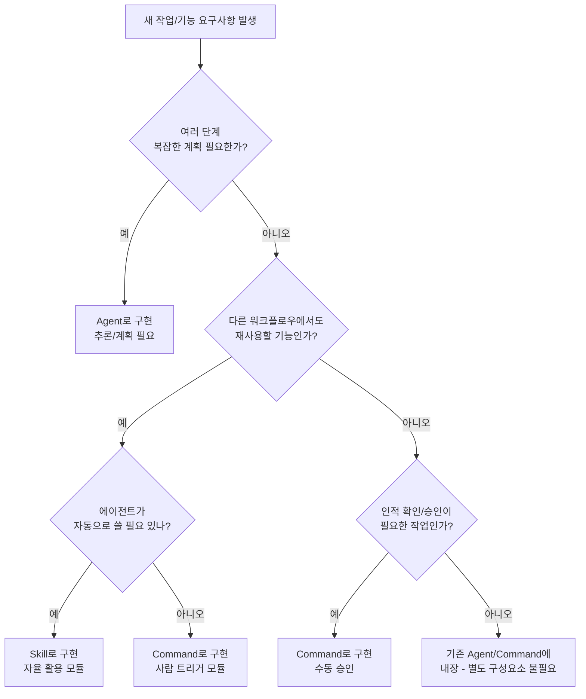

# C. "언제 무엇을 만들지" 결정 규칙 (결정 트리 + 체크리스트)

## 결정 트리 (Designation Flowchart)

## 결정 흐름 설명

**1. 작업이 다단계 복잡한가?** 예: 단일 프롬프트로 끝나지 않고, 계획/분기/반복이 필요한 문제인가?

- 예 → 새로운 Agent를 고려합니다. (이 작업은 여러 하위 작업으로 구성되고, 스스로 사고/추론하면서 진행해야 하므로 Agent 적합)
- 아니오 → (단계 2로)

**2. 이 기능이 여러 워크플로우에서 재사용되나?** 즉, 모듈화 가치가 있는가? (다른 곳에서도 써먹을 전문 루틴인가?)

- 예 → (단계 3로)
- 아니오 → (단계 4로)

**3. 에이전트가 자동으로 이 기능을 쓸 필요가 있나?** 사용자가 매번 지시하지 않아도, 상황에 따라 에이전트가 알아서 활용해야 하는 지식/절차인가?

- 예 → Skill로 구현. (Agent의 "두뇌" 일부로서 언제든 꺼내 쓰도록)
- 아니오 → Command로 구현. (재사용은 되지만, 항상 명시적 호출이 원하는 경우)

**4. 사람의 확인이나 승인이 필요한 작업인가?** (위험하거나 비용이 큰 작업으로, 자동 실행은 위험하고 사용자가 일일이 트리거/확인해야 안전한가?)

- 예 → Command로 구현. (사용자 승인 하에 실행되도록 함. 예: 프로덕션 배포)
- 아니오 → 새 구성요소 불필요. (그냥 기존 Agent의 한 단계로 충분히 처리 가능하므로, 굳이 Skill/Command/Agent 분리 안 함)

이 결정 흐름에 따라, 주어진 요구사항이 Agent인지 Skill인지 Command인지 빠르게 분류할 수 있습니다.

---

## 설계 선택 체크리스트

각 질문에 "예/아니오"로 답해보며 결정:

| 질문 | 예시 상황 | 결론 |
|------|-----------|------|
| **재사용성 높은가?** | 여러 다른 에이전트/명령에서도 이 로직을 사용할 듯하다 | → Skill 후보 |
| **외부 부작용/위험 있는가?** | 시스템 변경, 데이터 삭제, 비용 발생 | → Command로 사용자 승인 거치게, 또는 Agent에 컨펌 단계 포함 |
| **사람이 직접 트리거해야 하나?** | 특정 시점에만 실행, 자동화 불필요 | → Command 적합 |
| **결정론적 안정성 필요?** | 매번 같은 입력에 거의 같은 결과 필요 | → Skill/Command에 절차 명시 또는 룰기반 처리 (Agent 자유 추론보다 안전) |
| **멀티스텝 계획/분기 필요?** | 조건에 따라 다른 조치, 루프 돌 가능성 | → Agent 필요 (Skill/Command는 고정 순서만) |
| **보안/권한 경계 있는가?** | 고객 데이터 접근, 권한 제한, 격리 필요 | → 별도 Agent로 격리 또는 Command로 분리해서 권한 통제 |
| **실행 비용이 큰가?** | API 비용, 모델 토큰 대량 소모 | → 명시적 Command로 남용 방지 또는 Agent에 캐싱/재확인 단계 |

**활용 방법:**
- "YES"가 많은 쪽으로 무게를 두고 설계
- 재사용성 Yes + 부작용 Yes → Command로 구현하고 내부에 Skill 재사용
- 재사용성 낮고 단순 → 별도 구성요소 없이 기존 Agent에 절차 추가
