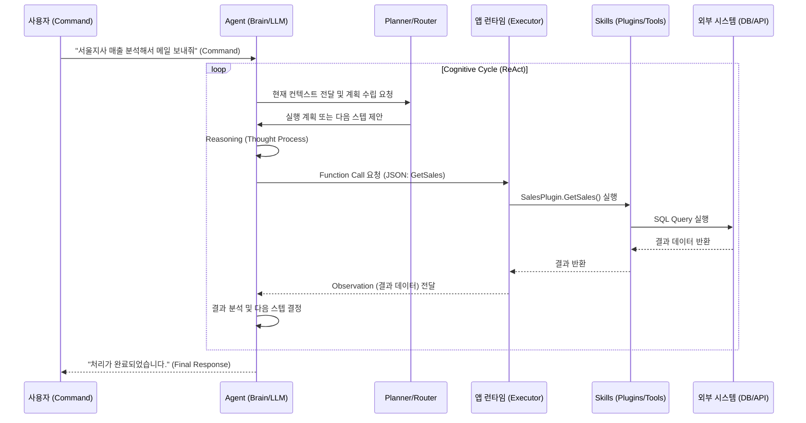

# 엔터프라이즈 생성형 AI 시스템 아키텍처: Command, Skills, Agents의 통합적 설계와 구현 전략

## 1. 서론: 결정론적 소프트웨어에서 확률론적 인지 컴퓨팅으로의 대전환

소프트웨어 엔지니어링은 기계어에서 고수준 언어로 발전하며 추상화 비용을 줄여왔습니다. 그러나 LLM의 등장은 단순한 추상화를 넘어 **결정론적(Deterministic) 시스템**에서 **확률론적(Probabilistic) 인지 시스템**으로의 패러다임 전환을 의미합니다.

이 새로운 패러다임의 핵심 3요소는 다음과 같습니다:

- **Command (명령):** 사용자의 의도
- **Skills (기술/도구):** 실제 과업을 수행하는 기능 단위
- **Agents (에이전트):** 중재 및 추론을 통한 문제 해결 주체

본 보고서는 시니어 아키텍트 관점에서 이들의 상호작용, 설계 원칙(원자성, 자율성), 그리고 프레임워크(Semantic Kernel, LangChain 등) 비교를 통해 엔터프라이즈급 AI 시스템 구축 전략을 제시합니다.

---

## 2. 개념적 프레임워크와 비유적 해석 (The Conceptual Triad)

복잡한 개념을 **'최고급 레스토랑의 주방'**과 **'심포니 오케스트라'**에 비유하여 분석합니다.

### 2.1 Command (명령): 의도의 발화와 목표의 설정

> **비유 (레스토랑):** 고객의 주문서 (The Guest's Order)
> _"특별한 날인데 무겁지 않고 계절감이 느껴지는 코스 요리 추천해 주세요."_

- **특성:**
- **모호성 (Ambiguity):** 해석의 여지가 큼.
- **맥락 의존성 (Context-Dependency):** "특별한 날" 등의 상황 정보 포함.
- **목표 지향성 (Goal-Oriented):** 구체적 지시가 아닌 최종 만족 상태를 요구.

- **기술적 정의:**
- 사용자의 자연어 발화, 작업의 의도(Intent), 최종 목표(Goal)를 정의하는 입력 데이터의 집합.
- 단순 프롬프트를 넘어 시스템 페르소나, 사용자 요청, 컨텍스트가 결합된 **'실행 가능한 지시(Actionable Instruction)'**.

### 2.2 Skills (기술/도구): 실행의 단위와 결정론적 수단

> **비유 (레스토랑):** 조리 도구와 표준 레시피 (Kitchen Tools & Standard Recipes)
> _오븐, 칼, 스테이크 굽기 기술 등_

- **특성:**
- **결정론적 실행:** 입력에 따라 항상 같은 결과를 출력 (환각 없음).
- **수동성:** 외부 호출이 있어야 작동.
- **전문성:** 특정 작업에 특화됨.

- **기술적 정의:**
- 디지털/물리적 세계와 상호작용하여 변화를 만드는 **기능적 모듈(Functional Modules)**. (Plugins, Tools 등으로도 불림)
- **구성:** 정의(Schema), 구현(Code/API), 실행 결과(Output).
- **원자성:** 하나의 명확한 작업을 수행.

### 2.3 Agents (에이전트): 인지적 조정자와 오케스트레이터

> **비유 (레스토랑):** 총괄 셰프 (Executive Chef)
> _직접 요리하기보다 상황을 판단하고 지시하며 동적으로 계획을 수정._

- **특성:**
- **해석 및 계획:** 주문(Command)과 상황(Context)을 고려해 계획 수립.
- **도구 할당:** 적절한 Skill 호출.
- **동적 대응:** 돌발 상황 발생 시 계획 수정.

- **기술적 정의:**
- LLM을 **추론 엔진(Reasoning Engine)**으로 활용하여 인지-계획-행동-관측-재조정의 루프를 도는 **자율적 시스템**.
- 단기 기억(대화)과 장기 기억(지식)을 통한 상태 관리.

### 2.4 개념 비교 요약 (Conceptual Comparison Matrix)

| 비교 차원             | Command (명령)        | Skills (기술/도구)       | Agents (에이전트)              |
| --------------------- | --------------------- | ------------------------ | ------------------------------ |
| **비유 (레스토랑)**   | 고객의 주문서         | 조리 도구 및 레시피      | 총괄 셰프                      |
| **비유 (오케스트라)** | 악보 및 지휘자의 해석 | 악기 및 연주자           | 지휘자                         |
| **핵심 기능**         | 의도 전달, 목표 설정  | 구체적 작업 실행         | 추론, 계획, 도구 선택          |
| **작동 방식**         | 선언적 (Declarative)  | 결정론적 (Deterministic) | 확률론적 (Probabilistic)       |
| **입력 형태**         | 자연어, 시스템 메시지 | 정형 데이터 (JSON)       | 자연어, 실행 결과(Observation) |
| **실패 유형**         | 모호함으로 인한 오해  | 런타임 에러, 타임아웃    | 환각, 무한 루프, 논리 오류     |

---

## 3. 상호작용 메커니즘 및 워크플로우 (Interactions & Workflow)

**ReAct (Reason + Act) 패턴**에 기반한 '인지-계획-실행' 사이클 분석.

### 3.1 워크플로우 상세 시나리오

**Command:** _"지난주 서울 지사 매출 데이터를 조회해서, 이상치가 있는지 분석한 후 팀장님께 이메일로 보고해줘."_

1. **인지 및 의도 파악 (Perception):** LLM이 자연어를 분석하고 메모리(컨텍스트)를 로딩.
2. **계획 수립 및 도구 탐색 (Planning):** 하위 태스크 생성(`GetSalesData` -> `Analyze` -> `SendEmail`) 및 관련 Skill 검색.
3. **추론 및 도구 호출 결정 (Reasoning):** LLM이 **그라운딩(Grounding)**을 수행하여 함수 호출을 위한 JSON 생성.

```json
{
  "type": "function",
  "name": "SalesPlugin_GetSales",
  "arguments": "{\"location\": \"Seoul\", \"period\": \"2024-W03\"}"
}
```

4. **도구 실행 (Skill Execution):** 애플리케이션 런타임이 실제 코드(SQL 등)를 실행 (결정론적).
5. **관측 및 결과 반환 (Observation):** 실행 결과(데이터)를 텍스트/JSON으로 변환하여 Agent 메모리에 추가.
6. **반복 및 적응 (Iteration):** 결과 분석 후 이상치 발견 시 다음 행동 결정 (추가 분석 혹은 보고).
7. **최종 응답 (Final Response):** 작업 완료 후 사용자에게 보고.

### 3.2 워크플로우 아키텍처 (Sequence Diagram)



---

## 4. 심층 설계 전략 및 모범 사례 (Design Strategy & Best Practices)

### 4.1 Skills 설계 원칙: 입자성(Granularity)

Atomic(미세 입자) 설계와 Monolithic(거대 입자) 설계의 트레이드오프를 고려해야 합니다.

| 특성     | Atomic Skills                 | Monolithic Skills             |
| -------- | ----------------------------- | ----------------------------- |
| **정의** | 단일 기능 (예: GetEmail)      | 복합 기능 (예: ProcessReport) |
| **장점** | 유연성, 재사용성              | 효율성(토큰 절약), 신뢰성     |
| **단점** | 지연 시간(Latency), 오류 전파 | 경직성, 수정 비용             |
| **추천** | 탐색적 작업 (L4, L5)          | 정형화된 프로세스 (L1, L2)    |

🚀 **설계 가이드라인:**

- 기본적으로 **Atomic**하게 설계하되, 자주 쓰이는 패턴은 **Composite Skill (Façade Pattern)**로 묶어서 제공.
- **스키마 최적화:** 명확한 이름과 "언제 써야/쓰지 말아야 하는지"에 대한 설명 포함.
- **멱등성(Idempotency):** 부작용이 있는 Skill(결제, 메일 발송)은 멱등성을 보장하거나 확인 절차 필수.

### 4.2 Agent 설계 원칙: 자율성의 스펙트럼

자율성은 시스템 신뢰도와 반비례할 수 있습니다. 엔터프라이즈 환경에서는 적절한 수준 제어가 필요합니다.

- **Level 1 (Operator):** 단순 실행자 (예: Copilot)
- **Level 2 (Collaborator):** 계획 제안 후 승인 요청 (예: 여행 계획)
- **Level 3 (Consultant):** **[권장]** 특정 도메인 내 자율 판단, 예외 시 개입 요청.
- **Level 4 (Approver):** 반자율, 중요 결정만 승인.
- **Level 5 (Observer):** 완전 자율, 스스로 학습 (예: AutoGPT).

🚀 **설계 가이드라인:**

- **Scoped Agent:** 도구 범위를 제한하고 가드레일 설정.
- **Multi-Agent Orchestration:** 단일 슈퍼 에이전트 대신, 전문 에이전트(검색, 코드, 검수)를 조율하는 Router 구조 사용.

### 4.3 구분 기준: Skill(Code) vs. Prompt(LLM)

기능 구현 시 네이티브 코드와 LLM 프롬프트 중 무엇을 사용할지 결정하는 기준입니다.

| 판단 기준         | Skill (Code/Tool) 권장         | Prompt (LLM) 권장           |
| ----------------- | ------------------------------ | --------------------------- |
| **정확성**        | 수학, 날짜, 엄격한 포맷        | 요약, 감정 분석, 번역       |
| **외부 상호작용** | DB/API 호출, 파일 접근         | 텍스트 재가공, 내부 추론    |
| **복잡도/비용**   | 명확한 규칙, 비용 절감 필요 시 | 규칙 정의 불가, 비정형 작업 |
| **최신성**        | 실시간 데이터 (주가, 뉴스)     | 일반 상식, 내재된 지식      |
| **보안**          | 개인정보 마스킹, 접근 제어     | 일반 텍스트 생성            |

🚀 **Semantic Function:** 외부는 함수처럼 보이지만 내부는 프롬프트로 구현된 하이브리드 패턴 활용.

---

## 5. 프레임워크별 구현 전략 비교

| 프레임워크               | 철학 및 특징          | 추천 대상 |
| ------------------------ | --------------------- | --------- |
| **Semantic Kernel** (MS) | **"통합 접착제"**<br> |

<br>- C#/.NET 친화적<br>

<br>- 엔터프라이즈 보안/로깅(Filter, DI) 강점<br>

<br>- Process Framework 지향 | 안정성과 보안이 중요한 **대규모 기업 프로젝트**. |
| **LangChain / LangGraph** | **"표준 라이브러리"**<br>

<br>- 방대한 생태계, 빠른 업데이트<br>

<br>- Graph 기반의 상태/순환 관리 (LangGraph) | 빠른 프로토타이핑, **Data Science**, 복잡한 멀티 에이전트 실험. |
| **AutoGPT** | **"완전 자율성"**<br>

<br>- 목표 기반 무한 루프, Self-Prompting<br>

<br>- 통제 불가능성 존재 | **R&D 프로젝트**, 자율 에이전트 가능성 탐구. |

---

## 6. 결론: 오케스트레이션의 예술 (Art of Orchestration)

성공적인 AI 아키텍처는 기술 요소의 단순 결합이 아닌 **오케스트라와 같은 조화**입니다.

- **Command:** 악보이자 목표 (Goal)
- **Skills:** 명확한 기능을 가진 악기 (Instruments)
- **Agent:** 전체를 조율하는 지휘자 (Conductor)

단순히 좋은 모델을 쓰는 것을 넘어, **(1) 명확한 Command 변환**, **(2) 견고한 Atomic Skills 구축**, **(3) 똑똑하고 안전한 Agent 설계**가 어우러져야 합니다. 생성형 AI 시대의 아키텍트는 코드를 넘어 지능을 조율하는 설계자가 되어야 합니다.
