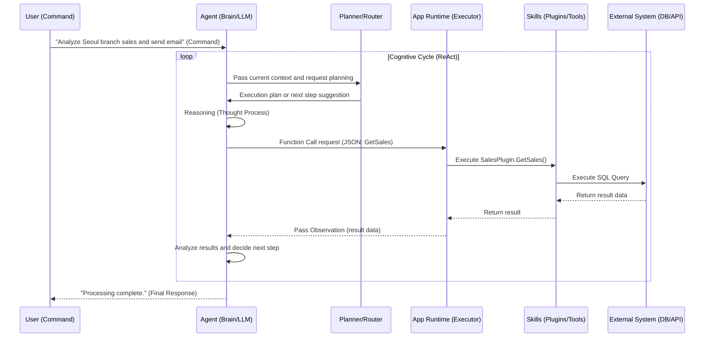

# Enterprise Generative AI System Architecture: Integrated Design and Implementation Strategy for Command, Skills, and Agents

## 1. Introduction: The Great Transition from Deterministic Software to Probabilistic Cognitive Computing

Software engineering has evolved from machine language to high-level languages, reducing abstraction costs. However, the emergence of LLMs signifies a paradigm shift beyond simple abstraction—from **Deterministic Systems** to **Probabilistic Cognitive Systems**.

The three core elements of this new paradigm are:

- **Command:** User's intent
- **Skills:** Functional units that perform actual tasks
- **Agents:** Problem-solving entities through mediation and reasoning

This report presents strategies for building enterprise-grade AI systems from a senior architect's perspective, through analysis of their interactions, design principles (atomicity, autonomy), and framework comparisons (Semantic Kernel, LangChain, etc.).

---

## 2. Conceptual Framework and Analogical Interpretation (The Conceptual Triad)

We analyze complex concepts through analogies to **'a high-end restaurant kitchen'** and **'a symphony orchestra'**.

### 2.1 Command: Expression of Intent and Goal Setting

> **Analogy (Restaurant):** The Guest's Order
> _"It's a special occasion—could you recommend a seasonal course menu that's not too heavy?"_

- **Characteristics:**
- **Ambiguity:** Open to interpretation.
- **Context-Dependency:** Contains situational information like "special occasion."
- **Goal-Oriented:** Requires a final satisfaction state rather than specific instructions.

- **Technical Definition:**
- A set of input data defining the user's natural language utterance, task intent, and final goal.
- Beyond simple prompts—an **'Actionable Instruction'** combining system persona, user request, and context.

### 2.2 Skills: Units of Execution and Deterministic Means

> **Analogy (Restaurant):** Kitchen Tools & Standard Recipes
> _Ovens, knives, steak-grilling techniques, etc._

- **Characteristics:**
- **Deterministic Execution:** Always produces the same result for given input (no hallucination).
- **Passivity:** Only operates when externally invoked.
- **Specialization:** Specialized for specific tasks.

- **Technical Definition:**
- **Functional Modules** that interact with the digital/physical world to create changes. (Also called Plugins, Tools, etc.)
- **Components:** Schema (definition), Implementation (Code/API), Output (execution result).
- **Atomicity:** Performs one clear task.

### 2.3 Agents: Cognitive Coordinators and Orchestrators

> **Analogy (Restaurant):** Executive Chef
> _Rather than cooking directly, they assess situations, give directions, and dynamically modify plans._

- **Characteristics:**
- **Interpretation and Planning:** Formulates plans considering the order (Command) and situation (Context).
- **Tool Assignment:** Invokes appropriate Skills.
- **Dynamic Response:** Modifies plans when unexpected situations arise.

- **Technical Definition:**
- An **autonomous system** that uses LLM as a **Reasoning Engine** to loop through cognition-planning-action-observation-readjustment.
- State management through short-term memory (conversation) and long-term memory (knowledge).

### 2.4 Conceptual Comparison Matrix

| Comparison Dimension   | Command                       | Skills                         | Agents                                |
| ---------------------- | ----------------------------- | ------------------------------ | ------------------------------------- |
| **Analogy (Restaurant)** | Guest's order               | Kitchen tools and recipes      | Executive Chef                        |
| **Analogy (Orchestra)** | Score and conductor's interpretation | Instruments and musicians | Conductor                             |
| **Core Function**      | Convey intent, set goals      | Execute specific tasks         | Reasoning, planning, tool selection   |
| **Operation Mode**     | Declarative                   | Deterministic                  | Probabilistic                         |
| **Input Format**       | Natural language, system messages | Structured data (JSON)      | Natural language, Observation         |
| **Failure Types**      | Misunderstanding due to ambiguity | Runtime errors, timeout    | Hallucination, infinite loops, logical errors |

---

## 3. Interaction Mechanisms and Workflow

Analysis of the 'cognition-planning-execution' cycle based on the **ReAct (Reason + Act) pattern**.

### 3.1 Detailed Workflow Scenario

**Command:** _"Query last week's Seoul branch sales data, analyze for anomalies, and send an email report to the team manager."_

1. **Perception:** LLM analyzes natural language and loads memory (context).
2. **Planning:** Creates subtasks (`GetSalesData` -> `Analyze` -> `SendEmail`) and searches for relevant Skills.
3. **Reasoning:** LLM performs **Grounding** to generate JSON for function calls.

```json
{
  "type": "function",
  "name": "SalesPlugin_GetSales",
  "arguments": "{\"location\": \"Seoul\", \"period\": \"2024-W03\"}"
}
```

4. **Skill Execution:** Application runtime executes actual code (SQL, etc.) (deterministic).
5. **Observation:** Converts execution results (data) to text/JSON and adds to Agent memory.
6. **Iteration:** After analyzing results, decides next action upon finding anomalies (additional analysis or reporting).
7. **Final Response:** Reports to user after task completion.

### 3.2 Workflow Architecture (Sequence Diagram)



---

## 4. In-Depth Design Strategy and Best Practices

### 4.1 Skills Design Principles: Granularity

Consider the trade-offs between Atomic (fine-grained) and Monolithic (coarse-grained) design.

| Attribute    | Atomic Skills                 | Monolithic Skills             |
| ------------ | ----------------------------- | ----------------------------- |
| **Definition** | Single function (e.g., GetEmail) | Composite function (e.g., ProcessReport) |
| **Pros**     | Flexibility, reusability      | Efficiency (token savings), reliability |
| **Cons**     | Latency, error propagation    | Rigidity, modification cost   |
| **Recommended For** | Exploratory tasks (L4, L5) | Formalized processes (L1, L2) |

🚀 **Design Guidelines:**

- Design **Atomically** by default, but bundle frequently used patterns into **Composite Skills (Façade Pattern)**.
- **Schema Optimization:** Include clear names and descriptions of "when to use/not use."
- **Idempotency:** Skills with side effects (payments, email sending) must guarantee idempotency or include confirmation procedures.

### 4.2 Agent Design Principles: The Spectrum of Autonomy

Autonomy can be inversely proportional to system reliability. Enterprise environments require appropriate level control.

- **Level 1 (Operator):** Simple executor (e.g., Copilot)
- **Level 2 (Collaborator):** Proposes plans and requests approval (e.g., travel planning)
- **Level 3 (Consultant):** **[Recommended]** Autonomous judgment within specific domains, requests intervention for exceptions.
- **Level 4 (Approver):** Semi-autonomous, approves only critical decisions.
- **Level 5 (Observer):** Fully autonomous, self-learning (e.g., AutoGPT).

🚀 **Design Guidelines:**

- **Scoped Agent:** Limit tool scope and set guardrails.
- **Multi-Agent Orchestration:** Instead of a single super-agent, use a Router structure that coordinates specialized agents (search, code, review).

### 4.3 Distinction Criteria: Skill (Code) vs. Prompt (LLM)

Criteria for deciding between native code and LLM prompts when implementing functionality.

| Judgment Criteria      | Skill (Code/Tool) Recommended  | Prompt (LLM) Recommended      |
| ---------------------- | ------------------------------ | ----------------------------- |
| **Accuracy**           | Math, dates, strict formatting | Summarization, sentiment analysis, translation |
| **External Interaction** | DB/API calls, file access    | Text processing, internal reasoning |
| **Complexity/Cost**    | Clear rules, cost reduction needed | Rules undefinable, unstructured tasks |
| **Recency**            | Real-time data (stocks, news) | Common knowledge, embedded knowledge |
| **Security**           | PII masking, access control   | General text generation       |

🚀 **Semantic Function:** Utilize hybrid patterns that look like functions externally but are implemented with prompts internally.

---

## 5. Framework Implementation Strategy Comparison

| Framework              | Philosophy & Features         | Recommended For |
| ---------------------- | ----------------------------- | --------------- |
| **Semantic Kernel** (MS) | **"Integration Glue"**<br>- C#/.NET friendly<br>- Enterprise security/logging strengths (Filter, DI)<br>- Process Framework oriented | **Large enterprise projects** where stability and security are paramount. |
| **LangChain / LangGraph** | **"Standard Library"**<br>- Vast ecosystem, rapid updates<br>- Graph-based state/cycle management (LangGraph) | Rapid prototyping, **Data Science**, complex multi-agent experiments. |
| **AutoGPT** | **"Full Autonomy"**<br>- Goal-based infinite loop, Self-Prompting<br>- Uncontrollability exists | **R&D projects**, exploring autonomous agent possibilities. |

---

## 6. Conclusion: The Art of Orchestration

Successful AI architecture is not a simple combination of technical elements but **harmony like an orchestra**.

- **Command:** The score and goal
- **Skills:** Instruments with clear functions
- **Agent:** The conductor who orchestrates everything

Beyond simply using good models, **(1) clear Command transformation**, **(2) robust Atomic Skills construction**, and **(3) smart and safe Agent design** must come together. Architects in the generative AI era must become designers who orchestrate intelligence beyond code.
